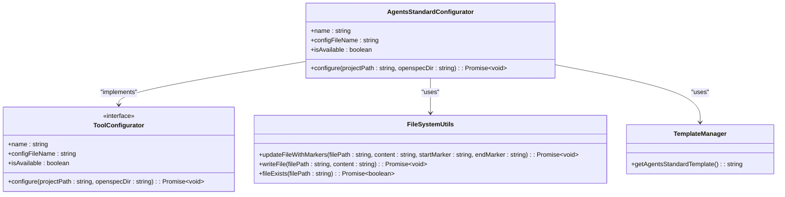
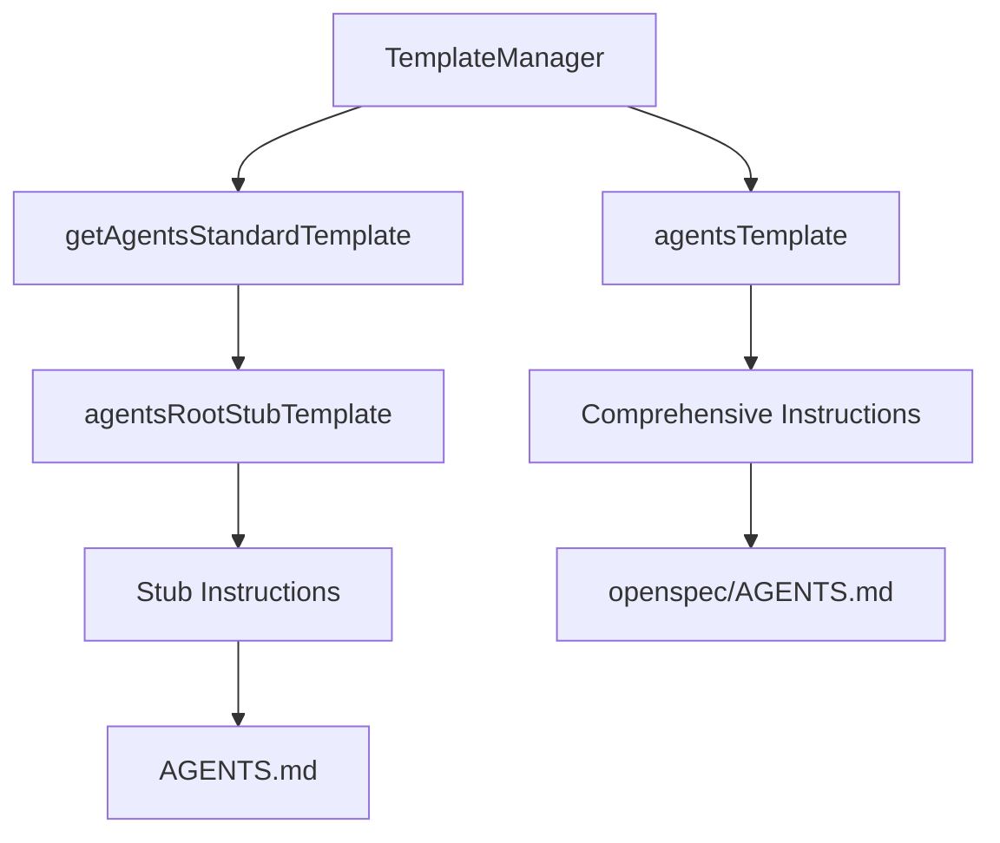
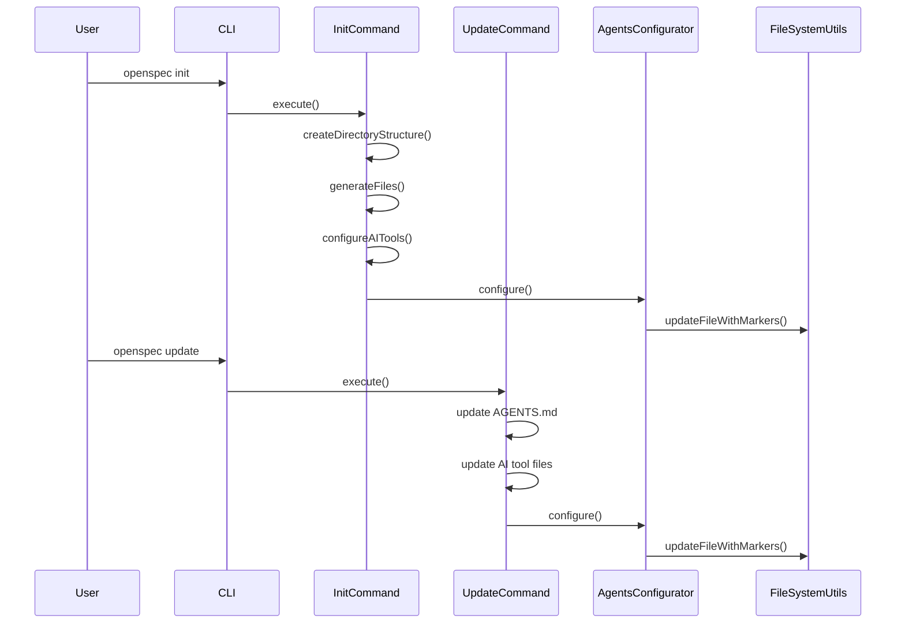

# AGENTS.md Compatibility

<cite>
**Referenced Files in This Document**   
- [AGENTS.md](file://AGENTS.md)
- [agents.ts](file://src/core/configurators/agents.ts)
- [agents-template.ts](file://src/core/templates/agents-template.ts)
- [agents-root-stub.ts](file://src/core/templates/agents-root-stub.ts)
- [init.ts](file://src/core/init.ts)
- [update.ts](file://src/core/update.ts)
- [config.ts](file://src/core/config.ts)
- [file-system.ts](file://src/utils/file-system.ts)
- [index.ts](file://src/core/templates/index.ts)
</cite>

## Table of Contents
1. [Introduction](#introduction)
2. [AGENTS.md File Structure](#agentsmd-file-structure)
3. [AgentsConfigurator Implementation](#agentsconfigurator-implementation)
4. [Template System](#template-system)
5. [Initialization and Update Process](#initialization-and-update-process)
6. [AI Assistant Configuration](#ai-assistant-configuration)
7. [Troubleshooting](#troubleshooting)
8. [Conclusion](#conclusion)

## Introduction

The AGENTS.md compatibility system in OpenSpec provides a standardized instruction file that enables cross-tool compatibility for AI assistants. This system allows various AI tools like Amp, Jules, and others that don't support native slash commands to access project-specific guidelines and workflows. The AGENTS.md file serves as a universal interface that ensures all AI assistants, regardless of their native capabilities, can follow the same project conventions and processes.

The system works by maintaining a managed block within the AGENTS.md file, delimited by `<!-- OPENSPEC:START -->` and `<!-- OPENSPEC:END -->` comments. This block contains project-specific instructions that are automatically generated and updated by the OpenSpec CLI during `openspec init` and `openspec update` operations. The content within this block is populated using a template system that incorporates project context and change management guidelines.

**Section sources**
- [AGENTS.md](file://AGENTS.md)
- [agents.ts](file://src/core/configurators/agents.ts)

## AGENTS.md File Structure

The AGENTS.md file follows a specific structure designed to provide clear instructions to AI assistants while allowing for automated management of the core content. The file contains a managed block that is automatically generated and updated by the OpenSpec system.

The managed block is enclosed within special HTML comments that serve as markers for the OpenSpec system:

```
<!-- OPENSPEC:START -->
[Managed content]
<!-- OPENSPEC:END -->
```

The content within this block includes comprehensive instructions for AI assistants, covering the three-stage workflow (creating changes, implementing changes, and archiving changes), search guidance, CLI commands, directory structure, and best practices. The file also includes instructions for when AI assistants should consult the AGENTS.md file, such as when handling requests related to proposals, specs, or architectural changes.

The structure is designed to be both human-readable and machine-maintainable, allowing team members to add custom content before or after the managed block while ensuring the core instructions remain up-to-date with the latest project guidelines.

```mermaid
flowchart TD
A[AGENTS.md File] --> B[Custom Content (Optional)]
A --> C[Managed Block]
A --> D[Custom Content (Optional)]
C --> E[<!-- OPENSPEC:START --> ]
C --> F[Instruction Content]
C --> G[<!-- OPENSPEC:END --> ]
```

**Diagram sources**
- [AGENTS.md](file://AGENTS.md)
- [config.ts](file://src/core/config.ts)

**Section sources**
- [AGENTS.md](file://AGENTS.md)
- [config.ts](file://src/core/config.ts)

## AgentsConfigurator Implementation

The AgentsConfigurator class is responsible for generating and updating the AGENTS.md file during OpenSpec operations. Implemented in the `agents.ts` file, this class follows the ToolConfigurator interface and provides the logic for managing the AGENTS.md file.

The AgentsStandardConfigurator class implements the configuration process by:

1. Defining the file name as 'AGENTS.md'
2. Specifying the managed block markers from the OPENSPEC_MARKERS configuration
3. Using the TemplateManager to retrieve the appropriate template content
4. Utilizing the FileSystemUtils to update the file with markers

The configuration process uses the `updateFileWithMarkers` method from FileSystemUtils, which intelligently handles the file content by:
- Creating a new file with markers if the file doesn't exist
- Prepending the managed block if markers are not present
- Replacing only the content between the markers if they exist

This approach ensures that any custom content added by team members outside the managed block is preserved during updates, while the core instructions are kept current with the latest project guidelines.



**Diagram sources**
- [agents.ts](file://src/core/configurators/agents.ts)
- [file-system.ts](file://src/utils/file-system.ts)
- [index.ts](file://src/core/templates/index.ts)

**Section sources**
- [agents.ts](file://src/core/configurators/agents.ts)
- [file-system.ts](file://src/utils/file-system.ts)

## Template System

The template system for AGENTS.md is implemented across multiple files, with the primary template content defined in `agents-template.ts` and a stub template in `agents-root-stub.ts`. This system allows for the generation of comprehensive instruction content that is populated with project context and change management guidelines.

The main template in `agents-template.ts` contains extensive documentation covering:
- The three-stage workflow for change management
- Search guidance for finding existing work
- Quick start commands and flags
- Directory structure explanation
- Decision trees for creating change proposals
- Spec file format requirements
- Troubleshooting guidance
- Best practices for development

The stub template in `agents-root-stub.ts` contains a concise version of the instructions that is used in the root AGENTS.md file. This stub directs AI assistants to the full instructions in `openspec/AGENTS.md` and explains when to consult these instructions.

The TemplateManager class in `index.ts` orchestrates the template system by providing methods to retrieve the appropriate template content. The `getAgentsStandardTemplate()` method returns the stub template content, which is used by the AgentsConfigurator during file generation.

This template system ensures consistency across projects while allowing for future enhancements to the instruction content without requiring changes to the configuration logic.



**Diagram sources**
- [agents-template.ts](file://src/core/templates/agents-template.ts)
- [agents-root-stub.ts](file://src/core/templates/agents-root-stub.ts)
- [index.ts](file://src/core/templates/index.ts)

**Section sources**
- [agents-template.ts](file://src/core/templates/agents-template.ts)
- [agents-root-stub.ts](file://src/core/templates/agents-root-stub.ts)
- [index.ts](file://src/core/templates/index.ts)

## Initialization and Update Process

The AGENTS.md file is created and updated through two primary OpenSpec commands: `openspec init` and `openspec update`. These commands are implemented in `init.ts` and `update.ts` respectively, and follow a systematic process to ensure the AGENTS.md file is properly configured.

During `openspec init`, the initialization process:
1. Validates the project path and write permissions
2. Creates the OpenSpec directory structure if it doesn't exist
3. Generates the template files including AGENTS.md
4. Configures AI tools based on user selection
5. Specifically handles the AGENTS.md stub configuration

The `configureRootAgentsStub` method in the InitCommand class is responsible for setting up the root AGENTS.md file. It checks if the configurator is available and then calls the configure method to generate the file.

The `openspec update` command refreshes existing instruction files, including AGENTS.md. The UpdateCommand class:
1. Verifies the OpenSpec directory exists
2. Updates the AGENTS.md file in the openspec directory with the latest template
3. Updates existing AI tool configuration files
4. Preserves any custom content outside the managed blocks

Both processes use the marker-based update system to ensure that only the managed content is replaced, preserving any custom additions made by team members. This approach allows for safe updates that maintain the integrity of the core instructions while respecting user modifications.



**Diagram sources**
- [init.ts](file://src/core/init.ts)
- [update.ts](file://src/core/update.ts)
- [agents.ts](file://src/core/configurators/agents.ts)
- [file-system.ts](file://src/utils/file-system.ts)

**Section sources**
- [init.ts](file://src/core/init.ts)
- [update.ts](file://src/core/update.ts)

## AI Assistant Configuration

To ensure AI assistants can effectively utilize the AGENTS.md compatibility system, they should be configured to automatically load the AGENTS.md file when handling requests related to proposals, specs, or architectural changes. This configuration enables assistants to access the most current project guidelines regardless of their preferred tool.

The system is designed to work with various AI assistants, including those that don't support native slash commands like Amp, Jules, and others. The AGENTS.md file serves as a universal instruction format that can be read and interpreted by any AI assistant capable of processing text files.

Team members should ensure all assistants have access to current project guidelines by:
1. Running `openspec init` when setting up a new project to create the initial AGENTS.md files
2. Running `openspec update` periodically to refresh instruction files with the latest guidelines
3. Configuring their AI assistants to automatically reference the AGENTS.md file when specific keywords are detected (e.g., "proposal", "spec", "change", "plan")
4. Ensuring the AI assistant can access both the root AGENTS.md file and the comprehensive version in the openspec directory

The instructions in AGENTS.md explicitly state when AI assistants should consult the file:
- When requests mention planning or proposals
- When introducing new capabilities, breaking changes, architecture shifts, or significant performance/security work
- When requests are ambiguous and require authoritative specs before coding

By following these configuration guidelines, teams can ensure consistent behavior across different AI assistants and maintain alignment with project standards.

**Section sources**
- [AGENTS.md](file://AGENTS.md)
- [agents-root-stub.ts](file://src/core/templates/agents-root-stub.ts)

## Troubleshooting

When working with the AGENTS.md compatibility system, several common issues may arise. This section provides guidance for troubleshooting these issues to ensure the system functions correctly.

### Stale Instructions
If AI assistants are using outdated instructions, ensure that:
1. The `openspec update` command has been run recently
2. The AGENTS.md file in the openspec directory has been updated with the latest template
3. The root AGENTS.md file has been refreshed with the current stub content
4. No file permission issues are preventing updates

The update process preserves custom content outside the managed blocks, so if instructions appear to be missing, check that they were not placed within the managed block, which gets overwritten during updates.

### Missing File References
If the AGENTS.md file is not being created or updated:
1. Verify that the OpenSpec directory exists in the project root
2. Check that the user has write permissions to the project directory
3. Ensure the `agents` configurator is available in the AI_TOOLS configuration
4. Confirm that the `openspec init` command was run successfully

### Configuration Issues
If AI assistants are not properly loading the AGENTS.md file:
1. Verify that the assistant is configured to read files from the project directory
2. Check that the file path references in the assistant's configuration are correct
3. Ensure the assistant is set to automatically load AGENTS.md when specific keywords are detected
4. Confirm that both the root AGENTS.md and openspec/AGENTS.md files are accessible

The marker-based update system is designed to be resilient, but if marker corruption occurs (e.g., end marker appears before start marker), the system will throw an error. In such cases, manually verify the marker placement or recreate the file using `openspec init --tools agents`.

**Section sources**
- [agents.ts](file://src/core/configurators/agents.ts)
- [file-system.ts](file://src/utils/file-system.ts)
- [update.ts](file://src/core/update.ts)

## Conclusion

The AGENTS.md compatibility system in OpenSpec provides a robust solution for ensuring cross-tool compatibility among AI assistants. By implementing a standardized instruction file with managed content blocks, the system enables various AI tools to access consistent project guidelines and workflows, regardless of their native capabilities.

The system's architecture, centered around the AgentsConfigurator and template system, ensures that instruction content remains current while preserving custom modifications. The marker-based update mechanism allows for safe and reliable updates that maintain the integrity of both the core instructions and user-added content.

Through the `openspec init` and `openspec update` commands, teams can easily establish and maintain the AGENTS.md files across their projects. By configuring AI assistants to automatically load these instructions when handling relevant requests, teams can ensure consistent adherence to project standards and best practices.

This compatibility system represents a significant advancement in AI-assisted development, enabling seamless collaboration between different AI tools while maintaining the rigor and consistency required for spec-driven development.