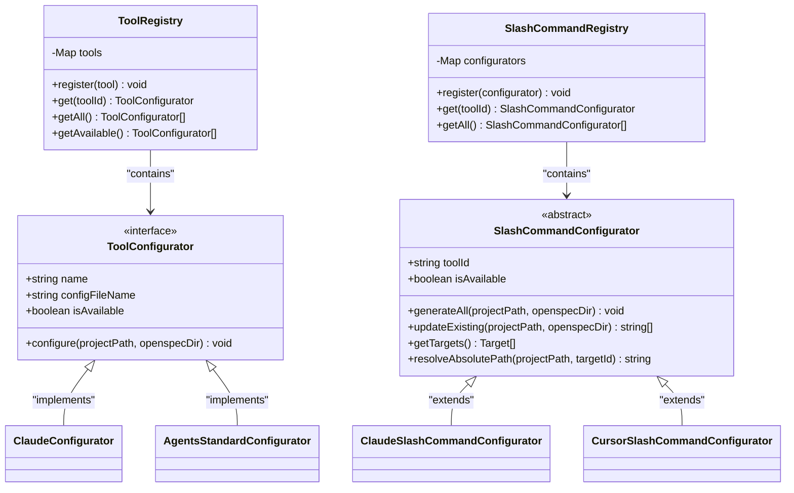
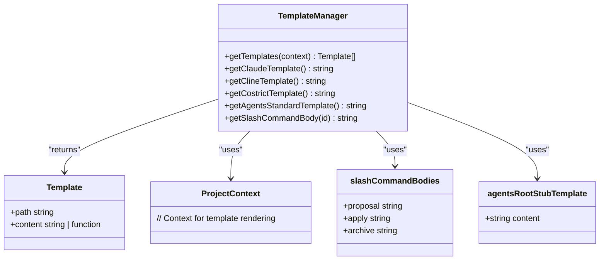

# AI Tool Integration

<cite>
**Referenced Files in This Document**   
- [src/core/configurators/registry.ts](file://src/core/configurators/registry.ts)
- [src/core/configurators/slash/registry.ts](file://src/core/configurators/slash/registry.ts)
- [src/core/init.ts](file://src/core/init.ts)
- [src/core/update.ts](file://src/core/update.ts)
- [src/core/configurators/base.ts](file://src/core/configurators/base.ts)
- [src/core/configurators/claude.ts](file://src/core/configurators/claude.ts)
- [src/core/configurators/slash/claude.ts](file://src/core/configurators/slash/claude.ts)
- [src/core/templates/index.ts](file://src/core/templates/index.ts)
- [src/core/templates/agents-root-stub.ts](file://src/core/templates/agents-root-stub.ts)
- [src/core/templates/slash-command-templates.ts](file://src/core/templates/slash-command-templates.ts)
- [src/core/config.ts](file://src/core/config.ts)
- [AGENTS.md](file://AGENTS.md)
</cite>

## Table of Contents
1. [Integration Approaches](#integration-approaches)
2. [Supported AI Tools](#supported-ai-tools)
3. [Configurator Registry Pattern](#configurator-registry-pattern)
4. [Template System](#template-system)
5. [Initialization Process](#initialization-process)
6. [Update Command](#update-command)
7. [Implementation Details](#implementation-details)
8. [Troubleshooting](#troubleshooting)
9. [Best Practices](#best-practices)

## Integration Approaches

OpenSpec supports two distinct integration approaches for AI coding assistants: native slash command support and AGENTS.md compatibility. The native slash command approach provides deep integration with specific AI tools through custom commands that streamline common workflows like creating proposals, applying changes, and archiving completed work. This approach is available for tools like Claude Code, Cursor, and GitHub Copilot, which support custom slash commands. The AGENTS.md compatibility approach provides a universal integration method that works with any AI assistant capable of reading markdown files, including tools like Amp and Jules. This approach centers around the AGENTS.md file, which contains comprehensive instructions for AI assistants working in the project.

The dual approach ensures broad compatibility while providing enhanced functionality for supported tools. AI assistants that support slash commands receive a more interactive experience with dedicated commands for key workflows, while all other assistants can still access the same core instructions through the AGENTS.md file. This design allows teams to use their preferred AI tools while maintaining consistent processes across the organization.

**Section sources**
- [src/core/configurators/registry.ts](file://src/core/configurators/registry.ts#L1-L47)
- [src/core/configurators/slash/registry.ts](file://src/core/configurators/slash/registry.ts#L1-L70)
- [AGENTS.md](file://AGENTS.md#L1-L19)

## Supported AI Tools

OpenSpec supports a wide range of AI coding assistants through its extensible integration system. The supported tools are categorized into two groups: those with native slash command support and those that use the universal AGENTS.md approach.

Tools with native slash command support include:
- Claude Code
- Cursor
- GitHub Copilot
- Amazon Q Developer
- Factory Droid
- Kilo Code
- Windsurf
- Codex
- Cline
- Crush
- Costrict
- Qwen Code
- Auggie
- OpenCode
- CodeBuddy Code

These tools receive custom slash commands that provide streamlined workflows for common tasks. The slash commands are implemented as markdown files in tool-specific directories with the appropriate file structure and formatting.

All AI assistants, including those without native support, can access instructions through the AGENTS.md file. This universal approach ensures that assistants like Amp and Jules can still follow project conventions and processes even without custom command support.

**Section sources**
- [src/core/config.ts](file://src/core/config.ts#L19-L37)
- [src/core/configurators/registry.ts](file://src/core/configurators/registry.ts#L10-L28)
- [src/core/configurators/slash/registry.ts](file://src/core/configurators/slash/registry.ts#L19-L55)

## Configurator Registry Pattern

OpenSpec employs a configurator registry pattern in src/core/configurators to enable extensibility and dynamic discovery of tool integrations. This pattern uses two registries: ToolRegistry for standard configuration files and SlashCommandRegistry for slash command integrations. Each registry maintains a map of tool configurators, allowing for dynamic registration and retrieval of integration implementations.

The ToolRegistry manages standard configuration files like CLAUDE.md and QODER.md, while the SlashCommandRegistry handles the generation of slash command files for supported tools. Both registries follow the same pattern: they maintain a private map of configurators, register instances during initialization, and provide methods to retrieve configurators by tool ID. This design enables easy extension of the system by simply adding new configurator classes and registering them in the appropriate registry.

The registry pattern provides several benefits:
- **Extensibility**: New tool integrations can be added without modifying existing code
- **Discoverability**: All available integrations are centrally registered and easily accessible
- **Consistency**: All integrations follow the same interface and lifecycle
- **Dynamic loading**: Integrations can be loaded and used based on project needs

This pattern allows OpenSpec to support a growing ecosystem of AI tools while maintaining a clean, maintainable codebase.

**Diagram sources**
- [src/core/configurators/base.ts](file://src/core/configurators/base.ts#L1-L6)
- [src/core/configurators/registry.ts](file://src/core/configurators/registry.ts#L10-L47)
- [src/core/configurators/slash/registry.ts](file://src/core/configurators/slash/registry.ts#L19-L70)

**Section sources**
- [src/core/configurators/base.ts](file://src/core/configurators/base.ts#L1-L6)
- [src/core/configurators/registry.ts](file://src/core/configurators/registry.ts#L10-L47)
- [src/core/configurators/slash/registry.ts](file://src/core/configurators/slash/registry.ts#L19-L70)

## Template System

OpenSpec's template system generates configuration files based on project context, supporting both slash command templates and agent instruction templates. The system is implemented in src/core/templates and provides a flexible way to generate tool-specific configuration files with the correct formatting and content.

The template system includes several key components:
- **TemplateManager**: The central class that coordinates template generation and provides methods to retrieve templates
- **Template files**: Individual template files for different tools and purposes (e.g., claude-template.ts, agents-template.ts)
- **Template functions**: Functions that generate dynamic content based on project context

For slash commands, the system uses the slash-command-templates.ts file to generate command bodies with standardized instructions for common workflows like creating proposals, applying changes, and archiving completed work. These templates include guardrails, step-by-step instructions, and reference information to ensure consistent behavior across different AI tools.

For agent instructions, the system uses the agents-root-stub.ts template to generate the universal AGENTS.md file. This template provides a consistent set of instructions that all AI assistants can follow, regardless of their specific capabilities.

The template system ensures that all generated files include OpenSpec markers (<!-- OPENSPEC:START --> and <!-- OPENSPEC:END -->) which allow the system to identify and update managed files during subsequent operations.

**Diagram sources**
- [src/core/templates/index.ts](file://src/core/templates/index.ts#L1-L51)
- [src/core/templates/slash-command-templates.ts](file://src/core/templates/slash-command-templates.ts#L1-L59)
- [src/core/templates/agents-root-stub.ts](file://src/core/templates/agents-root-stub.ts#L1-L17)

**Section sources**
- [src/core/templates/index.ts](file://src/core/templates/index.ts#L1-L51)
- [src/core/templates/slash-command-templates.ts](file://src/core/templates/slash-command-templates.ts#L1-L59)
- [src/core/templates/agents-root-stub.ts](file://src/core/templates/agents-root-stub.ts#L1-L17)

## Initialization Process

The 'openspec init' command prompts users to select AI tools with native support while ensuring all assistants can access instructions through the managed AGENTS.md file. The initialization process is implemented in src/core/init.ts and follows a structured workflow to set up the project for AI-assisted development.

When 'openspec init' is executed, it first checks if OpenSpec has already been initialized in the project. If not, it creates the necessary directory structure under the openspec/ directory, including specs/, changes/, and changes/archive/ subdirectories. It then displays an interactive wizard that allows users to select which AI tools they want to configure.

The wizard presents two categories of tools:
- Natively supported providers (with OpenSpec custom slash commands)
- Other tools (using Universal AGENTS.md)

Users can select one or more tools from the natively supported category, and the system will generate the appropriate configuration files and slash commands. The Universal AGENTS.md option is always available and selected by default, ensuring that all AI assistants can access the core instructions.

After the user makes their selections, the system creates the necessary files and directories, generates the selected configuration files, and sets up the slash commands for the chosen tools. The process concludes with a success message summarizing the configured tools and next steps.

**Section sources**
- [src/core/init.ts](file://src/core/init.ts#L376-L800)

## Update Command

The 'openspec update' command refreshes agent instructions when team members switch tools or when project conventions change. This command is implemented in src/core/update.ts and ensures that all AI assistants have access to the most current instructions and guidelines.

When 'openspec update' is executed, it performs several key operations:
1. Updates the AGENTS.md file with the latest instructions
2. Updates existing AI tool configuration files
3. Refreshes existing slash commands

The command first checks that the OpenSpec directory exists, then updates the AGENTS.md file with a full replacement of the content using the latest template. It then iterates through all registered configurators and updates any existing configuration files. For slash commands, it updates only the files that already exist, preserving any customizations while ensuring the core instructions are current.

The update process is designed to be safe and non-destructive. It only modifies files that are managed by OpenSpec (identified by the presence of OpenSpec markers) and preserves any user modifications outside the managed blocks. This allows teams to customize their AI tool configurations while still benefiting from updates to the core instructions.

The command provides detailed output about which files were updated, created, or failed to update, helping users understand the changes that were made.

**Section sources**
- [src/core/update.ts](file://src/core/update.ts#L8-L130)

## Implementation Details

The implementation of OpenSpec's AI tool integration is distributed across several key components in the src/core directory. The configurator classes handle the generation and management of tool-specific configuration files, while the template files define the content and structure of these files.

For example, the ClaudeConfigurator class (src/core/configurators/claude.ts) implements the ToolConfigurator interface and is responsible for generating the CLAUDE.md file. It uses the TemplateManager to retrieve the appropriate template and writes it to the project root with OpenSpec markers. Similarly, the ClaudeSlashCommandConfigurator class (src/core/configurators/slash/claude.ts) extends the SlashCommandConfigurator base class and defines the specific file paths and frontmatter for Claude's slash commands.

The template files handle tool-specific formatting requirements. For instance, the slash-command-templates.ts file defines the structure of slash commands with YAML frontmatter and standardized instruction sections. The agents-root-stub.ts template defines the universal AGENTS.md format that works across all AI assistants.

The system uses OpenSpec markers (<!-- OPENSPEC:START --> and <!-- OPENSPEC:END -->) to identify managed content within files. This allows the system to update instructions without overwriting user modifications. The file system utilities provide methods to read, write, and update files while preserving these markers.

**Section sources**
- [src/core/configurators/claude.ts](file://src/core/configurators/claude.ts#L7-L23)
- [src/core/configurators/slash/claude.ts](file://src/core/configurators/slash/claude.ts#L31-L43)
- [src/core/templates/claude-template.ts](file://src/core/templates/claude-template.ts#L1-L2)
- [src/core/config.ts](file://src/core/config.ts#L3-L6)

## Troubleshooting

When encountering issues with OpenSpec's AI tool integration, consider the following common problems and solutions:

**Permission errors**: If you receive permission errors when running 'openspec init' or 'openspec update', ensure that you have write permissions to the project directory. The system checks for write permissions before making any changes.

**Missing files**: If configuration files or slash commands are not being created, verify that the selected tools are available in the AI_TOOLS list and that their configurators are properly registered in the ToolRegistry or SlashCommandRegistry.

**Marker issues**: If managed content is not being updated, check that the files contain the correct OpenSpec markers (<!-- OPENSPEC:START --> and <!-- OPENSPEC:END -->). Files without these markers will not be recognized as managed files.

**Template problems**: If generated files have incorrect content, verify that the appropriate template files are being used and that they contain the expected content. The template system uses specific file paths and naming conventions to locate templates.

**Registry issues**: If a tool is not appearing in the initialization wizard, check that it is included in the AI_TOOLS array in src/core/config.ts and that its configurator is properly registered in the appropriate registry.

**File path issues**: If slash commands are not being created in the correct location, verify that the relative paths defined in the slash command configurators match the expected directory structure for the target tool.

**Section sources**
- [src/core/init.ts](file://src/core/init.ts#L462-L472)
- [src/core/update.ts](file://src/core/update.ts#L47-L66)
- [src/core/configurators/base.ts](file://src/core/configurators/base.ts#L1-L6)

## Best Practices

To maintain compatibility across different AI tools and ensure a smooth integration experience, follow these best practices:

**Consistent initialization**: Always use 'openspec init' to set up AI tool integrations rather than manually creating configuration files. This ensures that all files are created with the correct structure and markers.

**Regular updates**: Run 'openspec update' regularly, especially when project conventions change or when onboarding new team members. This ensures that all AI assistants have access to the latest instructions.

**Preserve markers**: Never remove or modify the OpenSpec markers (<!-- OPENSPEC:START --> and <!-- OPENSPEC:END -->) in configuration files. These markers are essential for the system to identify and update managed content.

**Use universal instructions**: Even when using tools with native slash command support, encourage team members to reference the AGENTS.md file for comprehensive guidance. This ensures consistency across different tools and team members.

**Test integrations**: After setting up or updating AI tool integrations, test the key workflows (proposal creation, change application, archiving) to ensure they are working as expected.

**Document customizations**: If you make customizations to AI tool configurations outside the managed blocks, document these changes so other team members understand the modifications.

**Keep dependencies updated**: Regularly update OpenSpec to benefit from new tool integrations, improved templates, and bug fixes.

**Section sources**
- [src/core/init.ts](file://src/core/init.ts#L385-L460)
- [src/core/update.ts](file://src/core/update.ts#L9-L130)
- [AGENTS.md](file://AGENTS.md#L1-L19)