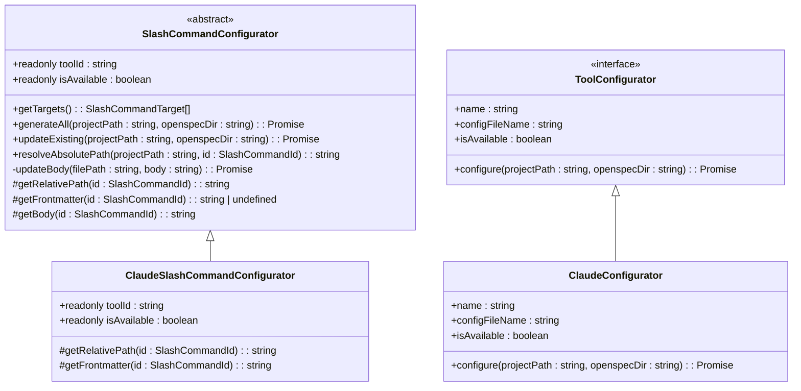
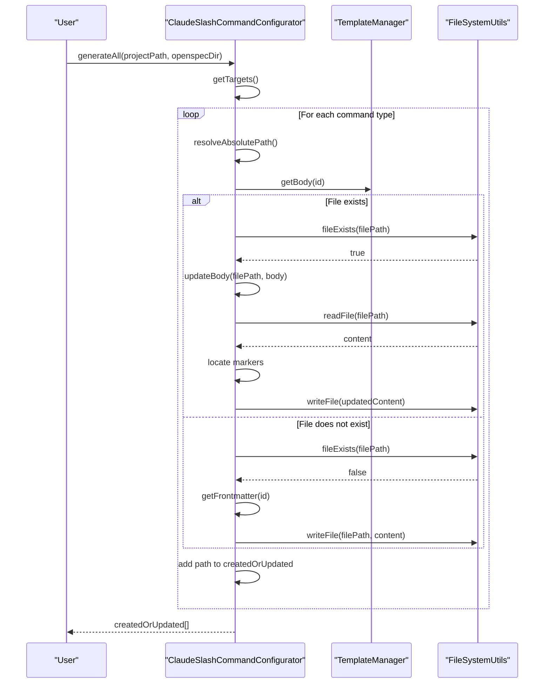
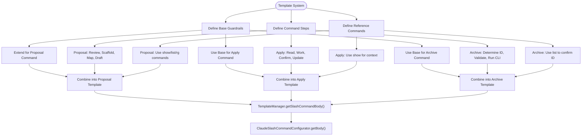

# Claude Integrations

<cite>
**Referenced Files in This Document**   
- [claude.ts](file://src/core/configurators/claude.ts)
- [slash-command-templates.ts](file://src/core/templates/slash-command-templates.ts)
- [claude.ts](file://src/core/configurators/slash/claude.ts)
- [claude-template.ts](file://src/core/templates/claude-template.ts)
- [base.ts](file://src/core/configurators/slash/base.ts)
- [index.ts](file://src/core/templates/index.ts)
- [config.ts](file://src/core/config.ts)
- [file-system.ts](file://src/utils/file-system.ts)
- [agents-root-stub.ts](file://src/core/templates/agents-root-stub.ts)
- [amazon-q.ts](file://src/core/configurators/slash/amazon-q.ts)
</cite>

## Table of Contents
1. [Introduction](#introduction)
2. [Claude Configurator Architecture](#claude-configurator-architecture)
3. [Slash Command Generation Process](#slash-command-generation-process)
4. [Template System for Claude Integration](#template-system-for-claude-integration)
5. [Context Window Management](#context-window-management)
6. [Message Formatting and Structure](#message-formatting-and-structure)
7. [Tool-Specific Constraints](#tool-specific-constraints)
8. [Practical Examples of Generated Commands](#practical-examples-of-generated-commands)
9. [Common Issues and Troubleshooting](#common-issues-and-troubleshooting)
10. [Version Compatibility Across Claude Implementations](#version-compatibility-across-claude-implementations)
11. [Best Practices for Command Effectiveness](#best-practices-for-command-effectiveness)

## Introduction
OpenSpec provides robust integration with Claude-based AI assistants, including Anthropic Claude, Amazon Q, and other Claude-derived tools. This documentation details the architecture and implementation of these integrations, focusing on how OpenSpec configures Claude-specific environments, generates slash commands, and manages the interaction between the development workflow and AI assistants. The system leverages a modular configurator pattern to support multiple AI tools while maintaining consistency in command structure and behavior.

**Section sources**
- [claude.ts](file://src/core/configurators/claude.ts#L1-L23)
- [amazon-q.ts](file://src/core/configurators/slash/amazon-q.ts#L1-L51)

## Claude Configurator Architecture
The Claude integration is built on a hierarchical configurator architecture that extends the base SlashConfigurator class. The `ClaudeSlashCommandConfigurator` class implements tool-specific configuration logic while inheriting core functionality from its parent class. This architecture enables consistent behavior across different AI tools while allowing for implementation-specific customizations.

The configurator system follows a clear inheritance pattern where the base `SlashCommandConfigurator` provides fundamental methods for command generation, file management, and template processing. Concrete implementations like `ClaudeSlashCommandConfigurator` override abstract methods to define tool-specific paths, frontmatter, and formatting requirements.

**Diagram sources**
- [base.ts](file://src/core/configurators/slash/base.ts#L13-L96)
- [claude.ts](file://src/core/configurators/slash/claude.ts#L31-L43)
- [claude.ts](file://src/core/configurators/claude.ts#L7-L23)

**Section sources**
- [base.ts](file://src/core/configurators/slash/base.ts#L13-L96)
- [claude.ts](file://src/core/configurators/slash/claude.ts#L1-L43)

## Slash Command Generation Process
The slash command generation process in OpenSpec follows a standardized workflow that ensures consistency across different AI tools. The `generateAll` method in the `SlashCommandConfigurator` base class orchestrates the creation of all supported slash commands by iterating through the available command types and processing each one according to the tool's specific configuration.

For Claude integrations, the process begins with the `ClaudeSlashCommandConfigurator` defining the appropriate file paths and frontmatter for each command type. The system then generates the complete command content by combining the frontmatter with the body content retrieved from the template system. The body content is generated using the `getSlashCommandBody` function, which assembles guardrails, steps, and reference information specific to each command type.

The file creation process uses OpenSpec's marker-based system to ensure that generated content can be safely updated in subsequent runs without overwriting user modifications. The `updateFileWithMarkers` utility function handles this process by locating the start and end markers in the target file and replacing only the content between them.

**Diagram sources**
- [base.ts](file://src/core/configurators/slash/base.ts#L25-L49)
- [file-system.ts](file://src/utils/file-system.ts#L129-L165)
- [index.ts](file://src/core/templates/index.ts#L44-L46)

**Section sources**
- [base.ts](file://src/core/configurators/slash/base.ts#L25-L49)
- [file-system.ts](file://src/utils/file-system.ts#L129-L165)

## Template System for Claude Integration
The template system in OpenSpec provides a structured approach to defining the content and format of Claude-specific commands. The `slash-command-templates.ts` file contains the core templates for all slash commands, organized by command type (proposal, apply, archive). Each template consists of three main components: guardrails, steps, and reference information.

The guardrails establish the fundamental principles that Claude should follow when executing commands, such as favoring minimal implementations and keeping changes scoped. The steps section provides a detailed, ordered sequence of actions that Claude should perform, with specific instructions for each phase of the workflow. The reference section includes utility commands and techniques that Claude can use to gather additional context or validate its work.

The template system is designed to be extensible, allowing for the addition of new command types or modifications to existing ones without requiring changes to the core configurator logic. Templates are accessed through the `TemplateManager` class, which provides a clean interface for retrieving command bodies by ID.

**Diagram sources**
- [slash-command-templates.ts](file://src/core/templates/slash-command-templates.ts#L1-L59)
- [index.ts](file://src/core/templates/index.ts#L44-L46)

**Section sources**
- [slash-command-templates.ts](file://src/core/templates/slash-command-templates.ts#L1-L59)
- [index.ts](file://src/core/templates/index.ts#L44-L46)

## Context Window Management
OpenSpec's Claude integration employs several strategies to manage context window limitations effectively. The system uses a marker-based approach to separate generated content from user modifications, allowing for targeted updates that minimize the amount of data that needs to be processed in each interaction.

The template design follows a hierarchical structure that prioritizes essential information at the beginning of each command, ensuring that critical instructions are processed even if the context window is constrained. Guardrails are placed at the top of each command template, followed by steps and reference information in descending order of importance.

For longer commands, the system leverages Claude's ability to reference external files and execute shell commands to gather additional context as needed. The templates include specific instructions for using OpenSpec CLI commands like `openspec show`, `openspec list`, and `rg` to retrieve information on demand rather than including it all in the initial prompt.

The file structure also contributes to context management by organizing commands in a dedicated directory structure (.claude/commands/openspec/) that can be easily referenced and navigated. This organization reduces the cognitive load on the AI assistant by providing a predictable location for command definitions.

**Section sources**
- [slash-command-templates.ts](file://src/core/templates/slash-command-templates.ts#L3-L48)
- [file-system.ts](file://src/utils/file-system.ts#L129-L165)

## Message Formatting and Structure
The message formatting system in OpenSpec's Claude integration follows a consistent structure that enhances readability and ensures proper parsing by the AI assistant. Each slash command follows a standardized format that includes frontmatter, guardrails, steps, and reference sections, separated by clear visual dividers.

The frontmatter section uses YAML syntax to define metadata about the command, including its name, description, category, and tags. This structured format allows Claude to quickly identify the purpose and context of each command. The guardrails section uses bold headers and bullet points to emphasize important principles that should guide the assistant's behavior.

The steps section employs a numbered list format to provide a clear sequence of actions, with each step containing specific, actionable instructions. For complex steps, the system uses nested bullet points to break down the task into smaller components. The reference section includes code blocks and command examples to demonstrate how to use various tools and commands effectively.

The system also uses consistent marker patterns (<!-- OPENSPEC:START --> and <!-- OPENSPEC:END -->) to delineate generated content within files, allowing for safe updates without affecting user-added content. This approach ensures that the message structure remains intact across multiple generations and modifications.

**Section sources**
- [slash-command-templates.ts](file://src/core/templates/slash-command-templates.ts#L3-L48)
- [claude.ts](file://src/core/configurators/slash/claude.ts#L10-L29)

## Tool-Specific Constraints
The Claude integration in OpenSpec addresses several tool-specific constraints through careful design and implementation choices. One key constraint is the requirement for Claude to operate within specific directory structures and file naming conventions. The `ClaudeSlashCommandConfigurator` defines these requirements through the `FILE_PATHS` constant, which maps each command type to its appropriate location within the .claude/commands/openspec/ directory.

Another constraint is the need to handle different versions of Claude-based tools consistently. The configurator system uses a registry pattern to manage tool availability and capabilities, with the `AI_TOOLS` constant in config.ts defining the supported tools and their properties. This allows the system to adapt to different Claude implementations while maintaining a consistent interface.

The integration also addresses constraints related to command execution and validation. The templates include specific instructions for using the OpenSpec CLI to validate changes and confirm completion, ensuring that actions are properly verified before being considered complete. The system also includes error handling for cases where markers are missing or improperly formatted, providing clear error messages to help diagnose issues.

**Section sources**
- [claude.ts](file://src/core/configurators/slash/claude.ts#L4-L8)
- [config.ts](file://src/core/config.ts#L19-L37)

## Practical Examples of Generated Commands
The OpenSpec Claude integration generates several types of slash commands, each with a specific purpose and structure. The proposal command is designed to help Claude create new change proposals by following a structured workflow that includes reviewing project context, scaffolding change files, mapping requirements, and validating the proposal.

The apply command guides Claude through the implementation of approved changes, with steps that emphasize reading the proposal and design documents, working through tasks sequentially, and updating completion status. The archive command provides a process for retiring completed changes by identifying the change ID, validating its status, and running the appropriate CLI command.

Each command is generated in a specific location within the project structure. The proposal command is created at .claude/commands/openspec/proposal.md, the apply command at .claude/commands/openspec/apply.md, and the archive command at .claude/commands/openspec/archive.md. These files contain the complete instructions needed for Claude to perform each task, including metadata in the frontmatter section and detailed steps in the body.

**Section sources**
- [claude.ts](file://src/core/configurators/slash/claude.ts#L5-L8)
- [slash-command-templates.ts](file://src/core/templates/slash-command-templates.ts#L50-L54)

## Common Issues and Troubleshooting
Several common issues can arise when using OpenSpec's Claude integration, primarily related to file system operations and configuration management. One frequent issue is the "Missing OpenSpec markers" error, which occurs when the updateBody method cannot find the required start and end markers in a target file. This typically happens when a file has been manually edited or corrupted, and can be resolved by ensuring the markers are present and properly formatted.

Another common issue is command registration failures, which can occur when the target directory structure does not exist or when there are permission issues preventing file creation. The system addresses this through the FileSystemUtils class, which includes methods for creating directories recursively and checking write permissions before attempting file operations.

Prompt overflow issues can occur when the generated command content exceeds Claude's context window limitations. The system mitigates this by structuring templates to prioritize essential information and by including instructions for retrieving additional context on demand through CLI commands.

Configuration conflicts can arise when multiple AI tools are configured simultaneously, potentially leading to conflicting instructions. The system handles this through the AI_TOOLS registry, which ensures that each tool is properly identified and configured according to its specific requirements.

**Section sources**
- [base.ts](file://src/core/configurators/slash/base.ts#L80-L94)
- [file-system.ts](file://src/utils/file-system.ts#L144-L159)

## Version Compatibility Across Claude Implementations
OpenSpec's architecture supports version compatibility across different Claude implementations through a modular configurator system. Each Claude-based tool, such as Anthropic Claude and Amazon Q, has its own configurator class that implements the same interface but with tool-specific configurations.

The `ClaudeSlashCommandConfigurator` and `AmazonQSlashCommandConfigurator` classes demonstrate this approach, sharing the same base functionality while defining different file paths and frontmatter formats appropriate to each tool. This design allows OpenSpec to support multiple versions and variants of Claude-based assistants without requiring changes to the core system.

The template system also contributes to version compatibility by providing a stable interface for command content. While the file locations and metadata formats may vary between implementations, the core command templates remain consistent, ensuring that the fundamental behavior and workflow are preserved across different versions.

The AI_TOOLS registry in config.ts provides a centralized location for managing tool availability and properties, making it easy to add support for new Claude implementations or deprecate older ones. Each tool is identified by a unique value that corresponds to its configurator, allowing the system to dynamically load and configure the appropriate components.

**Section sources**
- [claude.ts](file://src/core/configurators/slash/claude.ts#L1-L43)
- [amazon-q.ts](file://src/core/configurators/slash/amazon-q.ts#L1-L51)
- [config.ts](file://src/core/config.ts#L19-L37)

## Best Practices for Command Effectiveness
To maximize the effectiveness of Claude commands within the OpenSpec framework, several best practices should be followed. First, maintain clear separation between generated and user-modified content by preserving the OpenSpec markers in all configuration files. This ensures that updates can be applied safely without overwriting customizations.

Second, keep command templates focused and concise, prioritizing essential instructions at the beginning where they are less likely to be truncated by context window limitations. Use the guardrails section to establish fundamental principles, followed by specific steps and reference information.

Third, leverage the built-in validation and verification commands included in the templates. Encourage Claude to use `openspec validate`, `openspec show`, and `rg` commands to verify its understanding and confirm completion of tasks, rather than relying solely on assumptions.

Fourth, organize project structure consistently to make it easier for Claude to navigate and understand the codebase. Follow the OpenSpec conventions for change management, specification storage, and task tracking to ensure that Claude can effectively participate in the development workflow.

Finally, regularly update the AGENTS.md file and other project documentation to ensure that Claude has access to the most current information about project conventions, architecture, and requirements. This reduces ambiguity and helps prevent errors caused by outdated assumptions.

**Section sources**
- [slash-command-templates.ts](file://src/core/templates/slash-command-templates.ts#L1-L59)
- [agents-root-stub.ts](file://src/core/templates/agents-root-stub.ts#L1-L17)
- [claude.ts](file://src/core/configurators/claude.ts#L12-L22)