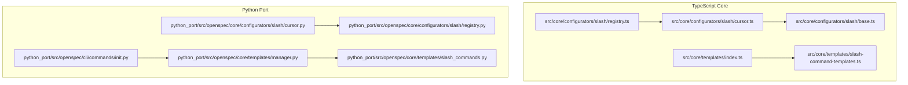
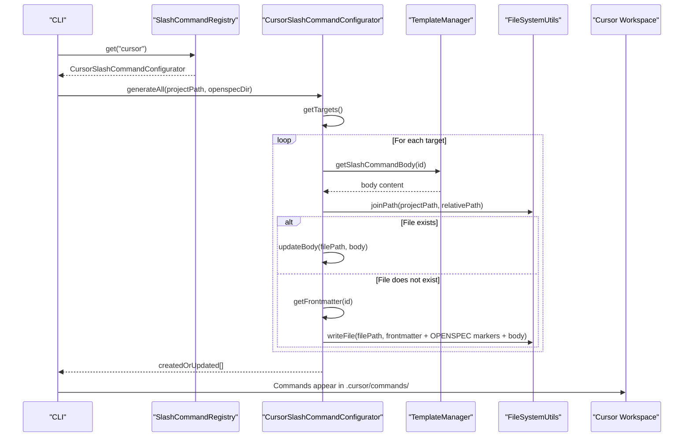
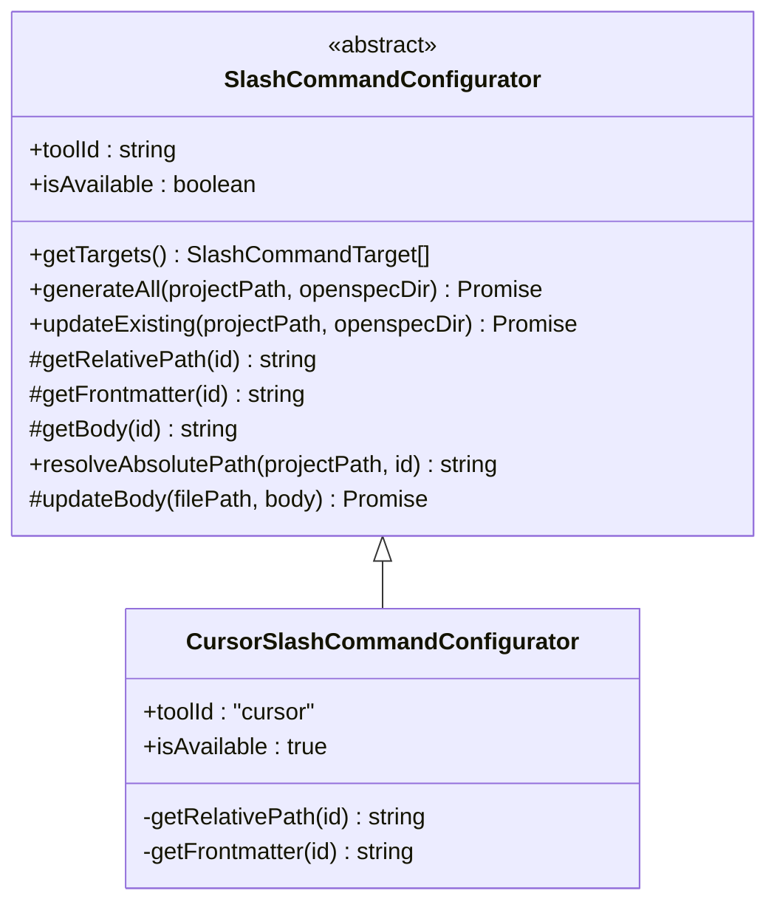
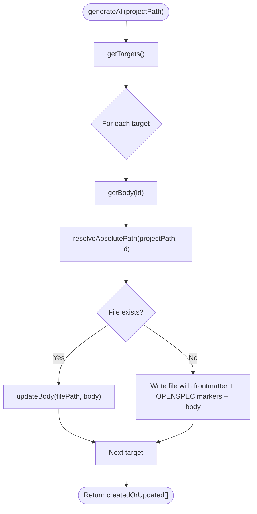
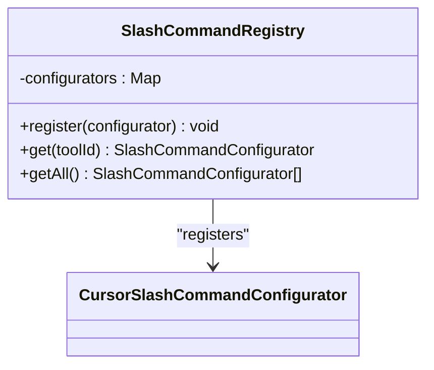
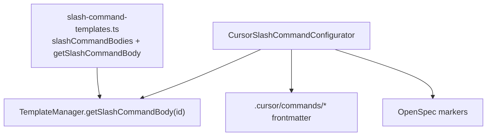
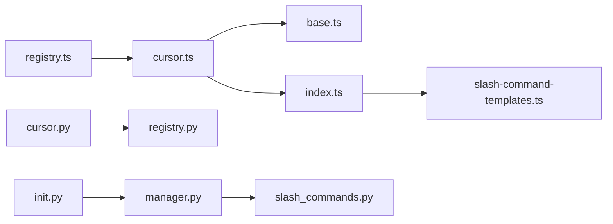

# Cursor Integration

<cite>
**Referenced Files in This Document**
- [cursor.ts](file://src/core/configurators/slash/cursor.ts)
- [base.ts](file://src/core/configurators/slash/base.ts)
- [registry.ts](file://src/core/configurators/slash/registry.ts)
- [slash-command-templates.ts](file://src/core/templates/slash-command-templates.ts)
- [index.ts](file://src/core/templates/index.ts)
- [manager.py](file://python_port/src/openspec/core/templates/manager.py)
- [slash_commands.py](file://python_port/src/openspec/core/templates/slash_commands.py)
- [cursor.py](file://python_port/src/openspec/core/configurators/slash/cursor.py)
- [init.py](file://python_port/src/openspec/cli/commands/init.py)
- [update.test.ts](file://test/core/update.test.ts)
- [init.test.ts](file://test/core/init.test.ts)
- [update.ts](file://src/core/update.ts)
- [index.ts](file://src/cli/index.ts)
</cite>

## Table of Contents
1. [Introduction](#introduction)
2. [Project Structure](#project-structure)
3. [Core Components](#core-components)
4. [Architecture Overview](#architecture-overview)
5. [Detailed Component Analysis](#detailed-component-analysis)
6. [Dependency Analysis](#dependency-analysis)
7. [Performance Considerations](#performance-considerations)
8. [Troubleshooting Guide](#troubleshooting-guide)
9. [Conclusion](#conclusion)
10. [Appendices](#appendices)

## Introduction
This document explains how OpenSpec integrates with Cursor AI to provide Cursor-specific slash commands. It details how the Cursor configurator implements the SlashConfigurator interface, how Cursor’s command format is structured, and how OpenSpec’s templates drive specification-driven development within Cursor’s IDE environment. It also covers common workflows (proposal, apply, archive), troubleshooting steps for typical issues, and best practices for maximizing Cursor’s AI capabilities through OpenSpec.

## Project Structure
OpenSpec provides a TypeScript core and a Python port. The Cursor integration lives in the TypeScript core under the slash configurators and templates subsystems. The Python port mirrors the same patterns for parity.

**Diagram sources**
- [cursor.ts](file://src/core/configurators/slash/cursor.ts#L1-L42)
- [base.ts](file://src/core/configurators/slash/base.ts#L1-L96)
- [registry.ts](file://src/core/configurators/slash/registry.ts#L1-L70)
- [slash-command-templates.ts](file://src/core/templates/slash-command-templates.ts#L1-L59)
- [index.ts](file://src/core/templates/index.ts#L1-L51)
- [cursor.py](file://python_port/src/openspec/core/configurators/slash/cursor.py#L1-L39)
- [registry.py](file://python_port/src/openspec/core/configurators/slash/registry.py#L1-L45)
- [manager.py](file://python_port/src/openspec/core/templates/manager.py#L1-L160)
- [slash_commands.py](file://python_port/src/openspec/core/templates/slash_commands.py#L1-L69)
- [init.py](file://python_port/src/openspec/cli/commands/init.py#L277-L309)

**Section sources**
- [cursor.ts](file://src/core/configurators/slash/cursor.ts#L1-L42)
- [base.ts](file://src/core/configurators/slash/base.ts#L1-L96)
- [registry.ts](file://src/core/configurators/slash/registry.ts#L1-L70)
- [slash-command-templates.ts](file://src/core/templates/slash-command-templates.ts#L1-L59)
- [index.ts](file://src/core/templates/index.ts#L1-L51)
- [cursor.py](file://python_port/src/openspec/core/configurators/slash/cursor.py#L1-L39)
- [registry.py](file://python_port/src/openspec/core/configurators/slash/registry.py#L1-L45)
- [manager.py](file://python_port/src/openspec/core/templates/manager.py#L1-L160)
- [slash_commands.py](file://python_port/src/openspec/core/templates/slash_commands.py#L1-L69)
- [init.py](file://python_port/src/openspec/cli/commands/init.py#L277-L309)

## Core Components
- CursorSlashCommandConfigurator: Implements the SlashConfigurator interface for Cursor, defining file paths and frontmatter for each slash command.
- SlashCommandConfigurator base: Provides the shared generation and update logic, including OpenSpec markers and file creation/update semantics.
- SlashCommandRegistry: Registers all tool-specific configurators, including Cursor.
- TemplateManager and slash-command-templates: Provide the shared command bodies used by all tools, including Cursor.
- Python port counterparts: Mirror the TypeScript logic for environments using the Python port.

Key responsibilities:
- Define Cursor-specific file paths and frontmatter.
- Generate or refresh Cursor slash command files with OpenSpec-managed markers.
- Use shared templates to keep command content consistent across tools.

**Section sources**
- [cursor.ts](file://src/core/configurators/slash/cursor.ts#L1-L42)
- [base.ts](file://src/core/configurators/slash/base.ts#L1-L96)
- [registry.ts](file://src/core/configurators/slash/registry.ts#L1-L70)
- [slash-command-templates.ts](file://src/core/templates/slash-command-templates.ts#L1-L59)
- [index.ts](file://src/core/templates/index.ts#L1-L51)

## Architecture Overview
The Cursor integration follows a layered architecture:
- Configurator layer: Tool-specific configurators implement the base interface to define target files and frontmatter.
- Template layer: Shared templates provide command bodies.
- Generation layer: Base configurator handles file creation and updates with OpenSpec markers.
- Registry layer: Centralized tool registration.

**Diagram sources**
- [registry.ts](file://src/core/configurators/slash/registry.ts#L1-L70)
- [cursor.ts](file://src/core/configurators/slash/cursor.ts#L1-L42)
- [base.ts](file://src/core/configurators/slash/base.ts#L1-L96)
- [index.ts](file://src/core/templates/index.ts#L1-L51)

## Detailed Component Analysis

### CursorSlashCommandConfigurator
- Purpose: Defines Cursor-specific slash command targets and frontmatter.
- Implementation highlights:
  - toolId: "cursor"
  - isAvailable: true
  - getRelativePath(id): Maps each command id to a Cursor-specific path under .cursor/commands/.
  - getFrontmatter(id): Supplies YAML frontmatter with name/id/category/description for Cursor’s slash command discovery.

**Diagram sources**
- [base.ts](file://src/core/configurators/slash/base.ts#L1-L96)
- [cursor.ts](file://src/core/configurators/slash/cursor.ts#L1-L42)

**Section sources**
- [cursor.ts](file://src/core/configurators/slash/cursor.ts#L1-L42)

### SlashCommandConfigurator Base
- Responsibilities:
  - getTargets(): Enumerates all command ids and computes relative paths.
  - generateAll(): Creates files if absent; otherwise updates bodies within OpenSpec markers.
  - updateExisting(): Refreshes existing files for a given tool.
  - updateBody(): Replaces content between OpenSpec markers, throwing if markers are missing.
  - resolveAbsolutePath(): Computes absolute paths for targets.

**Diagram sources**
- [base.ts](file://src/core/configurators/slash/base.ts#L1-L96)

**Section sources**
- [base.ts](file://src/core/configurators/slash/base.ts#L1-L96)

### SlashCommandRegistry
- Registers all tool-specific configurators, including Cursor.
- Provides get(toolId) and getAll() for runtime selection.

**Diagram sources**
- [registry.ts](file://src/core/configurators/slash/registry.ts#L1-L70)

**Section sources**
- [registry.ts](file://src/core/configurators/slash/registry.ts#L1-L70)

### Cursor Command Format and Templates
- Command ids: proposal, apply, archive.
- Frontmatter for Cursor:
  - name: /openspec-<command>
  - id: openspec-<command>
  - category: OpenSpec
  - description: Tool-specific description per command.
- Paths:
  - .cursor/commands/openspec-proposal.md
  - .cursor/commands/openspec-apply.md
  - .cursor/commands/openspec-archive.md
- Template bodies:
  - Shared across tools via TemplateManager.getSlashCommandBody(id).
  - Composed from guardrails, steps, and references sections.

**Diagram sources**
- [slash-command-templates.ts](file://src/core/templates/slash-command-templates.ts#L1-L59)
- [index.ts](file://src/core/templates/index.ts#L1-L51)
- [cursor.ts](file://src/core/configurators/slash/cursor.ts#L1-L42)

**Section sources**
- [slash-command-templates.ts](file://src/core/templates/slash-command-templates.ts#L1-L59)
- [index.ts](file://src/core/templates/index.ts#L1-L51)
- [cursor.ts](file://src/core/configurators/slash/cursor.ts#L1-L42)

### Python Port Parity
- CursorSlashCommandConfigurator (Python) mirrors the TypeScript counterpart:
  - tool_id = "cursor"
  - _FILE_PATHS and _FRONTMATTER define paths and frontmatter.
  - get_relative_path and get_frontmatter methods.
- TemplateManager (Python) reads TypeScript templates dynamically and falls back to Python templates if needed.
- CLI init creates Cursor slash commands with frontmatter and OpenSpec markers.

**Section sources**
- [cursor.py](file://python_port/src/openspec/core/configurators/slash/cursor.py#L1-L39)
- [manager.py](file://python_port/src/openspec/core/templates/manager.py#L1-L160)
- [slash_commands.py](file://python_port/src/openspec/core/templates/slash_commands.py#L1-L69)
- [init.py](file://python_port/src/openspec/cli/commands/init.py#L277-L309)

## Dependency Analysis
- CursorSlashCommandConfigurator depends on:
  - SlashCommandConfigurator base for generation/update logic.
  - TemplateManager for command body retrieval.
  - FileSystemUtils for file operations.
- Registry centralizes tool selection and ensures Cursor is discoverable.
- TemplateManager bridges TypeScript and Python ports for shared templates.

**Diagram sources**
- [cursor.ts](file://src/core/configurators/slash/cursor.ts#L1-L42)
- [base.ts](file://src/core/configurators/slash/base.ts#L1-L96)
- [index.ts](file://src/core/templates/index.ts#L1-L51)
- [slash-command-templates.ts](file://src/core/templates/slash-command-templates.ts#L1-L59)
- [registry.ts](file://src/core/configurators/slash/registry.ts#L1-L70)
- [cursor.py](file://python_port/src/openspec/core/configurators/slash/cursor.py#L1-L39)
- [registry.py](file://python_port/src/openspec/core/configurators/slash/registry.py#L1-L45)
- [manager.py](file://python_port/src/openspec/core/templates/manager.py#L1-L160)
- [slash_commands.py](file://python_port/src/openspec/core/templates/slash_commands.py#L1-L69)
- [init.py](file://python_port/src/openspec/cli/commands/init.py#L277-L309)

**Section sources**
- [cursor.ts](file://src/core/configurators/slash/cursor.ts#L1-L42)
- [base.ts](file://src/core/configurators/slash/base.ts#L1-L96)
- [registry.ts](file://src/core/configurators/slash/registry.ts#L1-L70)
- [index.ts](file://src/core/templates/index.ts#L1-L51)
- [slash-command-templates.ts](file://src/core/templates/slash-command-templates.ts#L1-L59)
- [cursor.py](file://python_port/src/openspec/core/configurators/slash/cursor.py#L1-L39)
- [registry.py](file://python_port/src/openspec/core/configurators/slash/registry.py#L1-L45)
- [manager.py](file://python_port/src/openspec/core/templates/manager.py#L1-L160)
- [slash_commands.py](file://python_port/src/openspec/core/templates/slash_commands.py#L1-L69)
- [init.py](file://python_port/src/openspec/cli/commands/init.py#L277-L309)

## Performance Considerations
- File I/O is linear in the number of commands (constant 3 for Cursor).
- Template extraction in the Python port reads and parses TypeScript templates once per command; caching is implicit via process lifetime.
- Generation and update operations are lightweight; avoid frequent repeated writes by batching updates.

[No sources needed since this section provides general guidance]

## Troubleshooting Guide

Common issues and resolutions:
- Command registration failures
  - Symptom: Cursor commands not appearing in the registry.
  - Resolution: Ensure CursorSlashCommandConfigurator is registered in SlashCommandRegistry and that the toolId matches "cursor".
  - Evidence: Registry static initialization registers Cursor; tests verify availability.

- Incorrect template rendering
  - Symptom: Generated files lack expected sections or markers.
  - Resolution: Verify TemplateManager.getSlashCommandBody(id) returns content; ensure frontmatter and OpenSpec markers are included.
  - Evidence: Base configurator writes frontmatter and markers around the body.

- Synchronization problems between OpenSpec changes and Cursor workspace
  - Symptom: Outdated commands after openspec update.
  - Resolution: Use openspec update to refresh existing files; the base configurator updates bodies within markers.
  - Evidence: Update command logs updated slash commands; tests assert refresh behavior.

- Missing OpenSpec markers
  - Symptom: Error indicating missing markers when updating.
  - Resolution: Ensure files were created with markers; regeneration will create them; avoid manual edits outside markers.

- Cursor workspace discovery
  - Symptom: Commands not visible in Cursor.
  - Resolution: Confirm files are placed under .cursor/commands/ with correct frontmatter; Cursor scans this directory for slash commands.

Validation references:
- Cursor command creation and frontmatter presence are validated in tests.
- Update behavior and logging of refreshed slash commands are verified.

**Section sources**
- [registry.ts](file://src/core/configurators/slash/registry.ts#L1-L70)
- [base.ts](file://src/core/configurators/slash/base.ts#L1-L96)
- [update.test.ts](file://test/core/update.test.ts#L341-L373)
- [init.test.ts](file://test/core/init.test.ts#L273-L304)
- [update.ts](file://src/core/update.ts#L110-L129)

## Conclusion
OpenSpec’s Cursor integration leverages a clean configurator pattern with shared templates to produce Cursor-specific slash commands. The CursorSlashCommandConfigurator defines tool-specific paths and frontmatter, while the base configurator manages file creation and updates with OpenSpec markers. The Python port maintains parity for environments using the Python CLI. By following best practices and troubleshooting steps outlined above, teams can maximize Cursor’s AI capabilities through specification-driven development workflows.

[No sources needed since this section summarizes without analyzing specific files]

## Appendices

### Example Workflows and Generated Commands
- Proposal workflow
  - Command id: proposal
  - Cursor path: .cursor/commands/openspec-proposal.md
  - Frontmatter includes name, id, category, description.
  - Body includes guardrails, steps, and references tailored for proposal scaffolding.

- Apply workflow
  - Command id: apply
  - Cursor path: .cursor/commands/openspec-apply.md
  - Frontmatter includes name, id, category, description.
  - Body includes guardrails, steps, and references tailored for implementation.

- Archive workflow
  - Command id: archive
  - Cursor path: .cursor/commands/openspec-archive.md
  - Frontmatter includes name, id, category, description.
  - Body includes guardrails, steps, and references tailored for archiving.

These commands are generated consistently across tools using shared templates, ensuring uniform behavior and guidance.

**Section sources**
- [cursor.ts](file://src/core/configurators/slash/cursor.ts#L1-L42)
- [slash-command-templates.ts](file://src/core/templates/slash-command-templates.ts#L1-L59)
- [index.ts](file://src/core/templates/index.ts#L1-L51)
- [init.test.ts](file://test/core/init.test.ts#L273-L304)

### Best Practices for Cursor Integration
- Keep OpenSpec markers intact when editing command files manually.
- Use openspec update to refresh commands after template changes.
- Verify Cursor workspace paths (.cursor/commands/) and frontmatter fields.
- Align team workflows with the shared templates to ensure consistent AI guidance.

[No sources needed since this section provides general guidance]