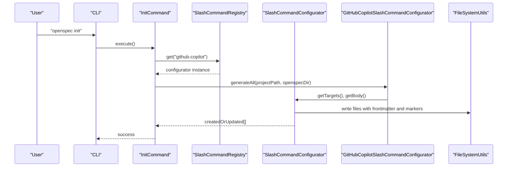
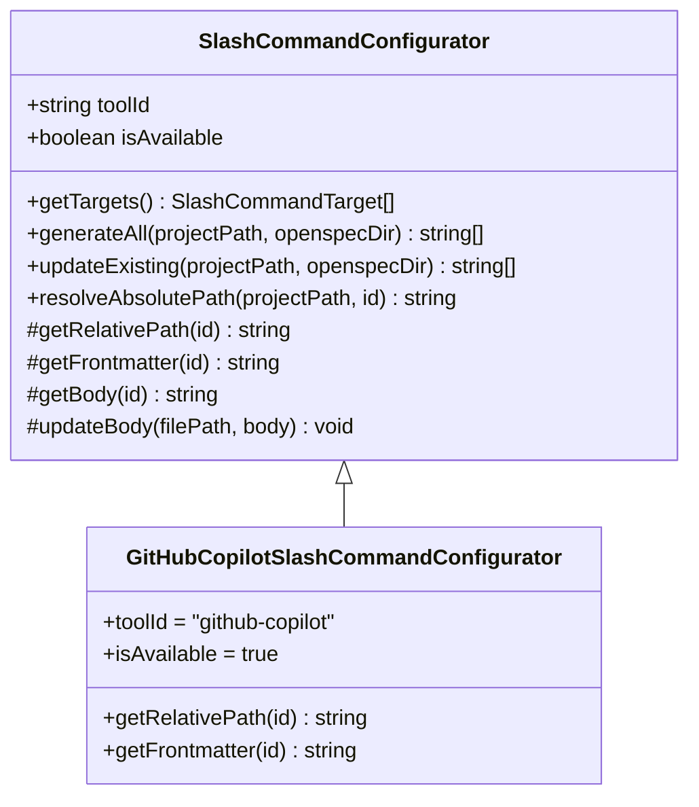
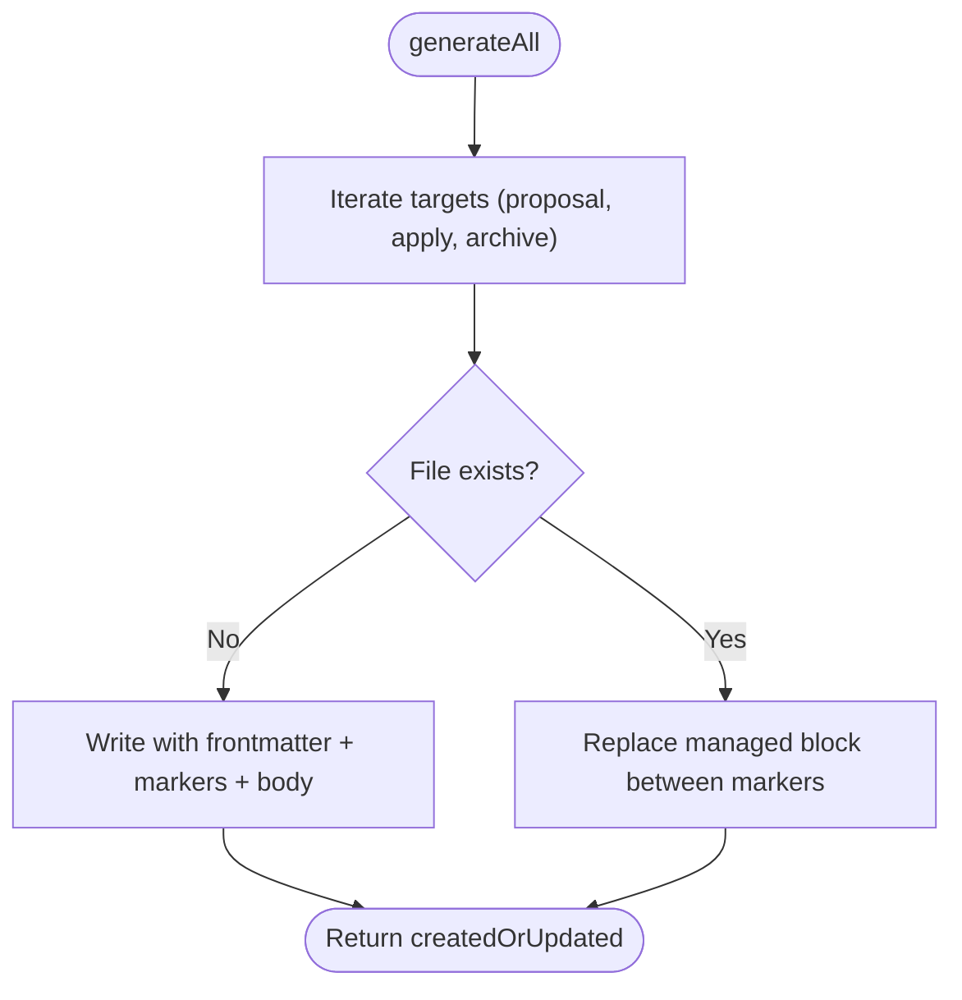
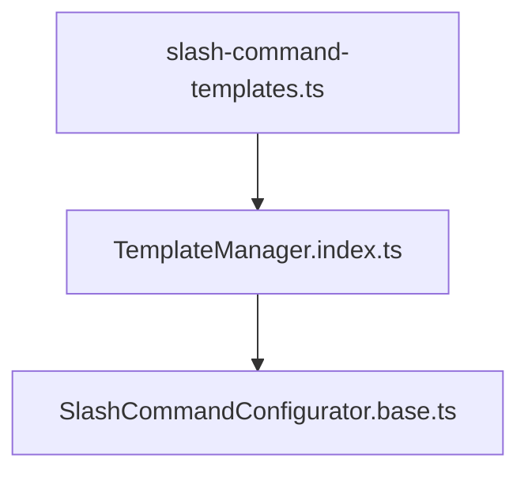
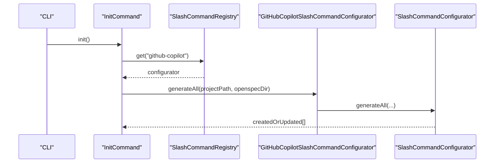
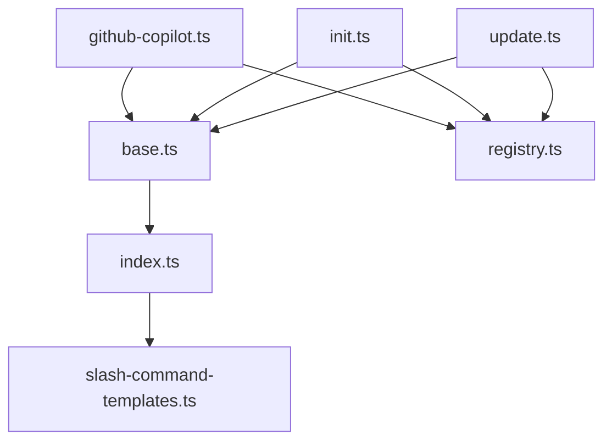

# GitHub Copilot Integration

<cite>
**Referenced Files in This Document**
- [github-copilot.ts](file://src/core/configurators/slash/github-copilot.ts)
- [base.ts](file://src/core/configurators/slash/base.ts)
- [registry.ts](file://src/core/configurators/slash/registry.ts)
- [slash-command-templates.ts](file://src/core/templates/slash-command-templates.ts)
- [index.ts](file://src/core/templates/index.ts)
- [config.ts](file://src/core/config.ts)
- [init.ts](file://src/core/init.ts)
- [update.ts](file://src/core/update.ts)
- [cli/index.ts](file://src/cli/index.ts)
- [proposal.md](file://openspec/changes/archive/2025-10-14-add-github-copilot-prompts/proposal.md)
- [tasks.md](file://openspec/changes/archive/2025-10-14-add-github-copilot-prompts/tasks.md)
- [init.test.ts](file://test/core/init.test.ts)
</cite>

## Table of Contents
1. [Introduction](#introduction)
2. [Project Structure](#project-structure)
3. [Core Components](#core-components)
4. [Architecture Overview](#architecture-overview)
5. [Detailed Component Analysis](#detailed-component-analysis)
6. [Dependency Analysis](#dependency-analysis)
7. [Performance Considerations](#performance-considerations)
8. [Troubleshooting Guide](#troubleshooting-guide)
9. [Conclusion](#conclusion)
10. [Appendices](#appendices)

## Introduction
This document explains how OpenSpec integrates with GitHub Copilot to generate Copilot-specific slash commands that align with OpenSpec’s workflow. It covers how the GitHub Copilot configurator extends the base slash command configurator, how Copilot’s prompt syntax and context requirements are satisfied, and how the integration leverages Copilot’s codebase awareness and suggestion capabilities. It also provides examples of generated commands, addresses common integration challenges, and outlines best practices for structuring specifications to maximize Copilot’s effectiveness while maintaining security compliance.

## Project Structure
The Copilot integration lives in the slash command configurator layer and template layer, and is wired into the CLI initialization and update flows. The key files are:
- Configurator: defines Copilot-specific paths and frontmatter
- Base configurator: shared generation/update logic
- Registry: registers the Copilot configurator
- Templates: shared command bodies and template manager
- CLI: init and update commands orchestrate generation and refresh
- Tests: verify prompt creation and refresh behavior

```mermaid
graph TB
subgraph "Slash Command Configurators"
Base["SlashCommandConfigurator<br/>base.ts"]
Copilot["GitHubCopilotSlashCommandConfigurator<br/>github-copilot.ts"]
Reg["SlashCommandRegistry<br/>registry.ts"]
end
subgraph "Templates"
TmplMgr["TemplateManager<br/>index.ts"]
Tmpl["Slash Command Templates<br/>slash-command-templates.ts"]
end
subgraph "CLI"
Init["InitCommand<br/>init.ts"]
Update["UpdateCommand<br/>update.ts"]
CLI["CLI Commands<br/>cli/index.ts"]
end
Base --> Copilot
Reg --> Copilot
TmplMgr --> Tmpl
Init --> Reg
Init --> Base
Update --> Reg
Update --> Base
CLI --> Init
CLI --> Update
```

**Diagram sources**
- [github-copilot.ts](file://src/core/configurators/slash/github-copilot.ts#L1-L39)
- [base.ts](file://src/core/configurators/slash/base.ts#L1-L96)
- [registry.ts](file://src/core/configurators/slash/registry.ts#L1-L69)
- [slash-command-templates.ts](file://src/core/templates/slash-command-templates.ts#L1-L59)
- [index.ts](file://src/core/templates/index.ts#L1-L51)
- [init.ts](file://src/core/init.ts#L763-L786)
- [update.ts](file://src/core/update.ts#L69-L88)
- [cli/index.ts](file://src/cli/index.ts#L1-L254)

**Section sources**
- [github-copilot.ts](file://src/core/configurators/slash/github-copilot.ts#L1-L39)
- [base.ts](file://src/core/configurators/slash/base.ts#L1-L96)
- [registry.ts](file://src/core/configurators/slash/registry.ts#L1-L69)
- [slash-command-templates.ts](file://src/core/templates/slash-command-templates.ts#L1-L59)
- [index.ts](file://src/core/templates/index.ts#L1-L51)
- [init.ts](file://src/core/init.ts#L763-L786)
- [update.ts](file://src/core/update.ts#L69-L88)
- [cli/index.ts](file://src/cli/index.ts#L1-L254)

## Core Components
- GitHubCopilotSlashCommandConfigurator: Extends the base configurator to produce Copilot-compatible prompt files with YAML frontmatter and argument placeholders.
- Base SlashCommandConfigurator: Provides shared generation and update logic, including marker-based content replacement.
- TemplateManager and slash-command-templates: Provide shared command bodies and guardrails/steps/references used across tools.
- InitCommand and UpdateCommand: Orchestrate generation and refresh of Copilot prompts during initialization and updates.
- CLI: Exposes init and update commands to users.

Key responsibilities:
- Copilot configurator sets toolId, file paths, and frontmatter for Copilot’s prompt discovery.
- Base configurator ensures managed blocks are preserved and updated safely.
- Templates define the command structure and context requirements.
- CLI orchestrates end-to-end setup and refresh.

**Section sources**
- [github-copilot.ts](file://src/core/configurators/slash/github-copilot.ts#L1-L39)
- [base.ts](file://src/core/configurators/slash/base.ts#L1-L96)
- [slash-command-templates.ts](file://src/core/templates/slash-command-templates.ts#L1-L59)
- [index.ts](file://src/core/templates/index.ts#L1-L51)
- [init.ts](file://src/core/init.ts#L763-L786)
- [update.ts](file://src/core/update.ts#L69-L88)

## Architecture Overview
The integration follows a layered design:
- Configurator layer: Tool-specific logic for file paths and frontmatter.
- Base layer: Shared generation/update mechanics with marker-based content replacement.
- Template layer: Shared command bodies and guardrails.
- CLI layer: User-facing commands to initialize and refresh integrations.



**Diagram sources**
- [init.ts](file://src/core/init.ts#L763-L786)
- [registry.ts](file://src/core/configurators/slash/registry.ts#L1-L69)
- [base.ts](file://src/core/configurators/slash/base.ts#L1-L96)
- [github-copilot.ts](file://src/core/configurators/slash/github-copilot.ts#L1-L39)

## Detailed Component Analysis

### GitHubCopilotSlashCommandConfigurator
- Extends the base configurator to implement Copilot-specific behavior.
- Defines file paths under the Copilot prompts directory for proposal, apply, and archive commands.
- Supplies YAML frontmatter with a description and an $ARGUMENTS placeholder for user input capture.
- Sets toolId and availability flags.



**Diagram sources**
- [base.ts](file://src/core/configurators/slash/base.ts#L1-L96)
- [github-copilot.ts](file://src/core/configurators/slash/github-copilot.ts#L1-L39)

**Section sources**
- [github-copilot.ts](file://src/core/configurators/slash/github-copilot.ts#L1-L39)

### Base SlashCommandConfigurator
- Provides the shared generation and update pipeline:
  - generateAll: Creates files if missing, otherwise updates managed blocks.
  - updateExisting: Refreshes only the managed content between markers.
  - Marker-based replacement: Ensures frontmatter and other content remain intact.
- getBody delegates to TemplateManager to retrieve shared command bodies.



**Diagram sources**
- [base.ts](file://src/core/configurators/slash/base.ts#L1-L96)

**Section sources**
- [base.ts](file://src/core/configurators/slash/base.ts#L1-L96)

### Template Layer: slash-command-templates and TemplateManager
- slash-command-templates defines shared command bodies for proposal, apply, and archive, including guardrails, steps, and references.
- TemplateManager exposes getSlashCommandBody to the base configurator.



**Diagram sources**
- [slash-command-templates.ts](file://src/core/templates/slash-command-templates.ts#L1-L59)
- [index.ts](file://src/core/templates/index.ts#L1-L51)
- [base.ts](file://src/core/configurators/slash/base.ts#L1-L96)

**Section sources**
- [slash-command-templates.ts](file://src/core/templates/slash-command-templates.ts#L1-L59)
- [index.ts](file://src/core/templates/index.ts#L1-L51)

### CLI Integration: init and update
- InitCommand:
  - Selects tools and configures both tool-specific configs and slash commands.
  - Calls SlashCommandRegistry to get the Copilot configurator and invokes generateAll.
- UpdateCommand:
  - Refreshes existing AI tool configuration files and slash commands.
  - Iterates SlashCommandRegistry to call updateExisting for Copilot prompts.



**Diagram sources**
- [init.ts](file://src/core/init.ts#L763-L786)
- [registry.ts](file://src/core/configurators/slash/registry.ts#L1-L69)
- [base.ts](file://src/core/configurators/slash/base.ts#L1-L96)
- [github-copilot.ts](file://src/core/configurators/slash/github-copilot.ts#L1-L39)

**Section sources**
- [init.ts](file://src/core/init.ts#L763-L786)
- [update.ts](file://src/core/update.ts#L69-L88)
- [registry.ts](file://src/core/configurators/slash/registry.ts#L1-L69)
- [cli/index.ts](file://src/cli/index.ts#L1-L254)

### Generated Command Structure for Copilot
- Prompt files are placed under the Copilot prompts directory and include:
  - YAML frontmatter with a description and an $ARGUMENTS placeholder.
  - Managed content block delimited by OpenSpec markers.
  - Shared command body content from templates.

Example structure outline:
- File paths:
  - proposal: .github/prompts/openspec-proposal.prompt.md
  - apply: .github/prompts/openspec-apply.prompt.md
  - archive: .github/prompts/openspec-archive.prompt.md
- Frontmatter:
  - description: short description of the command purpose
  - $ARGUMENTS: placeholder for user input
- Managed block:
  - <!-- OPENSPEC:START --> ... <!-- OPENSPEC:END -->

These files are generated by the Copilot configurator and refreshed by the update command.

**Section sources**
- [github-copilot.ts](file://src/core/configurators/slash/github-copilot.ts#L1-L39)
- [base.ts](file://src/core/configurators/slash/base.ts#L1-L96)
- [slash-command-templates.ts](file://src/core/templates/slash-command-templates.ts#L1-L59)

### How Copilot’s Codebase Awareness and Suggestions Are Leveraged
- Copilot discovers prompts from the repository’s .github/prompts/ directory.
- OpenSpec writes prompts with managed blocks, enabling safe updates via openspec update without losing frontmatter or other content.
- The shared command bodies embed guardrails, steps, and references that guide Copilot to align with OpenSpec conventions and current project state.

**Section sources**
- [proposal.md](file://openspec/changes/archive/2025-10-14-add-github-copilot-prompts/proposal.md#L1-L4)
- [tasks.md](file://openspec/changes/archive/2025-10-14-add-github-copilot-prompts/tasks.md#L1-L30)
- [github-copilot.ts](file://src/core/configurators/slash/github-copilot.ts#L1-L39)
- [base.ts](file://src/core/configurators/slash/base.ts#L1-L96)

### Examples of Generated Commands
- Proposal command:
  - Purpose: Scaffold a new OpenSpec change and validate strictly.
  - Includes guardrails, steps, and references to guide proposal creation.
- Apply command:
  - Purpose: Implement an approved OpenSpec change and keep tasks in sync.
  - Includes steps to track and complete tasks, with references to OpenSpec commands.
- Archive command:
  - Purpose: Archive a deployed OpenSpec change and update specs.
  - Includes steps to identify change IDs, validate readiness, and run archive with strict validation.

These commands are generated from shared templates and customized with Copilot-specific frontmatter and argument placeholders.

**Section sources**
- [slash-command-templates.ts](file://src/core/templates/slash-command-templates.ts#L1-L59)
- [github-copilot.ts](file://src/core/configurators/slash/github-copilot.ts#L1-L39)

## Dependency Analysis
- Copilot configurator depends on:
  - Base configurator for generation/update logic.
  - TemplateManager for shared command bodies.
  - Registry for registration and retrieval by toolId.
- CLI depends on:
  - InitCommand to generate prompts during initialization.
  - UpdateCommand to refresh prompts during updates.



**Diagram sources**
- [github-copilot.ts](file://src/core/configurators/slash/github-copilot.ts#L1-L39)
- [base.ts](file://src/core/configurators/slash/base.ts#L1-L96)
- [index.ts](file://src/core/templates/index.ts#L1-L51)
- [slash-command-templates.ts](file://src/core/templates/slash-command-templates.ts#L1-L59)
- [registry.ts](file://src/core/configurators/slash/registry.ts#L1-L69)
- [init.ts](file://src/core/init.ts#L763-L786)
- [update.ts](file://src/core/update.ts#L69-L88)

**Section sources**
- [registry.ts](file://src/core/configurators/slash/registry.ts#L1-L69)
- [config.ts](file://src/core/config.ts#L1-L38)
- [init.ts](file://src/core/init.ts#L763-L786)
- [update.ts](file://src/core/update.ts#L69-L88)

## Performance Considerations
- Generation and refresh operations iterate over a small, fixed set of commands (proposal, apply, archive), minimizing overhead.
- UpdateExisting only operates on files that already exist, avoiding unnecessary writes.
- Parallel checks for tool configuration are used in initialization to reduce latency.

[No sources needed since this section provides general guidance]

## Troubleshooting Guide
Common issues and resolutions:
- Missing OpenSpec markers in existing prompt files:
  - The base configurator throws an error if markers are missing during update. Ensure prompts include the managed block delimiters.
- Prompt files not being refreshed:
  - UpdateExisting only updates files that already exist. If prompts were not previously generated, run init first or ensure the files exist before running update.
- Tool not recognized as configured:
  - Initialization detects configuration by checking for OpenSpec markers in tool files. Ensure prompts are written with markers and frontmatter.
- Frontmatter not preserved:
  - The base configurator replaces only the managed block between markers. Verify frontmatter is intact and not overwritten by external edits.

Validation and tests:
- Integration tests verify prompt creation and refresh behavior for Copilot, including frontmatter presence and managed block updates.

**Section sources**
- [base.ts](file://src/core/configurators/slash/base.ts#L1-L96)
- [init.ts](file://src/core/init.ts#L632-L706)
- [init.test.ts](file://test/core/init.test.ts#L814-L824)
- [init.test.ts](file://test/core/init.test.ts#L826-L873)

## Conclusion
OpenSpec’s GitHub Copilot integration cleanly extends the base slash command configurator to produce Copilot-compatible prompts with YAML frontmatter and argument placeholders. The shared template layer ensures consistent command structure across tools, while the CLI orchestrates generation and refresh. By leveraging Copilot’s repository-based discovery and OpenSpec’s managed block approach, teams can maintain a single source of truth for slash commands and improve developer productivity.

[No sources needed since this section summarizes without analyzing specific files]

## Appendices

### Best Practices for Structuring Specifications to Maximize Copilot Effectiveness
- Keep change scoping tight and explicit to minimize ambiguity.
- Use the shared guardrails and steps to guide Copilot toward validated outcomes.
- Reference existing requirements and codebase exploration to ground proposals in current behavior.
- Maintain strict validation before sharing proposals to reduce back-and-forth.

[No sources needed since this section provides general guidance]

### Security and Compliance Notes
- Treat prompt files as part of the repository’s configuration. Avoid embedding secrets or sensitive information in prompts.
- Use repository-level controls to restrict who can modify prompt files.
- Keep prompt updates synchronized with OpenSpec changes to prevent drift.

[No sources needed since this section provides general guidance]