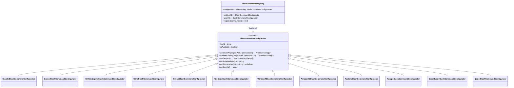

# Native Integrations

<cite>
**Referenced Files in This Document**   
- [base.ts](file://src/core/configurators/slash/base.ts)
- [registry.ts](file://src/core/configurators/slash/registry.ts)
- [slash-command-templates.ts](file://src/core/templates/slash-command-templates.ts)
- [claude.ts](file://src/core/configurators/slash/claude.ts)
- [cursor.ts](file://src/core/configurators/slash/cursor.ts)
- [github-copilot.ts](file://src/core/configurators/slash/github-copilot.ts)
- [cline.ts](file://src/core/configurators/slash/cline.ts)
- [crush.ts](file://src/core/configurators/slash/crush.ts)
- [kilocode.ts](file://src/core/configurators/slash/kilocode.ts)
- [windsurf.ts](file://src/core/configurators/slash/windsurf.ts)
- [amazon-q.ts](file://src/core/configurators/slash/amazon-q.ts)
- [factory.ts](file://src/core/configurators/slash/factory.ts)
- [auggie.ts](file://src/core/configurators/slash/auggie.ts)
- [codebuddy.ts](file://src/core/configurators/slash/codebuddy.ts)
- [qoder.ts](file://src/core/configurators/slash/qoder.ts)
- [init.ts](file://src/core/init.ts)
</cite>

## Table of Contents
1. [Architecture Overview](#architecture-overview)
2. [Base Configurator Implementation](#base-configurator-implementation)
3. [Command Template System](#command-template-system)
4. [Registry Pattern and Tool Discovery](#registry-pattern-and-tool-discovery)
5. [Tool-Specific Configurator Analysis](#tool-specific-configurator-analysis)
6. [Integration with Initialization Process](#integration-with-initialization-process)
7. [Troubleshooting Guide](#troubleshooting-guide)
8. [Best Practices](#best-practices)

## Architecture Overview

The OpenSpec native slash command integration system provides AI coding assistants with standardized workflows through tool-specific configuration files. This architecture enables seamless integration with various AI tools including Claude Code, Cursor, GitHub Copilot, Amazon Q, Cline, Crush, Kilocode, Windsurf, and others by implementing a consistent pattern across all supported platforms.

The system follows an object-oriented design with a base class that defines the common interface and behavior for all slash command configurators. Each supported AI tool has its own configurator class that extends this base class and implements tool-specific configurations. The integration is automatically discovered and registered through a registry pattern during the 'openspec init' command execution.

**Diagram sources**
- [base.ts](file://src/core/configurators/slash/base.ts)
- [registry.ts](file://src/core/configurators/slash/registry.ts)
- [claude.ts](file://src/core/configurators/slash/claude.ts)
- [cursor.ts](file://src/core/configurators/slash/cursor.ts)
- [github-copilot.ts](file://src/core/configurators/slash/github-copilot.ts)
- [cline.ts](file://src/core/configurators/slash/cline.ts)
- [crush.ts](file://src/core/configurators/slash/crush.ts)
- [kilocode.ts](file://src/core/configurators/slash/kilocode.ts)
- [windsurf.ts](file://src/core/configurators/slash/windsurf.ts)
- [amazon-q.ts](file://src/core/configurators/slash/amazon-q.ts)
- [factory.ts](file://src/core/configurators/slash/factory.ts)
- [auggie.ts](file://src/core/configurators/slash/auggie.ts)
- [codebuddy.ts](file://src/core/configurators/slash/codebuddy.ts)
- [qoder.ts](file://src/core/configurators/slash/qoder.ts)

**Section sources**
- [base.ts](file://src/core/configurators/slash/base.ts)
- [registry.ts](file://src/core/configurators/slash/registry.ts)

## Base Configurator Implementation

The foundation of the slash command integration system is the `SlashCommandConfigurator` abstract base class defined in base.ts. This class establishes the contract that all tool-specific configurators must follow, ensuring consistency across different AI assistant integrations.

The base class implements the Template Method pattern, providing a skeletal implementation of the command generation process while allowing subclasses to customize specific aspects. It defines two abstract properties: `toolId` which uniquely identifies the AI tool, and `isAvailable` which indicates whether the configurator is functional.

The class provides three key methods for command generation:
- `generateAll`: Creates or updates all slash command files for a tool
- `updateExisting`: Updates only existing command files
- `getTargets`: Returns metadata about the command files to be generated

Subclasses must implement two protected abstract methods:
- `getRelativePath`: Determines the file path for each command type
- `getFrontmatter`: Provides tool-specific metadata (YAML frontmatter, headers, etc.)

Additionally, the base class handles file operations including reading, writing, and updating command files while preserving OpenSpec markers that delineate the generated content boundaries.

**Section sources**
- [base.ts](file://src/core/configurators/slash/base.ts)

## Command Template System

The slash command content is managed through a centralized template system defined in slash-command-templates.ts. This system provides a consistent structure for all AI assistant commands while allowing for tool-specific variations through the configurator pattern.

The template system defines three primary command types:
- **proposal**: Guides the AI assistant through creating new change proposals
- **apply**: Directs implementation of approved changes
- **archive**: Handles archiving completed changes

Each command type consists of three components:
1. **Guardrails**: General principles and constraints
2. **Steps**: Sequential instructions for the AI assistant
3. **Reference**: Additional context and resources

The guardrails establish fundamental principles such as favoring minimal implementations and keeping changes tightly scoped. The steps provide detailed, sequential instructions for each workflow phase, while the reference section points to additional resources and validation commands.

**Diagram sources**
- [slash-command-templates.ts](file://src/core/templates/slash-command-templates.ts)
- [index.ts](file://src/core/templates/index.ts)

**Section sources**
- [slash-command-templates.ts](file://src/core/templates/slash-command-templates.ts)

## Registry Pattern and Tool Discovery

The system employs a registry pattern to enable automatic discovery and registration of supported AI tools during the 'openspec init' process. The SlashCommandRegistry class in registry.ts maintains a collection of all available configurators and provides methods to access them by tool ID.

The registry uses a static initialization block to instantiate and register all supported tool configurators, including:
- ClaudeSlashCommandConfigurator
- CodeBuddySlashCommandConfigurator
- QoderSlashCommandConfigurator
- CursorSlashCommandConfigurator
- WindsurfSlashCommandConfigurator
- KiloCodeSlashCommandConfigurator
- OpenCodeSlashCommandConfigurator
- CodexSlashCommandConfigurator
- GitHubCopilotSlashCommandConfigurator
- AmazonQSlashCommandConfigurator
- FactorySlashCommandConfigurator
- AuggieSlashCommandConfigurator
- ClineSlashCommandConfigurator
- CrushSlashCommandConfigurator
- CostrictSlashCommandConfigurator
- QwenSlashCommandConfigurator

This approach enables the initialization process to dynamically discover all available integrations without requiring manual configuration. The registry provides several key methods:
- `get(toolId)`: Retrieves a specific configurator by ID
- `getAll()`: Returns all registered configurators
- `register(configurator)`: Allows registration of additional configurators

During the 'openspec init' command execution, the system queries the registry to identify available tools and presents them to the user for selection.

**Diagram sources**
- [registry.ts](file://src/core/configurators/slash/registry.ts)
- [base.ts](file://src/core/configurators/slash/base.ts)

**Section sources**
- [registry.ts](file://src/core/configurators/slash/registry.ts)

## Tool-Specific Configurator Analysis

Each AI tool has a dedicated configurator class that extends the base SlashCommandConfigurator and implements tool-specific configurations. These configurators follow a consistent pattern while adapting to the unique requirements of each platform.

### Claude Code Integration

The ClaudeSlashCommandConfigurator creates command files in the .claude/commands/openspec/ directory with YAML frontmatter that includes name, description, category, and tags. The commands are structured as Markdown files with standardized naming.

**Section sources**
- [claude.ts](file://src/core/configurators/slash/claude.ts)

### Cursor Integration

The CursorSlashCommandConfigurator generates commands in the .cursor/commands/ directory with a specific naming convention (openspec-proposal.md, openspec-apply.md, openspec-archive.md). The YAML frontmatter includes an ID field in addition to the standard metadata.

**Section sources**
- [cursor.ts](file://src/core/configurators/slash/cursor.ts)

### GitHub Copilot Integration

The GitHubCopilotSlashCommandConfigurator creates prompt files in the .github/prompts/ directory with a .prompt.md extension. The frontmatter is minimal, containing only a description, and includes a $ARGUMENTS placeholder for user input.

**Section sources**
- [github-copilot.ts](file://src/core/configurators/slash/github-copilot.ts)

### Cline Integration

The ClineSlashCommandConfigurator generates files in the .clinerules/ directory without YAML frontmatter. Instead, it uses a Markdown header format with a description following the header.

**Section sources**
- [cline.ts](file://src/core/configurators/slash/cline.ts)

### Crush Integration

The CrushSlashCommandConfigurator creates command files in the .crush/commands/openspec/ directory with comprehensive YAML frontmatter including name, description, category, and tags, similar to the Claude implementation.

**Section sources**
- [crush.ts](file://src/core/configurators/slash/crush.ts)

### Kilocode Integration

The KiloCodeSlashCommandConfigurator generates workflow files in the .kilocode/workflows/ directory. Notably, it does not use any frontmatter (returns undefined), relying solely on the command body content.

**Section sources**
- [kilocode.ts](file://src/core/configurators/slash/kilocode.ts)

### Windsurf Integration

The WindsurfSlashCommandConfigurator creates workflow files in the .windsurf/workflows/ directory with YAML frontmatter that includes a description and an auto_execution_mode parameter set to 3.

**Section sources**
- [windsurf.ts](file://src/core/configurators/slash/windsurf.ts)

### Amazon Q Integration

The AmazonQSlashCommandConfigurator generates prompt files in the .amazonq/prompts/ directory with extended frontmatter that includes user request and change ID XML-style tags containing $ARGUMENTS placeholders.

**Section sources**
- [amazon-q.ts](file://src/core/configurators/slash/amazon-q.ts)

### Factory Integration

The FactorySlashCommandConfigurator creates command files in the .factory/commands/ directory with YAML frontmatter that includes an argument-hint field. It also overrides the getBody method to append $ARGUMENTS to the standard command body.

**Section sources**
- [factory.ts](file://src/core/configurators/slash/factory.ts)

## Integration with Initialization Process

The slash command configurators are integrated into the OpenSpec initialization process through the InitCommand class in init.ts. During the 'openspec init' execution, the system queries the SlashCommandRegistry to discover all available tools and presents them to the user for selection.

When a user selects one or more AI tools, the initialization process iterates through the selected tool IDs, retrieves the corresponding configurator from the registry, and invokes the generateAll method to create the necessary command files. This process ensures that only the requested integrations are configured, minimizing unnecessary file creation.

The initialization flow follows these steps:
1. Detect existing OpenSpec configuration
2. Present available AI tools to the user
3. Collect user selections
4. Create directory structure
5. Configure selected AI tools via their configurators
6. Generate slash command files

**Diagram sources**
- [init.ts](file://src/core/init.ts)
- [registry.ts](file://src/core/configurators/slash/registry.ts)
- [base.ts](file://src/core/configurators/slash/base.ts)

**Section sources**
- [init.ts](file://src/core/init.ts)

## Troubleshooting Guide

When encountering issues with OpenSpec slash command integrations, consider the following common problems and solutions:

### Command Format Mismatches
If AI assistants are not interpreting commands correctly:
- Verify the file paths match the tool's expected command location
- Check that the file extensions are correct for the specific tool
- Ensure the frontmatter format (YAML, headers, etc.) matches the tool's requirements
- Confirm that placeholders like $ARGUMENTS are properly positioned

### Missing Configuration Files
If command files are not being created:
- Verify the tool ID in the configurator matches the registry registration
- Check that the tool is selected during initialization
- Ensure the project has write permissions
- Confirm the directory structure can be created

### Content Update Issues
If existing command files are not being updated:
- Verify OpenSpec markers are present in the files
- Check that the markers are not corrupted or modified
- Ensure the file paths in the configurator match the actual file locations
- Confirm the configurator's isAvailable property is set to true

### Tool Discovery Problems
If tools are not appearing in the initialization wizard:
- Verify the configurator is imported and registered in registry.ts
- Check that the static initialization block in registry.ts includes the tool
- Ensure the tool's availability is not conditional on external factors

## Best Practices

To maintain consistent command behavior across different AI tools, follow these best practices:

### Standardize Command Structure
Maintain consistency in the three core command types (proposal, apply, archive) across all tools. While file formats and locations may vary, the underlying workflow should remain the same to ensure predictable behavior.

### Preserve OpenSpec Markers
Never modify or remove the OpenSpec markers in generated files. These markers enable safe content updates during subsequent initialization runs and prevent corruption of custom modifications.

### Follow Naming Conventions
Adhere to each tool's naming conventions for command files and directories. This ensures proper integration with the AI assistant's command system and prevents loading issues.

### Test Across Tools
Regularly test the core workflows across all supported tools to ensure consistent behavior. This helps identify platform-specific issues early and maintains a uniform user experience.

### Document Tool-Specific Requirements
Maintain documentation of each tool's specific requirements, such as file locations, format constraints, and special features. This helps new contributors understand the integration patterns and maintain consistency.

### Handle Backward Compatibility
When updating command templates, consider backward compatibility with existing installations. Use the updateExisting method to safely update content without disrupting established workflows.

### Monitor Tool Evolution
Stay informed about updates to the supported AI tools, as changes to their command systems may require corresponding updates to the configurators. Regularly review tool documentation and release notes.