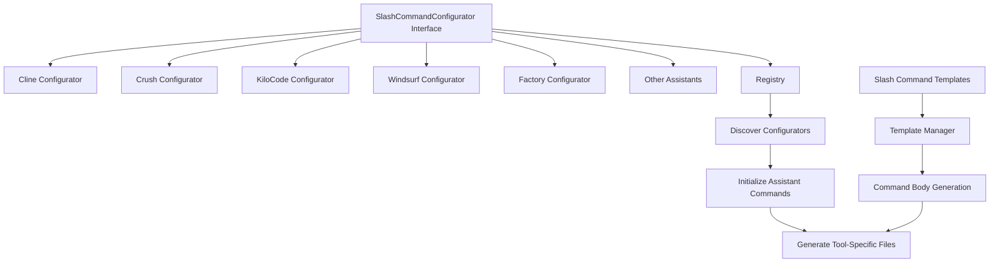
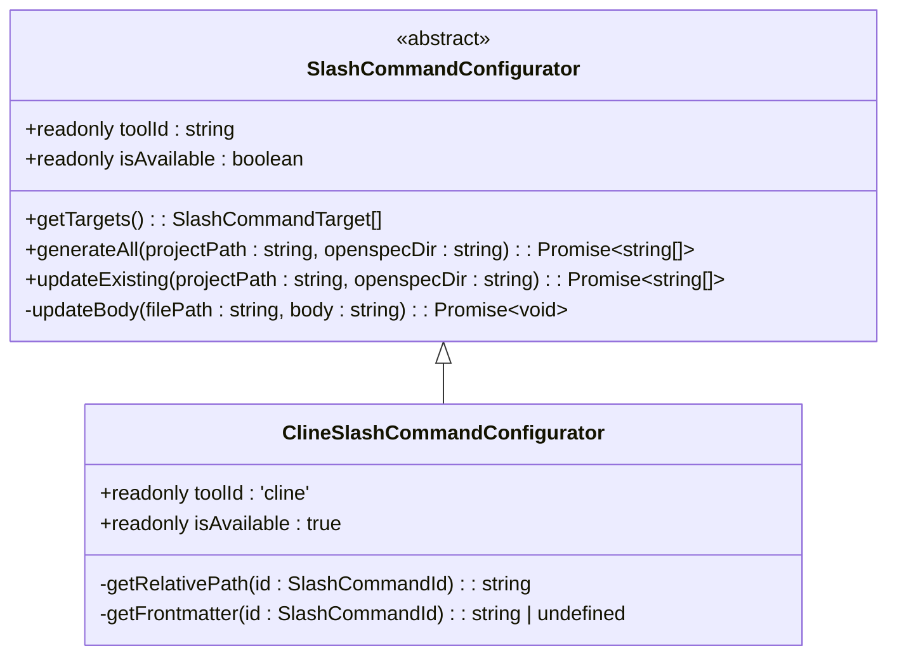
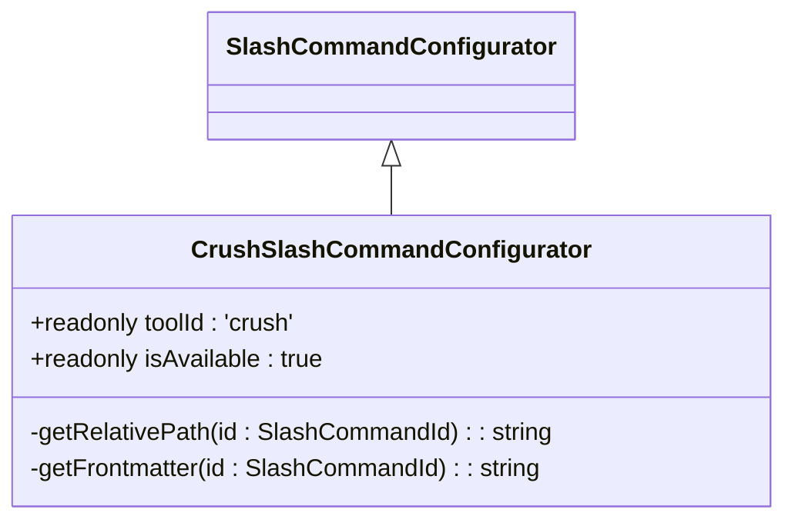
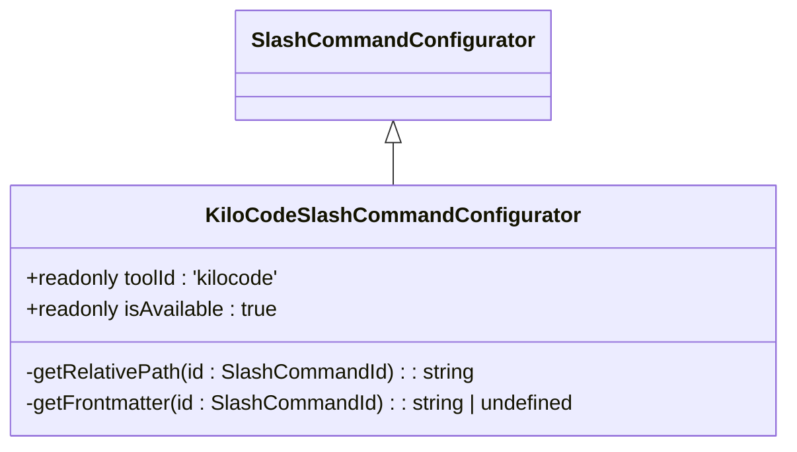
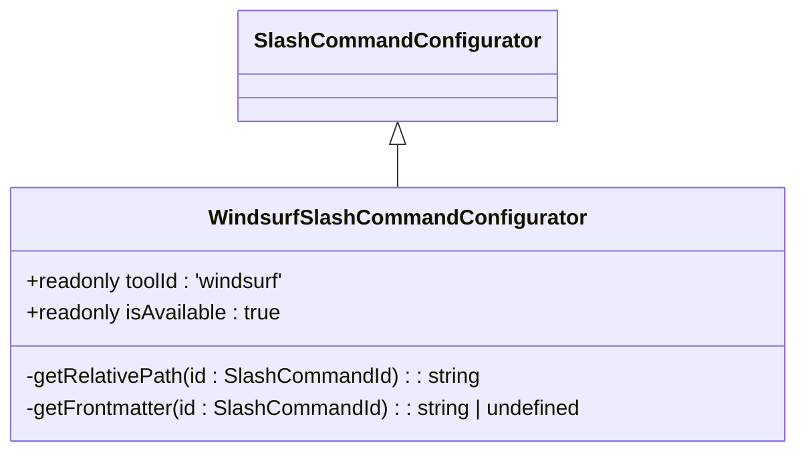
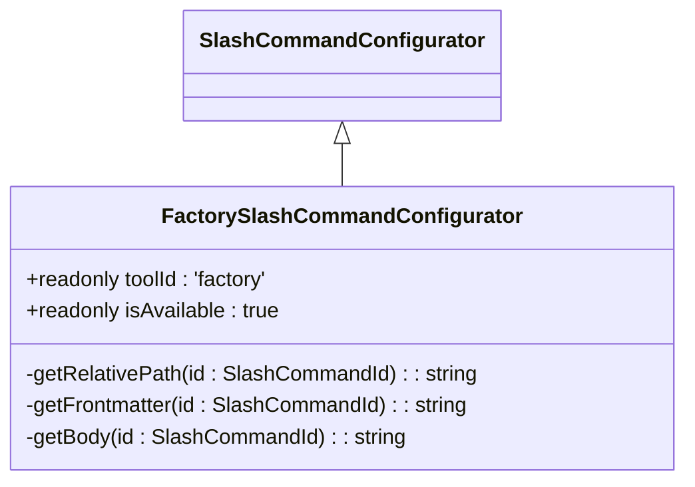
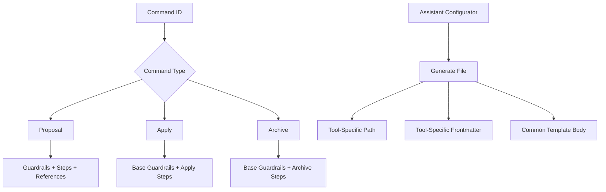
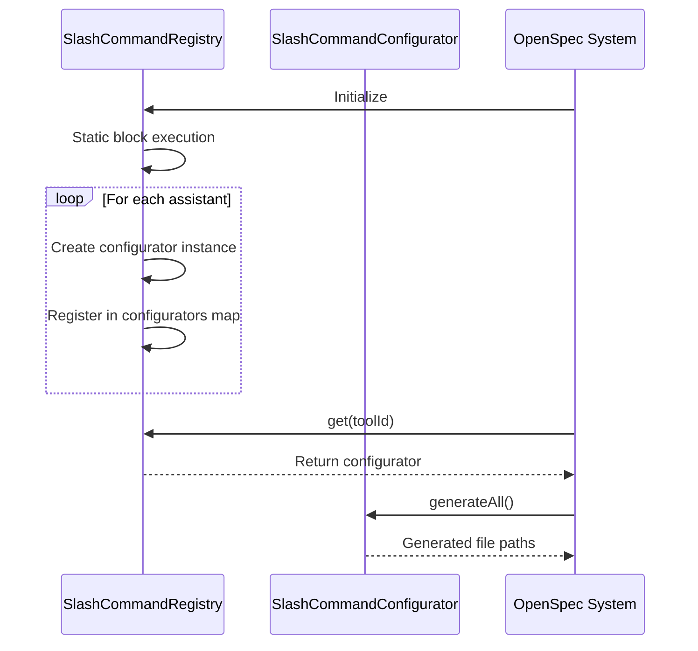
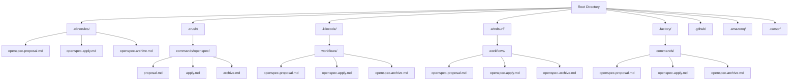

# Other Assistant Integrations

<cite>
**Referenced Files in This Document**   
- [cline.ts](file://src/core/configurators/slash/cline.ts)
- [crush.ts](file://src/core/configurators/slash/crush.ts)
- [kilocode.ts](file://src/core/configurators/slash/kilocode.ts)
- [windsurf.ts](file://src/core/configurators/slash/windsurf.ts)
- [factory.ts](file://src/core/configurators/slash/factory.ts)
- [slash-command-templates.ts](file://src/core/templates/slash-command-templates.ts)
- [registry.ts](file://src/core/configurators/slash/registry.ts)
- [base.ts](file://src/core/configurators/slash/base.ts)
- [config.ts](file://src/core/config.ts)
</cite>

## Table of Contents
1. [Introduction](#introduction)
2. [Core Integration Architecture](#core-integration-architecture)
3. [Slash Command Configurator Implementation](#slash-command-configurator-implementation)
4. [Command Template Structure and Variations](#command-template-structure-and-variations)
5. [Registry Pattern for Automatic Discovery](#registry-pattern-for-automatic-discovery)
6. [Comparative Analysis of Assistant Integrations](#comparative-analysis-of-assistant-integrations)
7. [Troubleshooting Common Integration Issues](#troubleshooting-common-integration-issues)
8. [Best Practices for Multi-Assistant Workflows](#best-practices-for-multi-assistant-workflows)
9. [Conclusion](#conclusion)

## Introduction
OpenSpec provides seamless integration with multiple AI coding assistants through a modular configurator system. This document details how OpenSpec supports alternative AI assistants including Cline, Crush, Kilocode, Windsurf, and Factory AI by implementing a consistent interface for slash command generation. The system enables developers to maintain consistent workflows across different AI platforms while accommodating tool-specific requirements and conventions. The integration architecture is designed to be extensible, allowing new AI assistants to be added with minimal configuration.

## Core Integration Architecture

The OpenSpec integration architecture follows a clean separation of concerns between command definition, template management, and assistant-specific configuration. At its core, the system uses an interface-driven approach where each AI assistant implements a common contract while providing tool-specific implementations.

**Diagram sources**
- [base.ts](file://src/core/configurators/slash/base.ts)
- [registry.ts](file://src/core/configurators/slash/registry.ts)
- [slash-command-templates.ts](file://src/core/templates/slash-command-templates.ts)

**Section sources**
- [base.ts](file://src/core/configurators/slash/base.ts#L1-L96)
- [registry.ts](file://src/core/configurators/slash/registry.ts#L1-L70)

## Slash Command Configurator Implementation

Each AI assistant integration implements the `SlashCommandConfigurator` interface, which defines the contract for generating assistant-specific command files. The base class provides common functionality while requiring subclasses to implement tool-specific path and metadata configurations.

### Common Implementation Patterns

All configurator classes follow a consistent pattern:
- Implement the `SlashCommandConfigurator` abstract base class
- Define tool-specific file paths for slash commands
- Provide assistant-specific frontmatter metadata
- Register with the global registry for automatic discovery

The base class handles common operations such as file generation, content updating, and marker-based content injection, ensuring consistency across all integrations.

### Tool-Specific Configurator Examples

#### Cline Integration
The Cline configurator implements the interface with Cline-specific conventions, placing command files in the `.clinerules/` directory with simple frontmatter containing descriptive titles.

**Diagram sources**
- [base.ts](file://src/core/configurators/slash/base.ts#L13-L96)
- [cline.ts](file://src/core/configurators/slash/cline.ts#L10-L28)

**Section sources**
- [cline.ts](file://src/core/configurators/slash/cline.ts#L1-L28)

#### Crush Integration
The Crush configurator follows the same interface but implements Crush-specific YAML frontmatter with additional metadata fields such as category and tags, placing files in the `.crush/commands/openspec/` directory structure.

**Diagram sources**
- [base.ts](file://src/core/configurators/slash/base.ts#L13-L96)
- [crush.ts](file://src/core/configurators/slash/crush.ts#L31-L42)

**Section sources**
- [crush.ts](file://src/core/configurators/slash/crush.ts#L1-L42)

#### KiloCode Integration
The KiloCode configurator implements the interface with KiloCode-specific workflow conventions, placing command files in the `.kilocode/workflows/` directory. Notably, it returns `undefined` for frontmatter, indicating that KiloCode does not require metadata headers.

**Diagram sources**
- [base.ts](file://src/core/configurators/slash/base.ts#L13-L96)
- [kilocode.ts](file://src/core/configurators/slash/kilocode.ts#L10-L22)

**Section sources**
- [kilocode.ts](file://src/core/configurators/slash/kilocode.ts#L1-L22)

#### Windsurf Integration
The Windsurf configurator implements the interface with Windsurf-specific conventions, including custom frontmatter with `auto_execution_mode` settings and placing files in the `.windsurf/workflows/` directory.

**Diagram sources**
- [base.ts](file://src/core/configurators/slash/base.ts#L13-L96)
- [windsurf.ts](file://src/core/configurators/slash/windsurf.ts#L10-L28)

**Section sources**
- [windsurf.ts](file://src/core/configurators/slash/windsurf.ts#L1-L28)

#### Factory AI Integration
The Factory AI configurator extends the base functionality by overriding the `getBody` method to include `$ARGUMENTS` placeholder, supporting Factory's argument-passing mechanism. It places files in the `.factory/commands/` directory with descriptive frontmatter including `argument-hint` fields.

**Diagram sources**
- [base.ts](file://src/core/configurators/slash/base.ts#L13-L96)
- [factory.ts](file://src/core/configurators/slash/factory.ts#L25-L42)

**Section sources**
- [factory.ts](file://src/core/configurators/slash/factory.ts#L1-L42)

## Command Template Structure and Variations

The command template system provides a consistent foundation for all AI assistant integrations while allowing for tool-specific variations in file structure and metadata.

### Common Template Structure

All slash commands share a common set of command IDs defined in the system:
- `proposal`: For scaffolding new changes with strict validation
- `apply`: For implementing approved changes while keeping tasks synchronized
- `archive`: For archiving deployed changes and updating specifications

The base template structure includes standardized sections for guardrails, steps, and references that ensure consistent behavior across all assistants.

**Diagram sources**
- [slash-command-templates.ts](file://src/core/templates/slash-command-templates.ts#L1-L59)
- [base.ts](file://src/core/configurators/slash/base.ts#L66-L71)

**Section sources**
- [slash-command-templates.ts](file://src/core/templates/slash-command-templates.ts#L1-L59)

### Tool-Specific Variations

While the command bodies remain consistent across assistants, the file placement and metadata structures vary significantly based on each tool's requirements:

| Assistant | Configuration Path | Frontmatter Format | Special Features |
|---------|-------------------|-------------------|----------------|
| Cline | `.clinerules/` | Markdown headers | Simple descriptive format |
| Crush | `.crush/commands/openspec/` | YAML frontmatter | Category and tags support |
| KiloCode | `.kilocode/workflows/` | None | No frontmatter required |
| Windsurf | `.windsurf/workflows/` | YAML frontmatter | Auto-execution mode |
| Factory AI | `.factory/commands/` | YAML frontmatter | Argument hints |

These variations are encapsulated within each configurator class, allowing the core template system to remain unchanged while accommodating tool-specific requirements.

## Registry Pattern for Automatic Discovery

The registry pattern enables automatic discovery and initialization of all AI assistant integrations during project setup, providing a clean mechanism for extensibility.

### Registry Implementation

The `SlashCommandRegistry` class maintains a map of all available configurators, indexed by their tool ID. During initialization, it statically registers all supported assistants, making them available for discovery.

**Diagram sources**
- [registry.ts](file://src/core/configurators/slash/registry.ts#L1-L70)
- [base.ts](file://src/core/configurators/slash/base.ts#L25-L49)

**Section sources**
- [registry.ts](file://src/core/configurators/slash/registry.ts#L1-L70)

### Registration Process

The registration process follows these steps:
1. Import all configurator classes
2. Instantiate each configurator in the static initialization block
3. Register each instance in the configurators map using the toolId as key
4. Provide public methods for retrieval and enumeration

This approach ensures that all assistants are automatically available without requiring additional configuration or discovery logic at runtime.

## Comparative Analysis of Assistant Integrations

A comparative analysis of the different assistant integrations reveals both common patterns and important distinctions in their implementation approaches.

### File Placement Strategies

Different assistants follow distinct conventions for configuration file placement:

**Diagram sources**
- [cline.ts](file://src/core/configurators/slash/cline.ts#L4-L8)
- [crush.ts](file://src/core/configurators/slash/crush.ts#L4-L8)
- [kilocode.ts](file://src/core/configurators/slash/kilocode.ts#L4-L8)
- [windsurf.ts](file://src/core/configurators/slash/windsurf.ts#L4-L8)
- [factory.ts](file://src/core/configurators/slash/factory.ts#L4-L8)

**Section sources**
- [cline.ts](file://src/core/configurators/slash/cline.ts#L1-L28)
- [crush.ts](file://src/core/configurators/slash/crush.ts#L1-L42)
- [kilocode.ts](file://src/core/configurators/slash/kilocode.ts#L1-L22)
- [windsurf.ts](file://src/core/configurators/slash/windsurf.ts#L1-L28)
- [factory.ts](file://src/core/configurators/slash/factory.ts#L1-L42)

### Metadata Format Comparison

The metadata formats vary significantly between assistants, reflecting their different configuration requirements:

| Assistant | Metadata Format | Required Fields | Optional Fields |
|---------|----------------|----------------|----------------|
| Cline | Markdown headers | Title, Description | None |
| Crush | YAML frontmatter | name, description, category | tags |
| KiloCode | None | None | None |
| Windsurf | YAML frontmatter | description | auto_execution_mode |
| Factory AI | YAML frontmatter | description | argument-hint |
| GitHub Copilot | YAML frontmatter | description | None |
| Amazon Q | YAML frontmatter with XML-like blocks | description | UserRequest/ChangeId wrappers |

These differences are encapsulated within each configurator's `getFrontmatter` method, allowing the core system to remain agnostic to the specific metadata requirements of each assistant.

## Troubleshooting Common Integration Issues

When working with multiple AI assistant integrations, several common issues may arise. This section provides guidance for diagnosing and resolving these problems.

### Inconsistent Command Behavior

Inconsistent behavior across assistants typically stems from:
- Missing or incorrect OpenSpec markers in command files
- Version incompatibilities between OpenSpec and the AI assistant
- Conflicting configurations from multiple assistant files

**Resolution steps:**
1. Verify that all command files contain the proper markers (`<!-- OPENSPEC:START -->` and `<!-- OPENSPEC:END -->`)
2. Check for conflicting command files from different assistants in the same project
3. Ensure all assistants are using compatible versions of OpenSpec templates

**Section sources**
- [base.ts](file://src/core/configurators/slash/base.ts#L80-L94)
- [config.ts](file://src/core/config.ts#L3-L6)

### Template Rendering Errors

Template rendering issues often occur when:
- The template body cannot be properly extracted or updated
- There are syntax errors in the frontmatter section
- The file encoding is incompatible with the assistant

**Resolution steps:**
1. Validate that the template body is properly enclosed by OpenSpec markers
2. Check for syntax errors in YAML frontmatter (if applicable)
3. Ensure files are saved with UTF-8 encoding
4. Verify that the assistant can parse the template structure

**Section sources**
- [base.ts](file://src/core/configurators/slash/base.ts#L25-L49)
- [slash-command-templates.ts](file://src/core/templates/slash-command-templates.ts#L50-L54)

### Compatibility Problems with Evolving APIs

As AI assistants update their APIs, compatibility issues may arise:
- Deprecated configuration formats
- Changed file location requirements
- Modified command syntax

**Resolution steps:**
1. Consult the assistant's documentation for recent changes
2. Update the configurator class to match new requirements
3. Test the integration thoroughly after updates
4. Consider maintaining version-specific configurators for backward compatibility

**Section sources**
- [registry.ts](file://src/core/configurators/slash/registry.ts#L22-L56)
- [base.ts](file://src/core/configurators/slash/base.ts#L13-L96)

## Best Practices for Multi-Assistant Workflows

To maintain consistent and reliable workflows across multiple AI assistant platforms, follow these best practices:

### Configuration Management
- Use the registry pattern to manage assistant availability
- Maintain clear separation between assistant-specific and shared configurations
- Document the purpose and usage of each assistant in the project

### Version Control
- Include assistant configuration files in version control
- Use consistent naming conventions across all assistants
- Document any tool-specific requirements in the project README

### Testing and Validation
- Test each assistant integration independently
- Validate that command outputs meet expectations
- Monitor for regressions when updating OpenSpec or assistant versions

### Error Handling
- Implement graceful degradation when assistants are unavailable
- Provide clear error messages for configuration issues
- Include fallback mechanisms for critical operations

### Documentation
- Maintain up-to-date documentation for all integrated assistants
- Document any limitations or known issues
- Provide examples of effective usage patterns

These practices ensure that teams can leverage multiple AI assistants effectively while maintaining consistency and reliability across their development workflows.

## Conclusion

OpenSpec's integration architecture provides a robust and extensible framework for supporting multiple AI coding assistants. By implementing the `SlashCommandConfigurator` interface, each assistant can provide tool-specific configurations while maintaining compatibility with the core system. The registry pattern enables automatic discovery and initialization, simplifying the setup process. Despite variations in file placement and metadata formats, the system maintains a consistent command structure across all assistants. This approach balances flexibility with consistency, allowing developers to choose the AI tools that best fit their needs while maintaining standardized workflows. The architecture is designed to be easily extended, making it straightforward to add support for new assistants as they emerge.