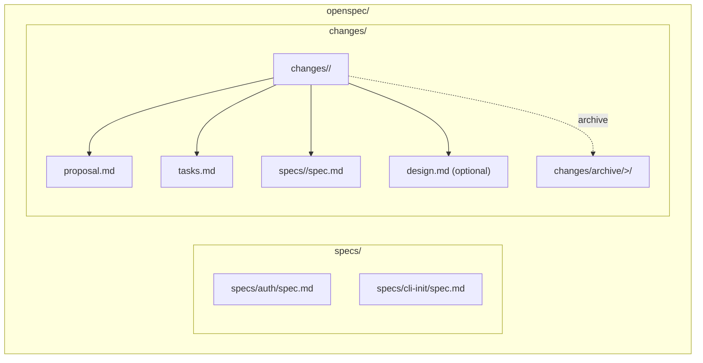
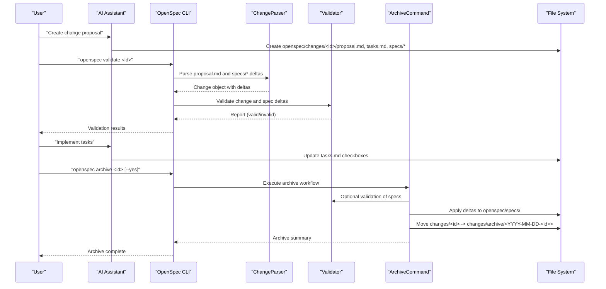
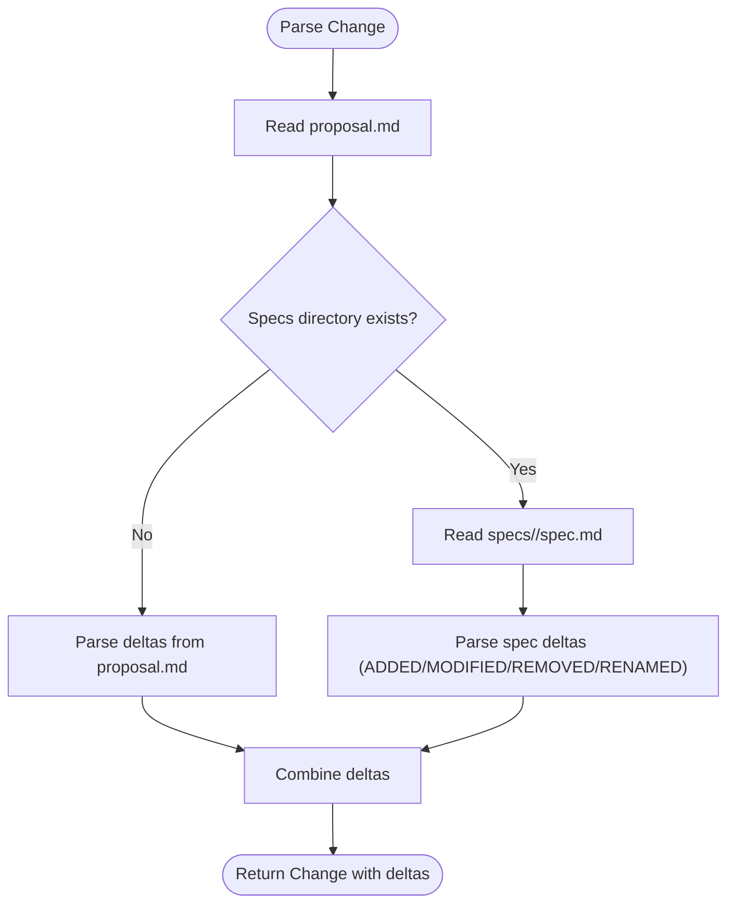
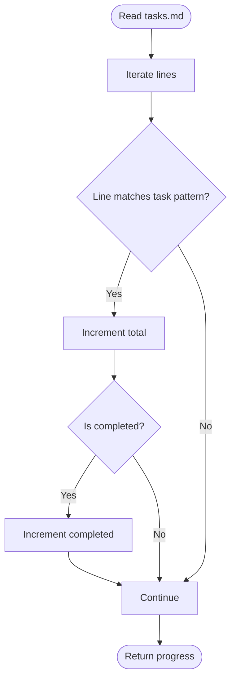
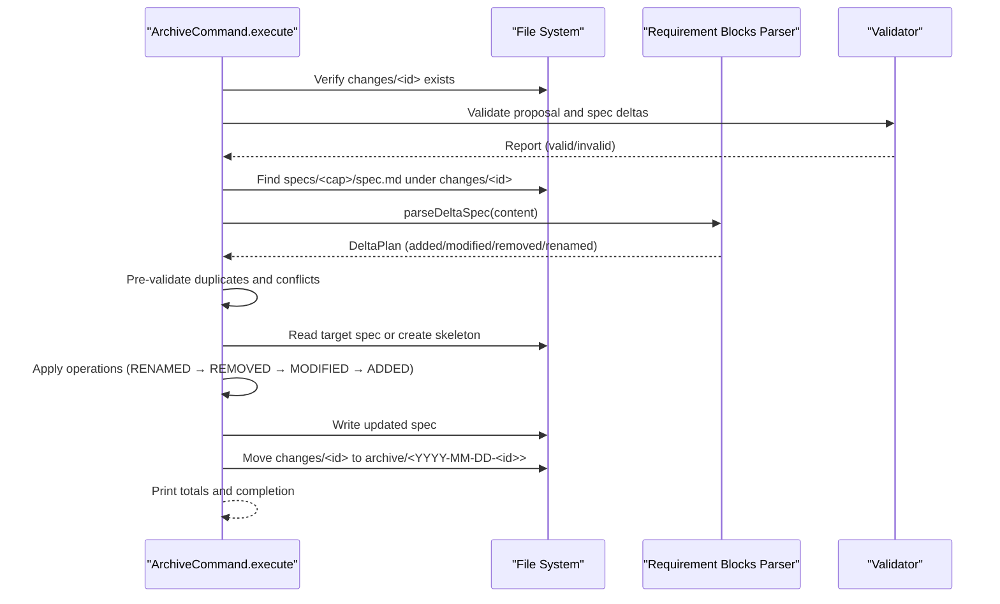
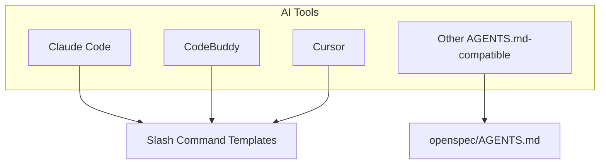
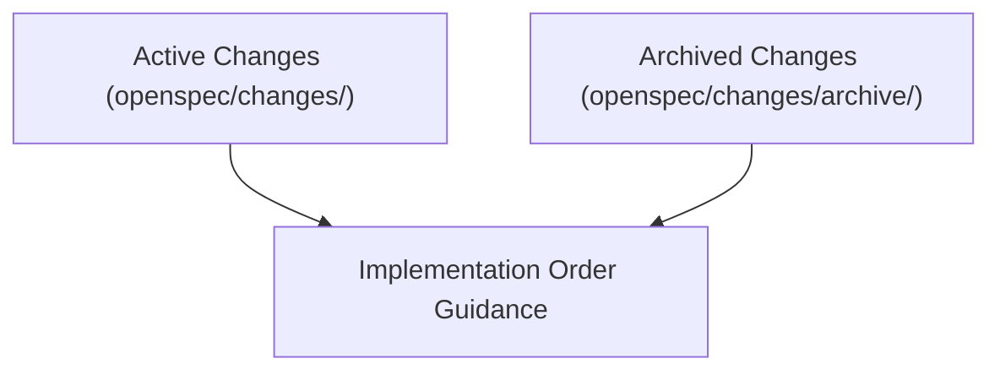
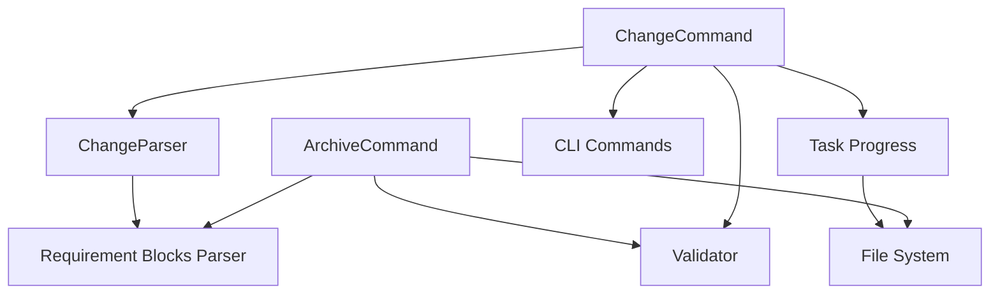

# Change Management Workflow

<cite>
**Referenced Files in This Document**
- [README.md](file://README.md)
- [openspec/AGENTS.md](file://openspec/AGENTS.md)
- [openspec/changes/IMPLEMENTATION_ORDER.md](file://openspec/changes/IMPLEMENTATION_ORDER.md)
- [src/commands/change.ts](file://src/commands/change.ts)
- [src/core/parsers/change-parser.ts](file://src/core/parsers/change-parser.ts)
- [src/core/parsers/requirement-blocks.ts](file://src/core/parsers/requirement-blocks.ts)
- [src/core/archive.ts](file://src/core/archive.ts)
- [src/utils/task-progress.ts](file://src/utils/task-progress.ts)
- [src/core/config.ts](file://src/core/config.ts)
- [src/core/templates/slash-command-templates.ts](file://src/core/templates/slash-command-templates.ts)
- [python_port/src/openspec/core/change_operations.py](file://python_port/src/openspec/core/change_operations.py)
- [openspec/changes/add-scaffold-command/proposal.md](file://openspec/changes/add-scaffold-command/proposal.md)
- [openspec/changes/add-scaffold-command/tasks.md](file://openspec/changes/add-scaffold-command/tasks.md)
- [openspec/changes/add-scaffold-command/specs/cli-scaffold/spec.md](file://openspec/changes/add-scaffold-command/specs/cli-scaffold/spec.md)
</cite>

## Table of Contents
1. [Introduction](#introduction)
2. [Project Structure](#project-structure)
3. [Core Components](#core-components)
4. [Architecture Overview](#architecture-overview)
5. [Detailed Component Analysis](#detailed-component-analysis)
6. [Dependency Analysis](#dependency-analysis)
7. [Performance Considerations](#performance-considerations)
8. [Troubleshooting Guide](#troubleshooting-guide)
9. [Conclusion](#conclusion)

## Introduction
This document explains OpenSpec’s end-to-end change management lifecycle: from proposal creation to archiving. It covers how change folders are organized, how AI assistants draft and refine proposals, how tasks are tracked, and how approved changes are merged into the source-of-truth specifications. It also describes how the change parser processes proposal files, how the archive command merges deltas, and how to maintain auditability and explicit scope across concurrent changes.

## Project Structure
OpenSpec organizes change proposals and their associated artifacts under openspec/changes/<change-id>/ with a standard set of files:
- proposal.md: Why the change is needed, what changes, and impact.
- tasks.md: Implementation checklist with markdown checkboxes for tracking progress.
- specs/<capability>/spec.md: Delta-formatted spec updates grouped by capability.

Archived changes are moved into openspec/changes/archive/<YYYY-MM-DD-<change-id>>/, preserving the same file layout for historical reference.

**Diagram sources**
- [openspec/AGENTS.md](file://openspec/AGENTS.md#L123-L141)
- [openspec/changes/add-scaffold-command/proposal.md](file://openspec/changes/add-scaffold-command/proposal.md#L1-L12)
- [openspec/changes/add-scaffold-command/tasks.md](file://openspec/changes/add-scaffold-command/tasks.md#L1-L12)
- [openspec/changes/add-scaffold-command/specs/cli-scaffold/spec.md](file://openspec/changes/add-scaffold-command/specs/cli-scaffold/spec.md#L1-L45)

**Section sources**
- [openspec/AGENTS.md](file://openspec/AGENTS.md#L123-L141)

## Core Components
- Change proposal and delta parsing: The change parser extracts structured deltas from proposal.md and optionally from delta-formatted spec files under changes/<change-id>/specs/.
- Task tracking: The CLI reads tasks.md and computes completion status for each change.
- Archive command: Validates changes, optionally updates specs, and moves the change into the archive with a date prefix.
- Slash command templates: Provide AI assistants with standardized workflows for proposal creation, applying changes, and archiving.

**Section sources**
- [src/core/parsers/change-parser.ts](file://src/core/parsers/change-parser.ts#L20-L53)
- [src/commands/change.ts](file://src/commands/change.ts#L266-L291)
- [src/core/archive.ts](file://src/core/archive.ts#L21-L606)
- [src/core/templates/slash-command-templates.ts](file://src/core/templates/slash-command-templates.ts#L1-L59)

## Architecture Overview
The change lifecycle integrates AI-assisted authoring with CLI-driven validation and archival.

**Diagram sources**
- [src/core/parsers/change-parser.ts](file://src/core/parsers/change-parser.ts#L20-L53)
- [src/core/archive.ts](file://src/core/archive.ts#L21-L256)
- [src/commands/change.ts](file://src/commands/change.ts#L185-L239)

## Detailed Component Analysis

### Proposal Creation and Delta Extraction
- Proposal structure: AI assistants scaffold openspec/changes/<change-id>/ with proposal.md, tasks.md, and optional design.md. The proposal defines Why, What Changes, and Impact.
- Delta extraction: The change parser reads proposal.md and optionally spec files under changes/<change-id>/specs/<capability>/spec.md. It recognizes top-level sections for ADDED, MODIFIED, REMOVED, and RENAMED requirements and builds a normalized delta list.
- Delta format: Each spec delta file uses top-level headers for operations and requirement blocks with scenario sections. The parser supports both simple inline deltas and structured spec deltas.

**Diagram sources**
- [src/core/parsers/change-parser.ts](file://src/core/parsers/change-parser.ts#L20-L82)
- [src/core/parsers/change-parser.ts](file://src/core/parsers/change-parser.ts#L83-L149)

**Section sources**
- [openspec/AGENTS.md](file://openspec/AGENTS.md#L143-L211)
- [openspec/changes/add-scaffold-command/proposal.md](file://openspec/changes/add-scaffold-command/proposal.md#L1-L12)
- [openspec/changes/add-scaffold-command/specs/cli-scaffold/spec.md](file://openspec/changes/add-scaffold-command/specs/cli-scaffold/spec.md#L1-L45)
- [src/core/parsers/change-parser.ts](file://src/core/parsers/change-parser.ts#L20-L149)

### Tasks.md and Implementation Tracking
- Tasks.md uses markdown checkboxes to track implementation progress. The CLI counts total and completed tasks to compute a status summary.
- AI assistants update tasks.md as they complete work, marking items as done to reflect reality.

**Diagram sources**
- [src/utils/task-progress.ts](file://src/utils/task-progress.ts#L1-L44)
- [src/commands/change.ts](file://src/commands/change.ts#L266-L291)

**Section sources**
- [openspec/changes/add-scaffold-command/tasks.md](file://openspec/changes/add-scaffold-command/tasks.md#L1-L12)
- [src/utils/task-progress.ts](file://src/utils/task-progress.ts#L1-L44)
- [src/commands/change.ts](file://src/commands/change.ts#L266-L291)

### Archive Command and Spec Merging
- Validation: The archive command validates proposal.md and spec deltas before merging. It can skip validation with flags and warns accordingly.
- Spec updates: For each capability under changes/<change-id>/specs/<capability>/spec.md, the archiver:
  - Parses the delta plan (ADDED/MODIFIED/REMOVED/RENAMED).
  - Pre-validates for duplicates and cross-section conflicts.
  - Loads the target spec from openspec/specs/<capability>/spec.md or creates a skeleton for new specs.
  - Applies operations in a safe order (RENAMED → REMOVED → MODIFIED → ADDED), recomposing the requirements section.
  - Writes the updated spec and reports counts.
- Archiving: After successful spec updates, the change directory is moved into openspec/changes/archive/<YYYY-MM-DD-<change-id>>/.

**Diagram sources**
- [src/core/archive.ts](file://src/core/archive.ts#L21-L256)
- [src/core/archive.ts](file://src/core/archive.ts#L307-L606)
- [src/core/parsers/requirement-blocks.ts](file://src/core/parsers/requirement-blocks.ts#L99-L235)

**Section sources**
- [src/core/archive.ts](file://src/core/archive.ts#L21-L256)
- [src/core/archive.ts](file://src/core/archive.ts#L307-L606)
- [src/core/parsers/requirement-blocks.ts](file://src/core/parsers/requirement-blocks.ts#L99-L235)

### AI Assistants and Slash Commands
- Slash command templates: Provide structured guidance for proposal creation, applying changes, and archiving. They emphasize scoping, validation, and explicit acceptance criteria.
- Tool integrations: Many AI tools support native slash commands (e.g., /openspec:proposal, /openspec:apply, /openspec:archive). Others rely on AGENTS.md for shared instructions.
- Workflow alignment: AI assistants scaffold change folders, draft proposals and tasks, and update spec deltas based on natural language requests or slash commands.

**Diagram sources**
- [src/core/templates/slash-command-templates.ts](file://src/core/templates/slash-command-templates.ts#L1-L59)
- [openspec/AGENTS.md](file://openspec/AGENTS.md#L1-L120)
- [src/core/config.ts](file://src/core/config.ts#L1-L38)

**Section sources**
- [src/core/templates/slash-command-templates.ts](file://src/core/templates/slash-command-templates.ts#L1-L59)
- [openspec/AGENTS.md](file://openspec/AGENTS.md#L1-L120)
- [src/core/config.ts](file://src/core/config.ts#L1-L38)

### Managing Multiple Concurrent Changes
- Active vs archived: Active changes live under openspec/changes/<change-id>/; archived changes live under openspec/changes/archive/<YYYY-MM-DD-<change-id>>/.
- Listing and selection: The CLI lists active changes and can prompt for selection or accept a specific change ID.
- Implementation order: Some changes depend on others; refer to the implementation order guidance to sequence development safely.

**Diagram sources**
- [openspec/AGENTS.md](file://openspec/AGENTS.md#L123-L141)
- [openspec/changes/IMPLEMENTATION_ORDER.md](file://openspec/changes/IMPLEMENTATION_ORDER.md#L1-L68)

**Section sources**
- [openspec/AGENTS.md](file://openspec/AGENTS.md#L123-L141)
- [openspec/changes/IMPLEMENTATION_ORDER.md](file://openspec/changes/IMPLEMENTATION_ORDER.md#L1-L68)

### Best Practices for Effective Change Proposals
- Scope explicitly: Use proposal.md to state Why, What Changes, and Impact. Keep changes narrowly scoped and verb-led.
- Use delta format: Under specs/<capability>/spec.md, use ADDED, MODIFIED, REMOVED, and RENAMED sections with requirement blocks and scenario sections.
- Validate early: Run openspec validate <id> --strict to catch formatting and structural issues before implementation.
- Track tasks: Maintain tasks.md with actionable, verifiable items and update checkboxes as work completes.
- Reference existing specs: Search openspec/specs for related requirements to avoid duplication and ensure consistency.

**Section sources**
- [openspec/AGENTS.md](file://openspec/AGENTS.md#L143-L211)
- [openspec/AGENTS.md](file://openspec/AGENTS.md#L235-L316)
- [openspec/AGENTS.md](file://openspec/AGENTS.md#L374-L455)

### Auditability and Explicit Scope
- Separation of concerns: openspec/specs/ is the source of truth; openspec/changes/ contains proposals and deltas. This separation makes diffs explicit and auditable.
- Historical preservation: Archived changes retain their full structure under openspec/changes/archive/<YYYY-MM-DD-<change-id>>/ for traceability.
- Validation gates: The CLI enforces validation of proposals and spec deltas prior to archiving, reducing risk of inconsistent or invalid updates.

**Section sources**
- [README.md](file://README.md#L52-L82)
- [openspec/AGENTS.md](file://openspec/AGENTS.md#L433-L455)
- [src/core/archive.ts](file://src/core/archive.ts#L60-L123)

## Dependency Analysis
The change lifecycle depends on several modules:
- ChangeCommand orchestrates listing, showing, and validating changes.
- ChangeParser extracts deltas from proposal and spec files.
- Requirement Blocks Parser constructs delta plans and validates structure.
- ArchiveCommand coordinates validation, spec updates, and archival.
- Task Progress utilities compute completion status from tasks.md.
- Slash Command Templates and AGENTS.md coordinate AI workflows.

**Diagram sources**
- [src/commands/change.ts](file://src/commands/change.ts#L1-L292)
- [src/core/parsers/change-parser.ts](file://src/core/parsers/change-parser.ts#L1-L234)
- [src/core/parsers/requirement-blocks.ts](file://src/core/parsers/requirement-blocks.ts#L1-L235)
- [src/core/archive.ts](file://src/core/archive.ts#L1-L606)
- [src/utils/task-progress.ts](file://src/utils/task-progress.ts#L1-L44)

**Section sources**
- [src/commands/change.ts](file://src/commands/change.ts#L1-L292)
- [src/core/parsers/change-parser.ts](file://src/core/parsers/change-parser.ts#L1-L234)
- [src/core/parsers/requirement-blocks.ts](file://src/core/parsers/requirement-blocks.ts#L1-L235)
- [src/core/archive.ts](file://src/core/archive.ts#L1-L606)
- [src/utils/task-progress.ts](file://src/utils/task-progress.ts#L1-L44)

## Performance Considerations
- Parsing efficiency: Delta parsing operates on localized sections and requirement blocks, minimizing overhead.
- Validation pre-pass: Pre-validating duplicates and cross-section conflicts avoids expensive write attempts and reduces error cycles.
- Batch updates: The archiver prepares all updates first, then validates and writes, limiting disk I/O to a single pass per spec.

[No sources needed since this section provides general guidance]

## Troubleshooting Guide
Common issues and resolutions:
- Missing or malformed deltas: Ensure specs/<capability>/spec.md includes ADDED/MODIFIED/REMOVED/RENAMED sections with requirement blocks and scenario headers.
- Duplicate or conflicting operations: Resolve duplicates within and across sections before archiving.
- Unfinished tasks: Complete tasks in tasks.md before archiving; the CLI warns about incomplete tasks unless forced with flags.
- Validation failures: Use openspec validate <id> --strict and inspect JSON output for detailed messages. Debug with openspec show <id> --json --deltas-only.

**Section sources**
- [src/core/archive.ts](file://src/core/archive.ts#L348-L581)
- [src/commands/change.ts](file://src/commands/change.ts#L241-L291)
- [openspec/AGENTS.md](file://openspec/AGENTS.md#L288-L316)

## Conclusion
OpenSpec’s change management workflow provides a robust, spec-driven process for capturing intent, iterating on proposals, tracking implementation, and merging approved changes into the source-of-truth specifications. AI assistants can efficiently scaffold and refine change proposals, while the CLI ensures validation, explicit scope, and auditability. By following the documented patterns and leveraging slash command templates, teams can maintain consistency and reliability across concurrent changes.