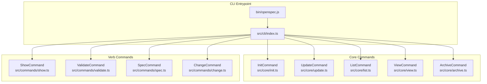
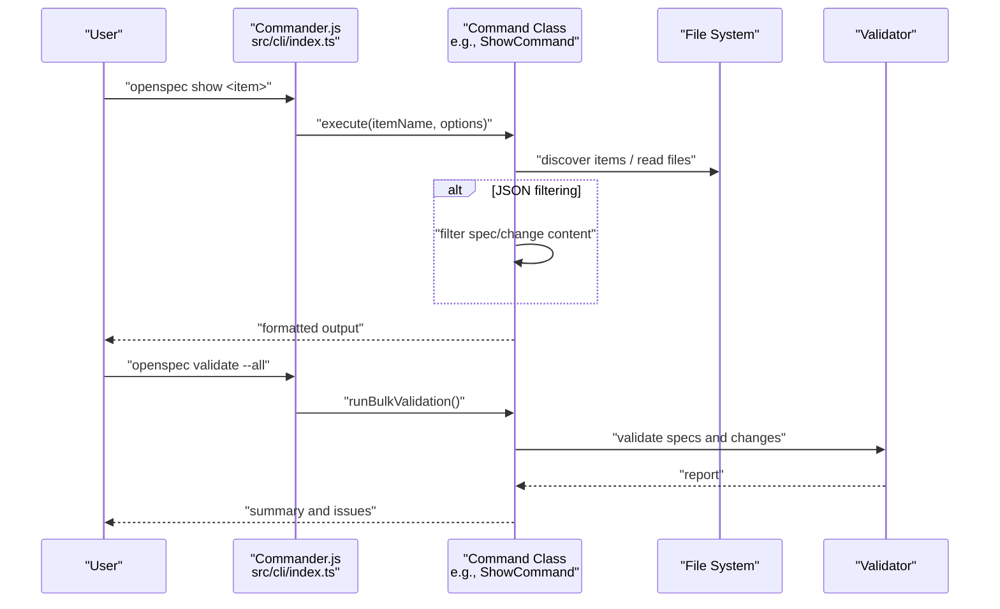
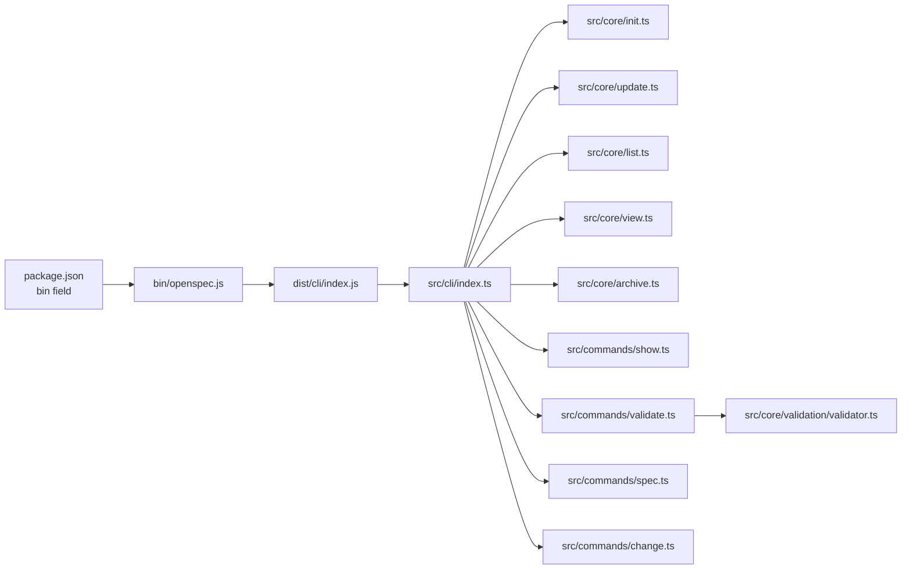

# Command Reference

<cite>
**Referenced Files in This Document**
- [bin/openspec.js](file://bin/openspec.js)
- [package.json](file://package.json)
- [src/cli/index.ts](file://src/cli/index.ts)
- [src/index.ts](file://src/index.ts)
- [src/core/init.ts](file://src/core/init.ts)
- [src/core/update.ts](file://src/core/update.ts)
- [src/core/list.ts](file://src/core/list.ts)
- [src/core/view.ts](file://src/core/view.ts)
- [src/core/archive.ts](file://src/core/archive.ts)
- [src/commands/change.ts](file://src/commands/change.ts)
- [src/commands/show.ts](file://src/commands/show.ts)
- [src/commands/spec.ts](file://src/commands/spec.ts)
- [src/commands/validate.ts](file://src/commands/validate.ts)
- [src/core/validation/validator.ts](file://src/core/validation/validator.ts)
- [src/utils/interactive.ts](file://src/utils/interactive.ts)
- [src/utils/item-discovery.ts](file://src/utils/item-discovery.ts)
</cite>

## Table of Contents
1. [Introduction](#introduction)
2. [Project Structure](#project-structure)
3. [Core Components](#core-components)
4. [Architecture Overview](#architecture-overview)
5. [Detailed Command Reference](#detailed-command-reference)
6. [Dependency Analysis](#dependency-analysis)
7. [Performance Considerations](#performance-considerations)
8. [Troubleshooting Guide](#troubleshooting-guide)
9. [Conclusion](#conclusion)

## Introduction
This document is a quick reference for OpenSpec’s command-line interface. It covers all available commands, their primary functions, and how they map to the core functionality implemented in the src/core and src/commands directories. It also explains how the Commander.js framework structures the CLI, routes commands to handlers, and how the global installation makes the executable available in the system path.

## Project Structure
OpenSpec exposes a single CLI binary named openspec. The CLI entrypoint resolves to a compiled module that wires up Commander.js and registers all commands. The CLI delegates to core command classes that encapsulate the logic for project setup, listing, viewing, validating, showing, archiving, and change/spec management.

**Diagram sources**
- [bin/openspec.js](file://bin/openspec.js#L1-L3)
- [src/cli/index.ts](file://src/cli/index.ts#L1-L254)
- [src/core/init.ts](file://src/core/init.ts#L1-L120)
- [src/core/update.ts](file://src/core/update.ts#L1-L130)
- [src/core/list.ts](file://src/core/list.ts#L1-L104)
- [src/core/view.ts](file://src/core/view.ts#L1-L189)
- [src/core/archive.ts](file://src/core/archive.ts#L1-L256)
- [src/commands/show.ts](file://src/commands/show.ts#L1-L140)
- [src/commands/validate.ts](file://src/commands/validate.ts#L1-L306)
- [src/commands/spec.ts](file://src/commands/spec.ts#L1-L250)
- [src/commands/change.ts](file://src/commands/change.ts#L1-L292)

**Section sources**
- [bin/openspec.js](file://bin/openspec.js#L1-L3)
- [package.json](file://package.json#L29-L31)
- [src/cli/index.ts](file://src/cli/index.ts#L1-L254)

## Core Components
- CLI bootstrap: The CLI is bootstrapped by importing the compiled CLI module from dist and wiring up Commander.js in src/cli/index.ts.
- Core command classes: Each top-level command is implemented as a class in src/core (init, update, list, view, archive) and in src/commands (show, validate, spec, change).
- Interactive helpers: Utilities determine whether interactive prompts are allowed and discover active items for selection.
- Validation engine: The Validator class performs structured validation for specs and change delta specs.

**Section sources**
- [src/cli/index.ts](file://src/cli/index.ts#L1-L254)
- [src/core/init.ts](file://src/core/init.ts#L1-L120)
- [src/core/update.ts](file://src/core/update.ts#L1-L130)
- [src/core/list.ts](file://src/core/list.ts#L1-L104)
- [src/core/view.ts](file://src/core/view.ts#L1-L189)
- [src/core/archive.ts](file://src/core/archive.ts#L1-L256)
- [src/commands/show.ts](file://src/commands/show.ts#L1-L140)
- [src/commands/validate.ts](file://src/commands/validate.ts#L1-L306)
- [src/commands/spec.ts](file://src/commands/spec.ts#L1-L250)
- [src/commands/change.ts](file://src/commands/change.ts#L1-L292)
- [src/core/validation/validator.ts](file://src/core/validation/validator.ts#L1-L449)
- [src/utils/interactive.ts](file://src/utils/interactive.ts#L1-L8)
- [src/utils/item-discovery.ts](file://src/utils/item-discovery.ts#L1-L46)

## Architecture Overview
OpenSpec’s CLI follows a layered architecture:
- Binary wrapper: bin/openspec.js loads the compiled CLI module.
- CLI wiring: src/cli/index.ts defines the CLI surface, registers commands, and applies global options.
- Command routing: Each command action instantiates a command class and invokes its execute/show/list/validate methods.
- Core logic: Command classes orchestrate file system operations, parsing, validation, and user prompts.
- Validation: The Validator class enforces schema and content rules for specs and change delta specs.

**Diagram sources**
- [src/cli/index.ts](file://src/cli/index.ts#L201-L251)
- [src/commands/show.ts](file://src/commands/show.ts#L1-L140)
- [src/commands/validate.ts](file://src/commands/validate.ts#L1-L306)
- [src/core/validation/validator.ts](file://src/core/validation/validator.ts#L1-L449)

## Detailed Command Reference

### openspec init
- Basic syntax: openspec init [path] [--tools <tools>]
- Primary use case: Initialize OpenSpec in a project. Creates the openspec directory structure, templates, and integrates AI tool configurations. Supports non-interactive selection of tools via --tools.
- Relationship to workflow: Sets up the project scaffolding and tooling before authoring changes and specs.
- Implementation mapping:
  - CLI wiring: src/cli/index.ts registers the init command and parses options.
  - Core logic: src/core/init.ts orchestrates directory creation, template writing, and tool configuration.
- Typical workflow: openspec init .; openspec update .

**Section sources**
- [src/cli/index.ts](file://src/cli/index.ts#L40-L74)
- [src/core/init.ts](file://src/core/init.ts#L376-L460)

### openspec update
- Basic syntax: openspec update [path]
- Primary use case: Refresh OpenSpec instruction files and AI tool configurations in place.
- Relationship to workflow: Keeps generated files and slash commands up-to-date after tool updates or policy changes.
- Implementation mapping:
  - CLI wiring: src/cli/index.ts registers the update command.
  - Core logic: src/core/update.ts updates AGENTS.md and reconfigures existing tool files.

**Section sources**
- [src/cli/index.ts](file://src/cli/index.ts#L76-L89)
- [src/core/update.ts](file://src/core/update.ts#L1-L130)

### openspec list
- Basic syntax: openspec list [--specs | --changes]
- Primary use case: List active changes or specs with counts and progress.
- Relationship to workflow: Provides a quick overview of ongoing work and spec inventory.
- Implementation mapping:
  - CLI wiring: src/cli/index.ts registers the list command with mode flags.
  - Core logic: src/core/list.ts enumerates changes and specs, computes task progress, and formats output.

**Section sources**
- [src/cli/index.ts](file://src/cli/index.ts#L91-L106)
- [src/core/list.ts](file://src/core/list.ts#L1-L104)

### openspec view
- Basic syntax: openspec view
- Primary use case: Display an interactive dashboard summarizing active changes, completed changes, and specs.
- Relationship to workflow: Visual overview to prioritize next steps.
- Implementation mapping:
  - CLI wiring: src/cli/index.ts registers the view command.
  - Core logic: src/core/view.ts reads changes and specs, computes progress, and renders a formatted dashboard.

**Section sources**
- [src/cli/index.ts](file://src/cli/index.ts#L108-L121)
- [src/core/view.ts](file://src/core/view.ts#L1-L189)

### openspec archive
- Basic syntax: openspec archive [change-name] [-y | --yes] [--skip-specs] [--no-validate]
- Primary use case: Archive a completed change and update main specs accordingly. Validates change delta specs and tasks, optionally skips spec updates, and moves the change to openspec/changes/archive with a timestamped folder.
- Relationship to workflow: Finalizes a change and merges deltas into main specs.
- Implementation mapping:
  - CLI wiring: src/cli/index.ts registers the archive command with flags.
  - Core logic: src/core/archive.ts validates, checks task progress, optionally rebuilds and validates target specs, writes updates, and renames the change directory.

**Section sources**
- [src/cli/index.ts](file://src/cli/index.ts#L184-L200)
- [src/core/archive.ts](file://src/core/archive.ts#L1-L256)

### openspec validate
- Basic syntax: openspec validate [item-name] [--all | --changes | --specs] [--type change|spec] [--strict] [--json] [--concurrency <n>] [--no-interactive]
- Primary use case: Validate a single item or bulk-validate all changes and/or specs. Supports structured JSON output and concurrency control.
- Relationship to workflow: Ensures quality and consistency of specs and change proposals before archiving or publishing.
- Implementation mapping:
  - CLI wiring: src/cli/index.ts registers the validate command with flags.
  - Core logic: src/commands/validate.ts orchestrates interactive selection, type detection, and delegates to src/core/validation/validator.ts for schema and content validation.

**Section sources**
- [src/cli/index.ts](file://src/cli/index.ts#L203-L225)
- [src/commands/validate.ts](file://src/commands/validate.ts#L1-L306)
- [src/core/validation/validator.ts](file://src/core/validation/validator.ts#L1-L449)

### openspec show
- Basic syntax: openspec show [item-name] [--json] [--type change|spec] [--no-interactive] [--deltas-only | --requirements-only] [--requirements | --no-scenarios | -r <id>]
- Primary use case: Show a change or spec. Supports raw text mode and JSON mode with filtering options.
- Relationship to workflow: Inspect details of a specific item quickly.
- Implementation mapping:
  - CLI wiring: src/cli/index.ts registers the show command with flags.
  - Core logic: src/commands/show.ts resolves ambiguity, warns on irrelevant flags, and delegates to src/commands/change.ts or src/commands/spec.ts for rendering.

**Section sources**
- [src/cli/index.ts](file://src/cli/index.ts#L226-L251)
- [src/commands/show.ts](file://src/commands/show.ts#L1-L140)
- [src/commands/change.ts](file://src/commands/change.ts#L1-L292)
- [src/commands/spec.ts](file://src/commands/spec.ts#L1-L250)

### openspec change (deprecated verb-first commands)
- Basic syntax: openspec change show [change-name] [--json] [--deltas-only | --requirements-only] [--no-interactive]; openspec change list [--json] [--long]; openspec change validate [change-name] [--strict] [--json] [--no-interactive]
- Primary use case: Legacy verb-first commands for change operations. These are deprecated in favor of verb-first commands like openspec list, openspec show, and openspec validate.
- Relationship to workflow: Legacy path; prefer openspec list, openspec show, openspec validate.
- Implementation mapping:
  - CLI wiring: src/cli/index.ts registers the change subcommand group and emits deprecation warnings.
  - Core logic: src/commands/change.ts implements change-specific show, list, and validate.

**Section sources**
- [src/cli/index.ts](file://src/cli/index.ts#L122-L183)
- [src/commands/change.ts](file://src/commands/change.ts#L1-L292)

### openspec spec (deprecated verb-first commands)
- Basic syntax: openspec spec show [spec-id] [--json] [--requirements | --no-scenarios | -r <id>] [--no-interactive]; openspec spec list [--json] [--long]; openspec spec validate [spec-id] [--strict] [--json] [--no-interactive]
- Primary use case: Legacy verb-first commands for spec operations. Deprecated in favor of verb-first commands like openspec show and openspec validate.
- Relationship to workflow: Legacy path; prefer openspec show and openspec validate.
- Implementation mapping:
  - CLI wiring: src/cli/index.ts registers the spec subcommand group and emits deprecation warnings.
  - Core logic: src/commands/spec.ts implements spec-specific show, list, and validate.

**Section sources**
- [src/cli/index.ts](file://src/cli/index.ts#L201-L202)
- [src/commands/spec.ts](file://src/commands/spec.ts#L1-L250)

## Dependency Analysis
- Global installation: The package.json bin field maps the openspec executable to bin/openspec.js. This file imports the compiled CLI module from dist/cli/index.js.
- CLI wiring: src/cli/index.ts imports core command classes and registers them with Commander.js. It also registers the spec subcommand group and attaches deprecation hooks.
- Command routing: Each command action constructs a command class and calls its execute/show/list/validate methods. Interactive prompts are gated by src/utils/interactive.ts and item discovery helpers in src/utils/item-discovery.ts.
- Validation pipeline: Validation is centralized in src/core/validation/validator.ts, consumed by both archive and validate commands.

**Diagram sources**
- [package.json](file://package.json#L29-L31)
- [bin/openspec.js](file://bin/openspec.js#L1-L3)
- [src/cli/index.ts](file://src/cli/index.ts#L1-L254)
- [src/core/validation/validator.ts](file://src/core/validation/validator.ts#L1-L449)

**Section sources**
- [package.json](file://package.json#L29-L31)
- [bin/openspec.js](file://bin/openspec.js#L1-L3)
- [src/cli/index.ts](file://src/cli/index.ts#L1-L254)
- [src/commands/validate.ts](file://src/commands/validate.ts#L1-L306)
- [src/core/validation/validator.ts](file://src/core/validation/validator.ts#L1-L449)

## Performance Considerations
- Concurrency in bulk validation: The validate command supports configurable concurrency via --concurrency or the OPENSPEC_CONCURRENCY environment variable. This enables parallel validation of changes and specs to improve throughput.
- Interactive prompts: Interactive selection is disabled when --no-interactive is provided or when stdin is not a TTY, reducing overhead in non-interactive environments.
- File system operations: Commands that read and parse markdown files perform minimal IO and rely on cached discovery results where appropriate.

**Section sources**
- [src/commands/validate.ts](file://src/commands/validate.ts#L183-L273)
- [src/utils/interactive.ts](file://src/utils/interactive.ts#L1-L8)

## Troubleshooting Guide
- No OpenSpec directory found: Many commands expect an openspec directory. Use openspec init first, or run the command from a project root containing openspec/.
- Unknown item or ambiguous item: When using openspec show or openspec validate without specifying --type, the CLI attempts to disambiguate. If both a change and a spec share the same ID, pass --type change|spec explicitly.
- Validation failures: The validate command prints structured reports with levels (ERROR, WARNING, INFO). Use --json for machine-readable output and --strict to enforce stricter rules.
- Interactive mode disabled: If stdin is not a TTY or --no-interactive is set, commands may exit with hints. Run in an interactive terminal or provide explicit arguments.

**Section sources**
- [src/core/list.ts](file://src/core/list.ts#L1-L104)
- [src/core/view.ts](file://src/core/view.ts#L1-L189)
- [src/core/archive.ts](file://src/core/archive.ts#L1-L256)
- [src/commands/show.ts](file://src/commands/show.ts#L71-L114)
- [src/commands/validate.ts](file://src/commands/validate.ts#L104-L147)

## Conclusion
OpenSpec’s CLI provides a cohesive, verb-first interface for spec-driven development. Commands are organized around core workflows: setup (init), maintenance (update), inspection (list, view, show), validation (validate), and archival (archive). The Commander.js wiring cleanly routes to dedicated command classes, while the Validator centralizes enforcement. The global installation via package.json bin ensures the openspec executable is available in PATH after installation.