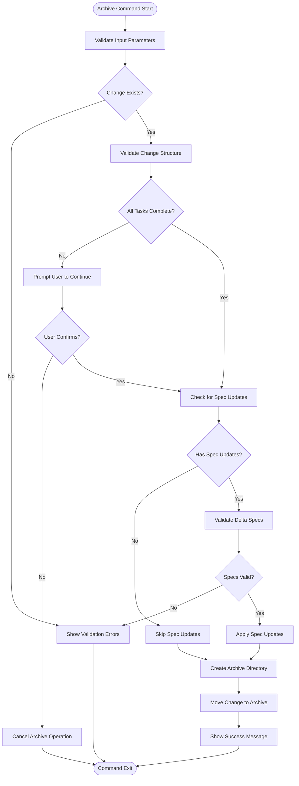
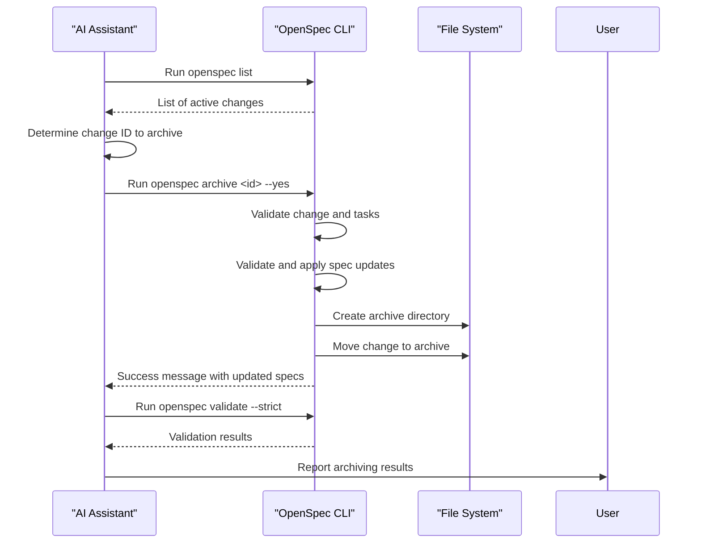
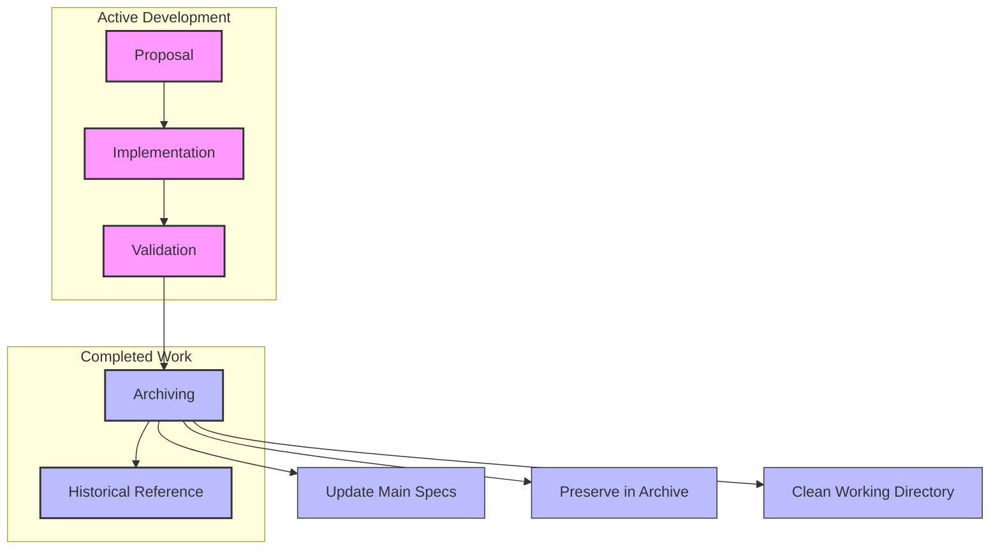
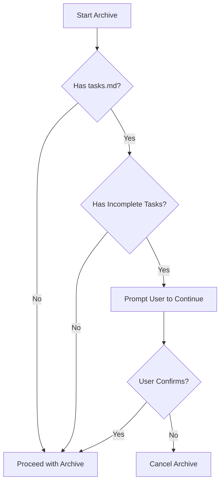

# openspec archive

<cite>
**Referenced Files in This Document**   
- [archive.ts](file://src/core/archive.ts)
- [cli/index.ts](file://src/cli/index.ts)
- [spec.md](file://openspec/specs/cli-archive/spec.md)
- [archive.test.ts](file://test/core/archive.test.ts)
- [slash-command-templates.ts](file://src/core/templates/slash-command-templates.ts)
- [agents-template.ts](file://src/core/templates/agents-template.ts)
</cite>

## Table of Contents
1. [Introduction](#introduction)
2. [Command Usage and Examples](#command-usage-and-examples)
3. [Implementation Details](#implementation-details)
4. [Integration with AI Tool Configurations](#integration-with-ai-tool-configurations)
5. [Change Management Lifecycle](#change-management-lifecycle)
6. [Common Issues and Solutions](#common-issues-and-solutions)
7. [Conclusion](#conclusion)

## Introduction
The `openspec archive` command is a critical component of the OpenSpec system for spec-driven development, designed to finalize completed changes by moving them from the active changes directory to the archive directory. This process ensures that the project's working directory remains clean and that completed work is preserved in a structured, chronological manner. The command plays a vital role in maintaining project history and ensuring that the main specification files reflect the current state of the system.

The archiving process involves several key steps: validating the change, checking task completion, updating main specifications with delta changes, and relocating the change directory to the archive with a date-based prefix. The command integrates seamlessly with AI tool configurations by removing obsolete slash commands and updating instruction files, ensuring that AI assistants have accurate and up-to-date guidance for future development tasks.

**Section sources**
- [spec.md](file://openspec/specs/cli-archive/spec.md#L1-L210)

## Command Usage and Examples
The `openspec archive` command supports both interactive and direct selection of changes to archive. When no change name is provided, the command displays an interactive list of available changes, allowing the user to select one. When a change name is provided directly, the command validates its existence and proceeds with the archiving process.

The command accepts several flags to modify its behavior:
- `-y, --yes`: Skips confirmation prompts, useful for automation
- `--skip-specs`: Skips spec update operations, ideal for infrastructure, tooling, or documentation-only changes
- `--no-validate`: Skips validation (not recommended, requires confirmation)

Examples of command usage:
```bash
# Interactive archiving (prompts for change selection)
openspec archive

# Archive a specific change with confirmation prompts
openspec archive add-new-feature

# Archive without confirmation prompts (for automation)
openspec archive add-new-feature --yes

# Archive without updating specs (for tooling changes)
openspec archive update-config --skip-specs

# Archive without validation (not recommended)
openspec archive experimental-change --no-validate
```

When the `--skip-specs` flag is used, the command skips spec discovery and update confirmation, proceeding directly to moving the change to the archive. This is particularly useful for changes that don't affect the system's specifications, such as tooling updates or documentation improvements.

**Section sources**
- [cli/index.ts](file://src/cli/index.ts#L184-L199)
- [spec.md](file://openspec/specs/cli-archive/spec.md#L7-L121)

## Implementation Details
The `ArchiveCommand` class in `archive.ts` implements the archiving functionality with a comprehensive process that ensures data integrity and prevents premature archival. The command begins by verifying the existence of the changes directory and the specified change. If no change name is provided, it uses an interactive selection process to allow the user to choose from available changes.

Before archiving, the command performs several validation steps:
1. **Change validation**: Validates the change structure and proposal.md file
2. **Delta spec validation**: Validates delta-formatted spec files for correctness
3. **Task completion check**: Verifies that all tasks in tasks.md are complete

The command then proceeds to update main specifications from the change's future state specs. It parses delta changes from the change's spec files and applies them to the main specifications in a specific order: RENAMED → REMOVED → MODIFIED → ADDED. This ensures that operations are applied correctly and prevents conflicts.

During the spec update process, the command performs extensive validation to prevent errors:
- Checks for duplicate requirements within sections
- Detects cross-section conflicts (e.g., a requirement present in both ADDED and REMOVED)
- Validates that MODIFIED operations reference the correct headers after renames
- Ensures that RENAMED operations don't create naming conflicts

After successful validation, the command creates an archive directory with a date prefix in the format `YYYY-MM-DD-[change-name]` and moves the entire change directory to this location. The date prefix maintains chronological order and prevents naming conflicts.



**Diagram sources **
- [archive.ts](file://src/core/archive.ts#L21-L256)

**Section sources**
- [archive.ts](file://src/core/archive.ts#L21-L607)

## Integration with AI Tool Configurations
The `openspec archive` command integrates with AI tool configurations by updating instruction files and removing obsolete slash commands. This ensures that AI assistants have accurate and up-to-date guidance for future development tasks.

The integration is implemented through the slash command templates defined in `slash-command-templates.ts`. The archive command has a specific template that guides AI assistants through the archiving process:

```typescript
const archiveSteps = `**Steps**
1. Determine the change ID to archive:
   - If this prompt already includes a specific change ID (for example inside a \`<ChangeId>\` block populated by slash-command arguments), use that value after trimming whitespace.
   - If the conversation references a change loosely (for example by title or summary), run \`openspec list\` to surface likely IDs, share the relevant candidates, and confirm which one the user intends.
   - Otherwise, review the conversation, run \`openspec list\`, and ask the user which change to archive; wait for a confirmed change ID before proceeding.
   - If you still cannot identify a single change ID, stop and tell the user you cannot archive anything yet.
2. Validate the change ID by running \`openspec list\` (or \`openspec show <id>\`) and stop if the change is missing, already archived, or otherwise not ready to archive.
3. Run \`openspec archive <id> --yes\` so the CLI moves the change and applies spec updates without prompts (use \`--skip-specs\` only for tooling-only work).
4. Review the command output to confirm the target specs were updated and the change landed in \`changes/archive/\`.
5. Validate with \`openspec validate --strict\` and inspect with \`openspec show <id>\` if anything looks off.`;
```

The agents template in `agents-template.ts` also includes guidance for the archiving stage:

```markdown
### Stage 3: Archiving Changes
After deployment, create separate PR to:
- Move \`changes/[name]/\` → \`changes/archive/YYYY-MM-DD-[name]/\`
- Update \`specs/\` if capabilities changed
- Use \`openspec archive <change-id> --skip-specs --yes\` for tooling-only changes (always pass the change ID explicitly)
- Run \`openspec validate --strict\` to confirm the archived change passes checks
```

This integration ensures that AI assistants follow a consistent process for archiving changes, maintaining the integrity of the spec-driven development workflow. The use of the `--yes` flag in the AI instructions allows for non-interactive execution, which is essential for automated workflows.



**Diagram sources **
- [slash-command-templates.ts](file://src/core/templates/slash-command-templates.ts#L35-L48)
- [agents-template.ts](file://src/core/templates/agents-template.ts#L59-L64)

**Section sources**
- [slash-command-templates.ts](file://src/core/templates/slash-command-templates.ts#L1-L59)
- [agents-template.ts](file://src/core/templates/agents-template.ts#L1-L458)

## Change Management Lifecycle
The `openspec archive` command plays a crucial role in the overall change management lifecycle, serving as the final step that transitions a change from "active" to "completed" status. This lifecycle ensures that changes are properly documented, implemented, and preserved for future reference.

The change management lifecycle consists of the following stages:
1. **Proposal**: Creating a change proposal with `openspec init` or manually
2. **Implementation**: Developing the change according to the proposal
3. **Validation**: Validating the change with `openspec validate`
4. **Archiving**: Finalizing the change with `openspec archive`
5. **Historical Reference**: Accessing archived changes for future reference

The archiving stage serves several important purposes:
- **Finalization**: Marks the change as complete and removes it from the active changes list
- **Specification Update**: Applies delta changes to the main specifications, ensuring they reflect the current state of the system
- **Historical Preservation**: Preserves the change in the archive directory with a date-based prefix for chronological organization
- **Clean Working Directory**: Removes completed changes from the working directory, reducing clutter and improving focus on active work

The command's integration with the task completion check ensures that changes are not archived prematurely. If incomplete tasks are detected, the user is prompted to confirm whether to proceed, preventing accidental archival of incomplete work.

The date-based naming convention (`YYYY-MM-DD-[change-name]`) in the archive directory provides several benefits:
- **Chronological Order**: Changes are automatically sorted by date
- **Unique Names**: Prevents naming conflicts even with similar change names
- **Temporal Context**: Provides immediate context about when the change was completed
- **Searchability**: Enables easy filtering and searching by date

This lifecycle approach promotes disciplined development practices, ensuring that changes are properly documented, validated, and preserved. The archive serves as a comprehensive history of the project's evolution, which can be invaluable for onboarding new team members, understanding design decisions, and troubleshooting issues.



**Diagram sources **
- [archive.ts](file://src/core/archive.ts#L235-L256)
- [spec.md](file://openspec/specs/cli-archive/spec.md#L47-L59)

**Section sources**
- [archive.ts](file://src/core/archive.ts#L21-L607)
- [spec.md](file://openspec/specs/cli-archive/spec.md#L1-L210)

## Common Issues and Solutions
The `openspec archive` command may encounter several common issues during execution. Understanding these issues and their solutions is essential for effective use of the command.

### Archiving Incomplete Changes
One common issue is attempting to archive changes with incomplete tasks. The command detects incomplete tasks by checking for unchecked items (`- [ ]`) in the `tasks.md` file. When incomplete tasks are found, the command prompts the user to confirm whether to proceed.

**Solution**: Complete all tasks in `tasks.md` before archiving, or explicitly confirm continuation if archiving is appropriate despite incomplete tasks.



### File Permission Errors
File permission errors can occur when the command lacks write permissions for the target directories. This is particularly common in shared development environments or when running the command with different user privileges.

**Solution**: Ensure the user has appropriate write permissions for the `openspec/changes` and `openspec/specs` directories. The command includes a permission check that attempts to create a test file to verify write access.

### Validation Failures
Validation failures can occur at multiple levels:
- **Change validation**: Issues with the proposal.md structure
- **Delta spec validation**: Problems with delta-formatted spec files
- **Rebuilt spec validation**: Errors in the updated main specifications

**Solution**: Address validation errors before attempting to archive. Use `openspec validate <change-name> --strict` to identify and fix issues. For temporary bypassing of validation (not recommended), use the `--no-validate` flag with explicit confirmation.

### Spec Update Conflicts
Spec update conflicts can occur when applying delta changes would create duplicate requirement headers or violate other constraints.

**Solution**: Manually resolve conflicts in the change's spec files before archiving. Common issues include:
- Duplicate requirements in the same section
- Conflicting operations (e.g., a requirement marked for both addition and removal)
- Incorrect header references after renames

### Archive Name Conflicts
Archive name conflicts occur when attempting to archive a change with a name that already exists in the archive directory with the same date prefix.

**Solution**: Wait until the next day to archive, or manually rename the existing archive if appropriate. The date-based naming convention minimizes this issue but doesn't eliminate it entirely.

The command provides clear error messages and guidance for resolving these issues, helping users maintain the integrity of their spec-driven development workflow.

**Section sources**
- [archive.ts](file://src/core/archive.ts#L60-L233)
- [archive.test.ts](file://test/core/archive.test.ts#L130-L150)

## Conclusion
The `openspec archive` command is a vital component of the OpenSpec system, providing a structured and reliable way to finalize completed changes. By moving changes to the archive directory with date-based naming, the command maintains a clean working directory and preserves a comprehensive history of the project's evolution.

The command's implementation includes robust validation, task completion checks, and spec update functionality, ensuring that changes are properly finalized before archiving. Its integration with AI tool configurations through slash command templates and agents instructions ensures that AI assistants follow a consistent process for archiving changes.

The `--skip-specs` flag provides flexibility for archiving changes that don't affect the system's specifications, while the `--yes` flag enables automation in CI/CD pipelines. The comprehensive error handling and clear feedback help users identify and resolve issues, maintaining the integrity of the spec-driven development workflow.

By following the change management lifecycle and addressing common issues proactively, teams can leverage the `openspec archive` command to maintain a well-organized, documented, and traceable development process.