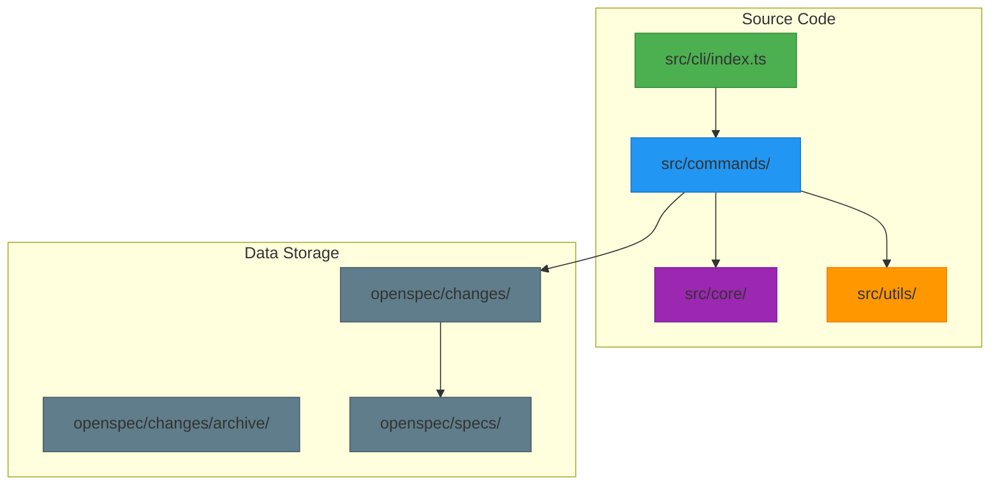
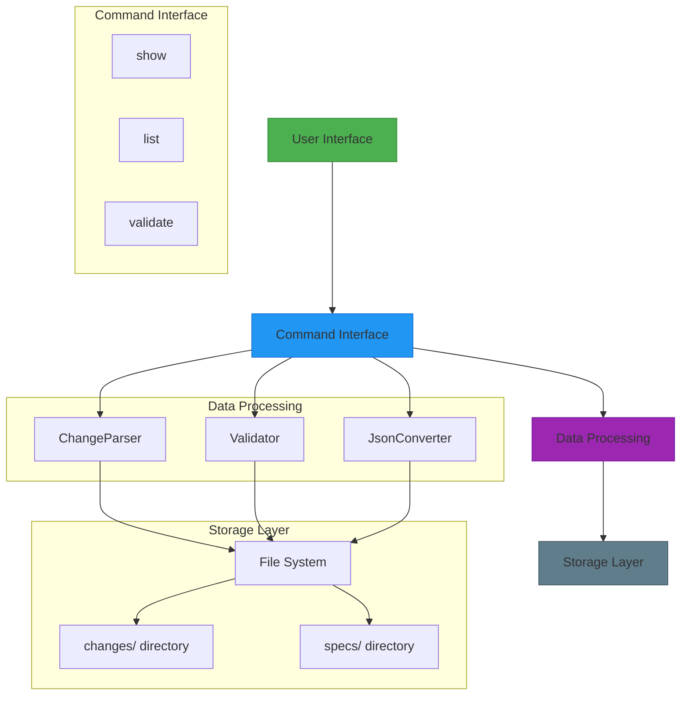
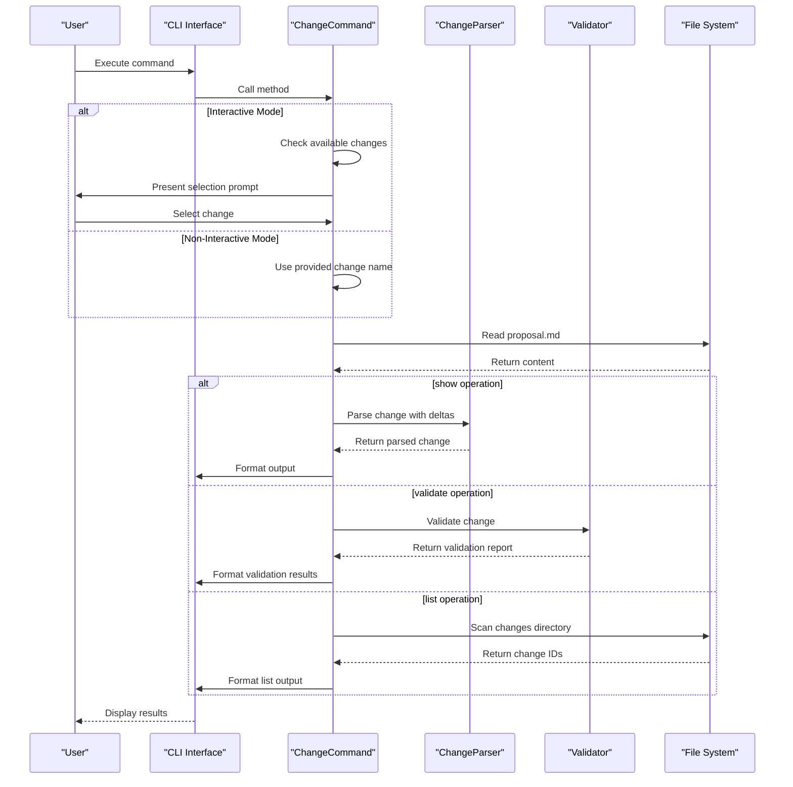
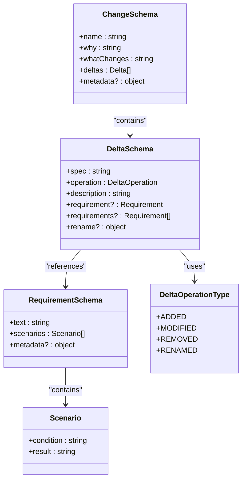
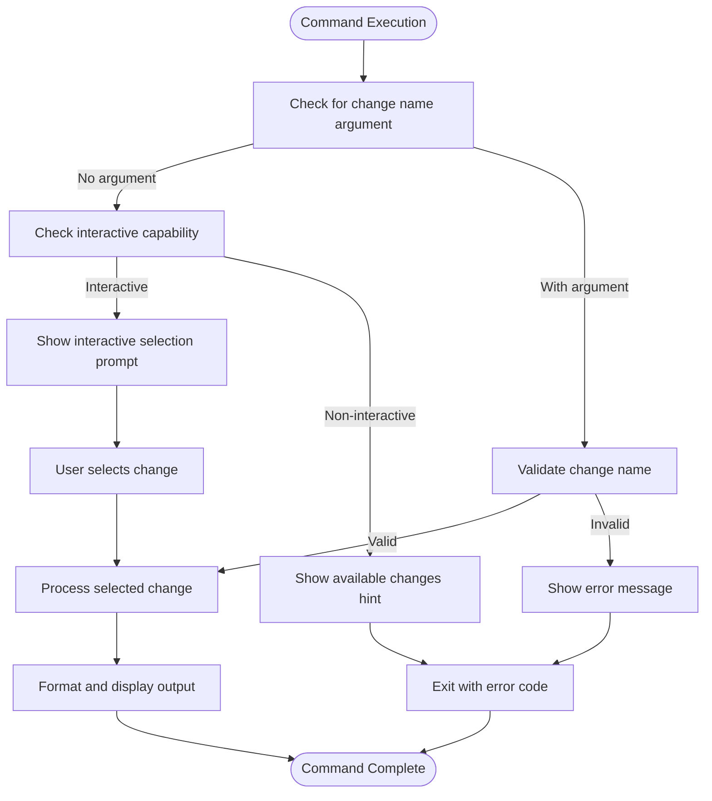
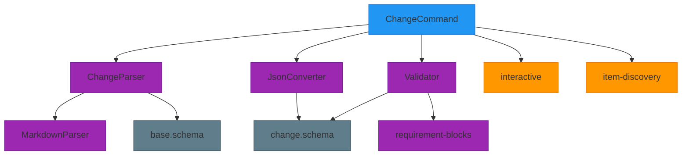

# openspec change

<cite>
**Referenced Files in This Document**   
- [change.ts](file://src/commands/change.ts)
- [change.schema.ts](file://src/core/schemas/change.schema.ts)
- [change-parser.ts](file://src/core/parsers/change-parser.ts)
- [validator.ts](file://src/core/validation/validator.ts)
- [interactive.ts](file://src/utils/interactive.ts)
- [task-progress.ts](file://src/utils/task-progress.ts)
- [item-discovery.ts](file://src/utils/item-discovery.ts)
- [cli-change/spec.md](file://openspec/specs/cli-change/spec.md)
</cite>

## Table of Contents
1. [Introduction](#introduction)
2. [Project Structure](#project-structure)
3. [Core Components](#core-components)
4. [Architecture Overview](#architecture-overview)
5. [Detailed Component Analysis](#detailed-component-analysis)
6. [Dependency Analysis](#dependency-analysis)
7. [Performance Considerations](#performance-considerations)
8. [Troubleshooting Guide](#troubleshooting-guide)
9. [Conclusion](#conclusion)

## Introduction
The `openspec change` command provides a comprehensive interface for managing change operations within the OpenSpec system. It enables users to create, view, validate, and manage change proposals that document modifications to specifications. The command supports both interactive and non-interactive modes, allowing for flexible workflow integration. Change operations are central to the OpenSpec methodology, serving as the primary mechanism for proposing, tracking, and implementing specification modifications. The command integrates with the specification system through delta-based change tracking, where changes are represented as additions, modifications, removals, or renamings of requirements.

## Project Structure
The `openspec change` functionality is organized within the OpenSpec repository according to a modular architecture. The core implementation resides in the `src/commands/change.ts` file, which contains the `ChangeCommand` class responsible for all change-related operations. Supporting functionality is distributed across various directories: schema definitions in `src/core/schemas/`, parsers in `src/core/parsers/`, validation logic in `src/core/validation/`, and utility functions in `src/utils/`. The changes themselves are stored in the `openspec/changes/` directory, with each change occupying its own subdirectory containing proposal, tasks, and specification files. Archived changes are moved to the `openspec/changes/archive/` directory with timestamped names.

**Diagram sources**
- [change.ts](file://src/commands/change.ts)
- [change.schema.ts](file://src/core/schemas/change.schema.ts)

**Section sources**
- [change.ts](file://src/commands/change.ts)
- [project.md](file://openspec/project.md)

## Core Components
The `openspec change` command is implemented as a class-based system with distinct components for different operations. The `ChangeCommand` class in `change.ts` serves as the primary interface, exposing methods for showing, listing, and validating changes. Each operation follows a consistent pattern of input validation, data retrieval, processing, and output formatting. The command integrates with the specification system through the `ChangeParser` and `Validator` classes, which extract and validate delta information from specification files. Task management is supported through the `task-progress.ts` utility, which parses task completion status from markdown files. Interactive functionality is enabled by the `isInteractive` function and `@inquirer/prompts` library, providing user-friendly selection interfaces when appropriate.

**Section sources**
- [change.ts](file://src/commands/change.ts#L16-L292)
- [task-progress.ts](file://src/utils/task-progress.ts#L1-L44)

## Architecture Overview
The `openspec change` command follows a layered architecture that separates concerns between command interface, data processing, and storage. At the top layer, the command interface handles user input and output formatting. Below this, the processing layer parses change proposals and validates their structure against defined schemas. The storage layer interacts with the filesystem to read and write change data. The system uses a delta-based approach to track changes, where modifications to specifications are explicitly declared as additions, modifications, removals, or renamings of requirements. This architecture enables both human-readable documentation and machine-processable change descriptions, supporting both collaborative development and automated tooling.

**Diagram sources**
- [change.ts](file://src/commands/change.ts#L16-L292)
- [change-parser.ts](file://src/core/parsers/change-parser.ts#L1-L234)
- [validator.ts](file://src/core/validation/validator.ts#L1-L449)

## Detailed Component Analysis

### Change Command Implementation
The `ChangeCommand` class provides three primary operations: show, list, and validate. Each method follows a consistent pattern of input handling, data retrieval, processing, and output formatting. The command supports both interactive and non-interactive modes, automatically detecting the appropriate behavior based on environment and user preferences.

#### For API/Service Components:

**Diagram sources**
- [change.ts](file://src/commands/change.ts#L16-L292)
- [change-parser.ts](file://src/core/parsers/change-parser.ts#L1-L234)
- [validator.ts](file://src/core/validation/validator.ts#L1-L449)

**Section sources**
- [change.ts](file://src/commands/change.ts#L16-L292)

### Change Schema and Validation
The change system uses a structured schema to ensure consistency and validity of change proposals. The schema defines required fields, data types, and validation rules that must be satisfied for a change to be considered valid. Validation occurs at multiple levels, from basic structural requirements to semantic rules about content quality.

#### For Object-Oriented Components:

**Diagram sources**
- [change.schema.ts](file://src/core/schemas/change.schema.ts#L1-L42)
- [base.schema.ts](file://src/core/schemas/base.schema.ts)

**Section sources**
- [change.schema.ts](file://src/core/schemas/change.schema.ts#L1-L42)
- [constants.ts](file://src/core/validation/constants.ts#L1-L49)

### Interactive Mode and Task Management
The change command supports interactive mode for user-friendly change selection and management. When no change name is provided, the command automatically detects whether interactive prompts should be used based on the environment. Task management is integrated through the tasks.md file in each change directory, which tracks implementation progress using a simple checklist format.

#### For Complex Logic Components:

**Diagram sources**
- [change.ts](file://src/commands/change.ts#L32-L50)
- [interactive.ts](file://src/utils/interactive.ts#L1-L8)
- [item-discovery.ts](file://src/utils/item-discovery.ts#L1-L46)

**Section sources**
- [change.ts](file://src/commands/change.ts#L32-L50)
- [interactive.ts](file://src/utils/interactive.ts#L1-L8)

## Dependency Analysis
The `openspec change` command has a well-defined dependency structure that follows the dependency inversion principle. The command depends on abstract interfaces rather than concrete implementations, allowing for flexibility and testability. Key dependencies include the `ChangeParser` for extracting structured data from markdown files, the `Validator` for ensuring change validity, and the `JsonConverter` for formatting output. Utility functions for interactive prompts and file system operations are imported as needed. The command has no circular dependencies and maintains a clear separation of concerns between input handling, data processing, and output formatting.

**Diagram sources**
- [change.ts](file://src/commands/change.ts)
- [change-parser.ts](file://src/core/parsers/change-parser.ts)
- [validator.ts](file://src/core/validation/validator.ts)

**Section sources**
- [change.ts](file://src/commands/change.ts)
- [change-parser.ts](file://src/core/parsers/change-parser.ts)
- [validator.ts](file://src/core/validation/validator.ts)

## Performance Considerations
The `openspec change` command is designed for optimal performance in typical usage scenarios. File operations are minimized through efficient directory scanning and selective file reading. The command uses asynchronous operations to avoid blocking the event loop during file I/O. For large projects with many changes, the list operation has been optimized to read only essential files and cache results when possible. The validation process is designed to fail fast, reporting the first encountered error rather than attempting to validate the entire structure. Memory usage is kept low by processing files in a streaming fashion rather than loading entire directories into memory at once.

## Troubleshooting Guide
Common issues with the `openspec change` command typically relate to file structure, naming conventions, or validation rules. When a change cannot be found, verify that the change directory exists in `openspec/changes/` and contains a `proposal.md` file. Naming conflicts can occur when attempting to create a change with an existing name; resolve this by choosing a unique name that follows kebab-case convention. Invalid change states often result from missing required sections in the proposal.md file; ensure that both "## Why" and "## What Changes" sections are present. Validation errors may indicate issues with delta specifications in the specs/ directory; use the `--deltas-only` flag to inspect parsed deltas and identify formatting problems. For interactive mode issues, check that stdin is connected to a TTY or that the `OPEN_SPEC_INTERACTIVE` environment variable is not set to '0'.

**Section sources**
- [change.ts](file://src/commands/change.ts)
- [validator.ts](file://src/core/validation/validator.ts)
- [constants.ts](file://src/core/validation/constants.ts)

## Conclusion
The `openspec change` command provides a robust and flexible interface for managing specification changes within the OpenSpec system. Its architecture balances ease of use with powerful functionality, supporting both interactive and automated workflows. The command's integration with the specification system through delta-based change tracking enables precise documentation of modifications while maintaining backward compatibility with existing content. By enforcing consistent structure through schema validation and providing helpful feedback for common issues, the command lowers the barrier to entry for contributing to specification development. The modular design allows for future enhancements while maintaining stability for existing workflows.