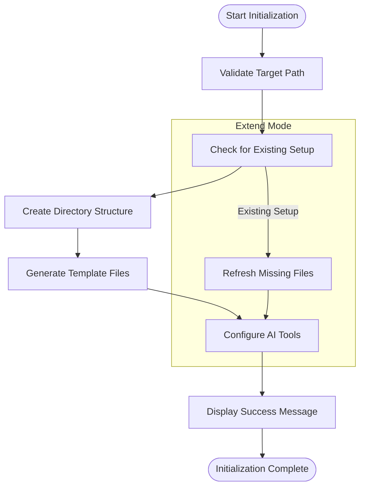
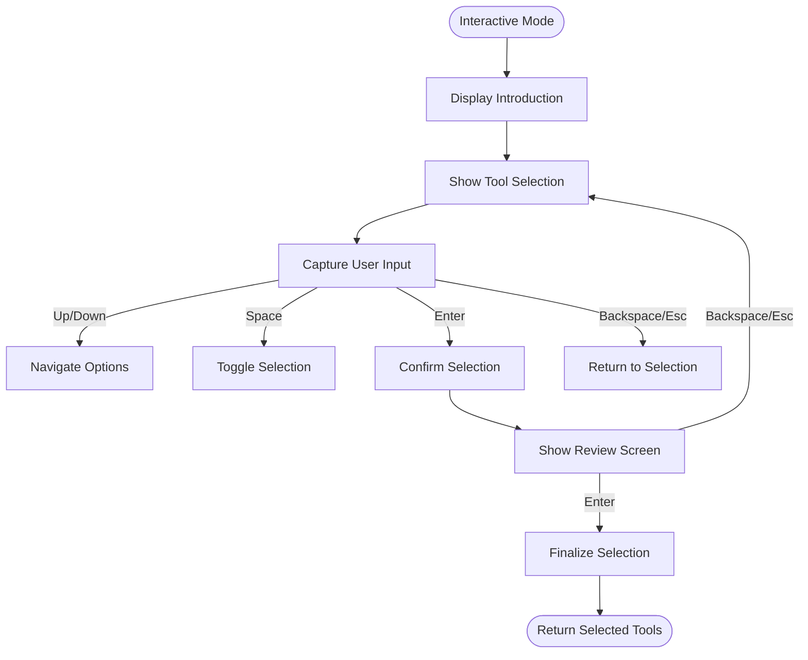
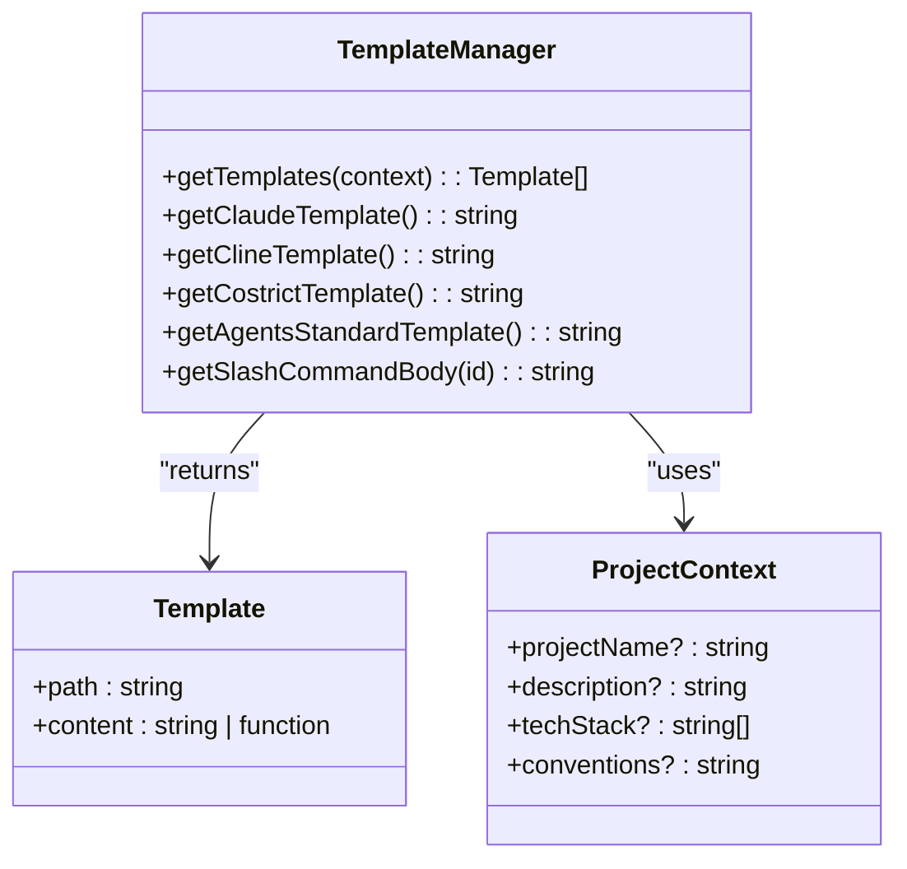
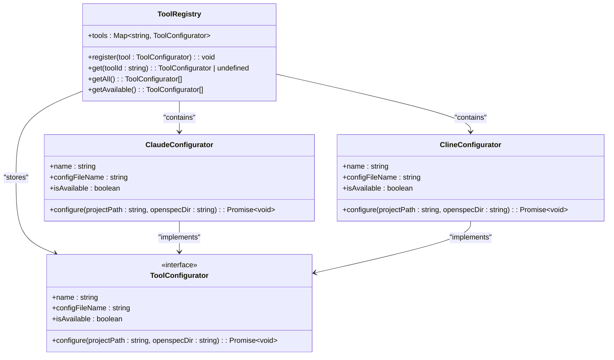
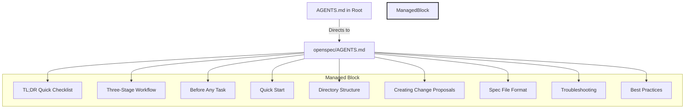

# openspec init

<cite>
**Referenced Files in This Document**   
- [init.ts](file://src/core/init.ts)
- [cli/index.ts](file://src/cli/index.ts)
- [config.ts](file://src/core/config.ts)
- [templates/index.ts](file://src/core/templates/index.ts)
- [configurators/registry.ts](file://src/core/configurators/registry.ts)
- [templates/agents-template.ts](file://src/core/templates/agents-template.ts)
- [templates/agents-root-stub.ts](file://src/core/templates/agents-root-stub.ts)
- [AGENTS.md](file://AGENTS.md)
</cite>

## Table of Contents
1. [Introduction](#introduction)
2. [Command Usage and Options](#command-usage-and-options)
3. [Initialization Workflow](#initialization-workflow)
4. [Interactive Mode](#interactive-mode)
5. [Non-Interactive Mode](#non-interactive-mode)
6. [Template System](#template-system)
7. [Configurators System](#configurators-system)
8. [AGENTS.md File Structure](#agentsmd-file-structure)
9. [Common Issues and Solutions](#common-issues-and-solutions)
10. [Conclusion](#conclusion)

## Introduction

The `openspec init` command is the entry point for setting up OpenSpec in a new or existing project. It initializes the OpenSpec directory structure, creates essential configuration files, and integrates with various AI tools through a configurable setup process. This command serves as the foundation for implementing spec-driven development with AI assistants.

The initialization process creates a standardized project structure under the `openspec/` directory, generates template files for project documentation and specifications, and configures AI tools to work with OpenSpec's conventions. The command supports both interactive and non-interactive modes, allowing users to customize their setup based on their preferences and workflow requirements.

**Section sources**
- [init.ts](file://src/core/init.ts#L376-L971)
- [cli/index.ts](file://src/cli/index.ts#L40-L74)

## Command Usage and Options

The `openspec init` command can be executed with various options to customize the initialization process. The basic syntax is:

```bash
openspec init [path]
```

Where `[path]` is an optional parameter specifying the target directory for initialization. If no path is provided, the current directory is used.

The command supports the following options:

- `--tools <tools>`: Configure AI tools non-interactively. This option accepts "all", "none", or a comma-separated list of tool IDs.

For example:
- `openspec init` - Initialize in current directory with interactive tool selection
- `openspec init ./my-project` - Initialize in the specified directory
- `openspec init --tools claude,cursor` - Initialize with specific tools in non-interactive mode
- `openspec init --tools all` - Initialize with all available tools

The command automatically detects whether OpenSpec has already been initialized in the target directory. If an existing setup is detected, the command switches to "extend mode," which preserves existing configurations while adding new integrations or refreshing instruction files.

**Section sources**
- [cli/index.ts](file://src/cli/index.ts#L40-L74)
- [init.ts](file://src/core/init.ts#L371-L383)

## Initialization Workflow

The `openspec init` command follows a structured workflow to initialize a project with OpenSpec. The process consists of several key phases that ensure proper setup and configuration.

### Directory Structure Creation

When initializing a new project, the command creates the following directory structure:

```
openspec/
├── specs/                  # Current truth - what IS built
│   └── [capability]/       # Single focused capability
├── changes/                # Proposals - what SHOULD change
│   ├── [change-name]/
│   └── archive/            # Completed changes
```

This structure is created in the target directory, establishing the foundation for spec-driven development. The command ensures all necessary directories exist, creating them if they don't.

### Configuration File Generation

The initialization process generates essential configuration files:

1. **openspec/AGENTS.md**: Contains comprehensive instructions for AI assistants, including workflow guidance, CLI commands, and best practices.
2. **openspec/project.md**: Provides project-specific context, including purpose, tech stack, conventions, and domain knowledge.
3. **AI tool configuration files**: Creates or updates configuration files for selected AI tools (e.g., CLAUDE.md, CLINE.md).

In extend mode, when OpenSpec is already initialized, the command checks for missing files and recreates them if necessary, ensuring the project structure remains complete.

### AI Tool Configuration

The final phase involves configuring the selected AI tools. For each selected tool, the command:
1. Creates or updates the tool's configuration file with OpenSpec instructions
2. Generates tool-specific slash commands when applicable
3. Applies OpenSpec markers to manage content blocks

The configuration process uses a registry system to locate the appropriate configurator for each tool, ensuring consistent setup across different AI platforms.



**Diagram sources **
- [init.ts](file://src/core/init.ts#L417-L437)
- [init.ts](file://src/core/init.ts#L438-L449)
- [init.ts](file://src/core/init.ts#L450-L459)

**Section sources**
- [init.ts](file://src/core/init.ts#L385-L459)
- [init.ts](file://src/core/init.ts#L708-L761)

## Interactive Mode

The interactive mode provides a guided experience for setting up OpenSpec with AI tools. When no `--tools` option is provided, the command automatically enters interactive mode, presenting users with a selection interface.

### Tool Selection Interface

The interactive tool selection wizard presents two categories of AI tools:

1. **Natively supported providers**: Tools with OpenSpec custom slash commands available (marked with ✔)
2. **Other tools**: Tools that use the Universal AGENTS.md for integration (e.g., Amp, VS Code, GitHub Copilot)

The interface uses keyboard navigation:
- ↑/↓: Move between options
- Space: Toggle selection
- Enter: Select highlighted tool and proceed to review
- Backspace/Esc: Return to selection screen

### Selection Process

The wizard guides users through a three-step process:

1. **Introduction**: Briefly explains the purpose of the initialization
2. **Selection**: Allows users to choose which AI tools to configure
3. **Review**: Displays the selected configuration for confirmation

The interface pre-selects tools that are already configured in extend mode, making it easy to refresh existing setups or add new integrations.



**Diagram sources **
- [init.ts](file://src/core/init.ts#L100-L369)
- [init.ts](file://src/core/init.ts#L559-L630)

**Section sources**
- [init.ts](file://src/core/init.ts#L100-L369)
- [init.ts](file://src/core/init.ts#L559-L630)

## Non-Interactive Mode

The non-interactive mode allows for automated setup of OpenSpec, making it ideal for scripting, CI/CD pipelines, or quick initialization without user input.

### Using the --tools Option

The non-interactive mode is activated by using the `--tools` flag with one of the following values:

- `all`: Configure all available AI tools
- `none`: Configure only the universal AGENTS.md (no specific tool integrations)
- Comma-separated list: Specify exactly which tools to configure (e.g., `claude,cursor,windsurf`)

For example:
```bash
openspec init --tools claude,cursor
openspec init --tools all
openspec init --tools none
```

### Error Handling

The non-interactive mode includes robust error handling to prevent invalid configurations:

- **Empty values**: Rejects empty tool lists that don't use "all" or "none"
- **Invalid tools**: Validates that all specified tool IDs exist in the available tools list
- **Conflicting values**: Prevents combining "all" or "none" with specific tool IDs

When an error occurs, the command provides a clear error message indicating the issue and listing available tool options.

### Use Cases

Non-interactive mode is particularly useful for:

1. **Automated project setup**: Integrating OpenSpec initialization into project templates or scaffolding tools
2. **CI/CD pipelines**: Ensuring consistent OpenSpec configuration across environments
3. **Bulk initialization**: Setting up multiple projects with the same tool configuration
4. **Documentation and tutorials**: Providing reproducible setup instructions

The mode bypasses the interactive wizard and directly processes the tool selection, making the initialization process faster and more predictable.

**Section sources**
- [init.ts](file://src/core/init.ts#L496-L557)
- [cli/index.ts](file://src/cli/index.ts#L37-L38)

## Template System

The OpenSpec initialization process relies on a template system to generate consistent configuration files across projects. This system ensures that all OpenSpec setups follow the same structure and conventions.

### Template Management

The `TemplateManager` class is responsible for managing and retrieving templates. It provides methods to:

- Get the core templates for project initialization
- Retrieve specific templates for individual AI tools
- Generate dynamic content based on project context

The manager returns an array of template objects, each containing:
- `path`: The relative path where the template should be written
- `content`: The template content as a string or function that generates content

### Core Templates

The initialization process uses several core templates:

- **agentsTemplate**: The main AGENTS.md content that provides comprehensive instructions for AI assistants
- **projectTemplate**: A template for project.md that includes placeholders for project-specific information
- **agentsRootStubTemplate**: A minimal version of AGENTS.md for the project root directory

These templates are stored in the `src/core/templates/` directory and are imported into the template manager.

### Dynamic Content Generation

Some templates support dynamic content generation based on project context. For example, the `projectTemplate` accepts a `ProjectContext` object with properties like:

- `projectName`: The name of the project
- `description`: A brief description of the project's purpose
- `techStack`: An array of technologies used in the project
- `conventions`: Project-specific coding conventions

This allows the initialization process to create personalized documentation that reflects the specific characteristics of the project.



**Diagram sources **
- [templates/index.ts](file://src/core/templates/index.ts#L9-L51)
- [templates/project-template.ts](file://src/core/templates/project-template.ts#L1-L38)
- [templates/agents-template.ts](file://src/core/templates/agents-template.ts#L1-L458)

**Section sources**
- [templates/index.ts](file://src/core/templates/index.ts#L9-L51)
- [templates/project-template.ts](file://src/core/templates/project-template.ts#L1-L38)
- [init.ts](file://src/core/init.ts#L735-L761)

## Configurators System

The configurators system is a key component of the OpenSpec initialization process, enabling integration with various AI tools through a consistent interface.

### Tool Registry

The `ToolRegistry` maintains a collection of configurators for different AI tools. It provides methods to:

- Register new configurators
- Retrieve configurators by tool ID
- Get lists of all or available configurators

The registry is initialized with configurators for all supported tools, including Claude, Cline, CodeBuddy, CoStrict, Qoder, and Qwen. Each configurator is registered with a unique ID that matches the tool's value in the AI tools list.

### Configurator Interface

All configurators implement the `ToolConfigurator` interface, which defines the following properties and methods:

- `name`: The display name of the tool
- `configFileName`: The name of the configuration file to create or update
- `isAvailable`: A boolean indicating whether the tool is available for configuration
- `configure(projectPath, openspecDir)`: A method that performs the actual configuration

This standardized interface allows the initialization command to work with any tool that implements the interface, making it easy to add support for new AI tools.

### Configuration Process

When a tool is selected during initialization, the process follows these steps:

1. Retrieve the appropriate configurator from the registry
2. Call the configurator's `configure` method with the project path and OpenSpec directory
3. The configurator reads the appropriate template content
4. The configurator updates the tool's configuration file with OpenSpec instructions

For tools that support slash commands, a separate `SlashCommandRegistry` handles the generation of command files in the appropriate directory structure.



**Diagram sources **
- [configurators/registry.ts](file://src/core/configurators/registry.ts#L1-L47)
- [configurators/claude.ts](file://src/core/configurators/claude.ts#L1-L23)
- [configurators/cline.ts](file://src/core/configurators/cline.ts#L1-L24)

**Section sources**
- [configurators/registry.ts](file://src/core/configurators/registry.ts#L1-L47)
- [configurators/claude.ts](file://src/core/configurators/claude.ts#L1-L23)
- [configurators/cline.ts](file://src/core/configurators/cline.ts#L1-L24)
- [init.ts](file://src/core/init.ts#L763-L785)

## AGENTS.md File Structure

The AGENTS.md file is a central component of the OpenSpec system, providing comprehensive instructions for AI assistants working on the project. The file structure is designed to be both human-readable and machine-friendly.

### Managed Content Blocks

The AGENTS.md file uses special markers to define managed content blocks:

```
<!-- OPENSPEC:START -->
# OpenSpec Instructions
...
<!-- OPENSPEC:END -->
```

These markers allow the `openspec update` command to refresh the instructions without overwriting custom content that users may have added outside the managed block. The initialization command ensures these markers are properly placed when creating or updating the file.

### Instruction Categories

The AGENTS.md file is organized into several key sections:

1. **Quick Checklist**: A TL;DR summary of the essential steps for working with OpenSpec
2. **Three-Stage Workflow**: Detailed guidance for creating changes, implementing changes, and archiving changes
3. **Before Any Task**: Context checklist and search guidance
4. **Quick Start**: CLI commands and flags
5. **Directory Structure**: Visual representation of the project structure
6. **Creating Change Proposals**: Decision tree and proposal structure
7. **Spec File Format**: Requirements for scenario formatting and requirement wording
8. **Troubleshooting**: Common errors and validation tips
9. **Best Practices**: Simplicity guidelines and complexity triggers

### Root vs. OpenSpec Directory

Two versions of AGENTS.md are maintained:

1. **Root directory (AGENTS.md)**: A minimal version that directs AI assistants to the full instructions and explains when to use them
2. **OpenSpec directory (openspec/AGENTS.md)**: The complete set of instructions with all details

The root version serves as a lightweight entry point, while the OpenSpec directory version contains the comprehensive guidance. This separation ensures that AI assistants can quickly access the instructions when needed without being overwhelmed by excessive detail.



**Diagram sources **
- [AGENTS.md](file://AGENTS.md#L1-L19)
- [templates/agents-root-stub.ts](file://src/core/templates/agents-root-stub.ts#L1-L17)
- [templates/agents-template.ts](file://src/core/templates/agents-template.ts#L1-L458)

**Section sources**
- [AGENTS.md](file://AGENTS.md#L1-L19)
- [templates/agents-root-stub.ts](file://src/core/templates/agents-root-stub.ts#L1-L17)
- [templates/agents-template.ts](file://src/core/templates/agents-template.ts#L1-L458)
- [configurators/agents.ts](file://src/core/configurators/agents.ts#L1-L24)

## Common Issues and Solutions

While using the `openspec init` command, users may encounter various issues. Understanding these common problems and their solutions can help ensure a smooth initialization process.

### Tool Selection Errors

**Invalid Tool IDs**: When using the `--tools` option with non-interactive mode, specifying tool IDs that don't exist will result in an error.

*Solution*: Check the available tool list by running `openspec init` without the `--tools` option to see the interactive selection screen, or refer to the documentation for the complete list of valid tool IDs.

**Conflicting Values**: Combining "all" or "none" with specific tool IDs will cause an error.

*Solution*: Use either "all", "none", or a comma-separated list of specific tool IDs, but not a combination of these options.

### Configuration File Conflicts

**Permission Issues**: The command may fail if it doesn't have write permissions to the target directory.

*Solution*: Ensure you have appropriate write permissions for the target directory. If working in a restricted environment, try initializing in a different location or contact your system administrator.

**File Overwrite Concerns**: Users may worry about existing configuration files being overwritten.

*Solution*: The initialization command uses a marker-based system to update files. When updating existing files like CLAUDE.md or CLINE.md, it preserves content outside the OpenSpec managed blocks (between `<!-- OPENSPEC:START -->` and `<!-- OPENSPEC:END -->` markers).

### Extend Mode Issues

**Missing Files Not Recreated**: In some cases, files may be missing from an existing OpenSpec setup but not automatically recreated.

*Solution*: Run `openspec init` again in the same directory. The command will detect the existing setup and recreate any missing files from the template system.

**Unexpected Tool Selections**: When extending an existing setup, previously configured tools may be pre-selected.

*Solution*: Review the tool selection carefully in the interactive mode, or use the `--tools` option with specific tool IDs in non-interactive mode to control exactly which tools are configured.

### General Troubleshooting

For persistent issues, consider the following steps:

1. Verify Node.js and npm are properly installed and updated
2. Check that you have sufficient disk space and write permissions
3. Ensure you're running the command in the correct directory
4. Try running the command with administrator privileges if permission errors occur
5. Consult the OpenSpec documentation or community for additional support

**Section sources**
- [init.ts](file://src/core/init.ts#L496-L557)
- [init.ts](file://src/core/init.ts#L648-L706)
- [init.ts](file://src/core/init.ts#L462-L473)

## Conclusion

The `openspec init` command provides a comprehensive solution for initializing OpenSpec in new or existing projects. By combining interactive and non-interactive modes, a flexible template system, and a modular configurators architecture, it enables seamless integration with various AI tools while maintaining consistency across projects.

The command's workflow ensures proper setup of the OpenSpec directory structure, generation of essential configuration files, and integration with AI assistants through standardized instruction files. The use of managed content blocks with markers allows for safe updates without overwriting custom content, making the system both robust and flexible.

Whether setting up a new project from scratch or extending an existing configuration, the `openspec init` command provides the foundation for effective spec-driven development with AI assistants. Its thoughtful design balances ease of use with powerful customization options, making it accessible to beginners while providing the depth needed for advanced users.