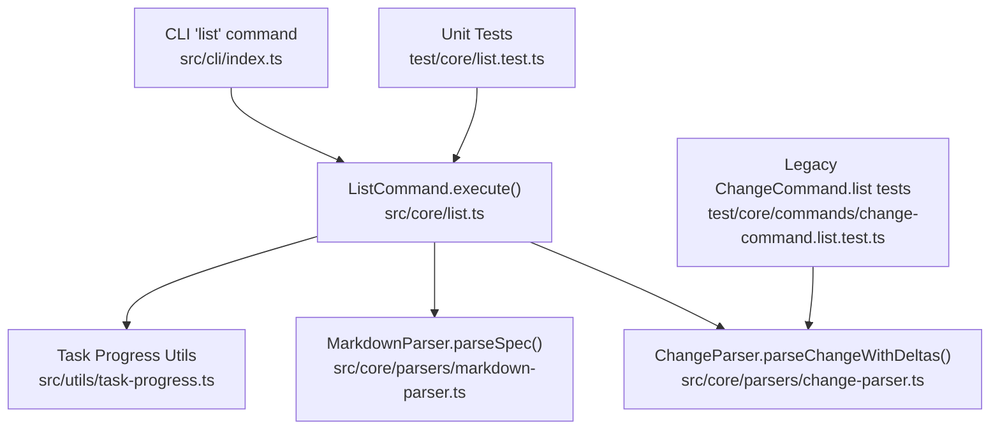
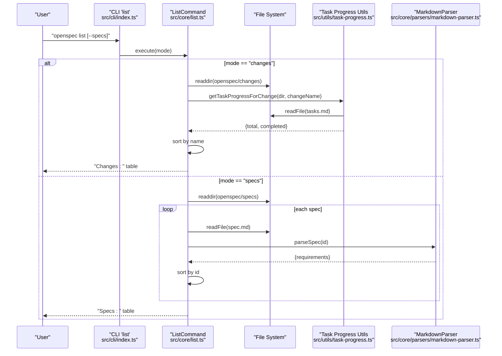
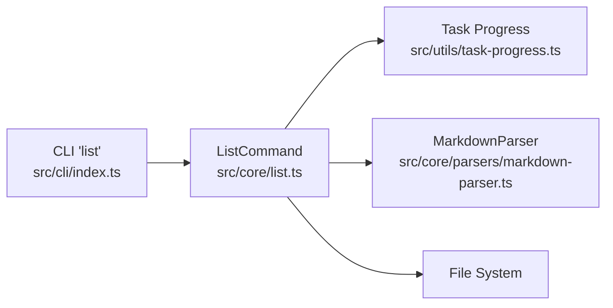

# openspec list

<cite>
**Referenced Files in This Document**
- [list.ts](file://src/core/list.ts)
- [task-progress.ts](file://src/utils/task-progress.ts)
- [markdown-parser.ts](file://src/core/parsers/markdown-parser.ts)
- [change-parser.ts](file://src/core/parsers/change-parser.ts)
- [cli/index.ts](file://src/cli/index.ts)
- [list.test.ts](file://test/core/list.test.ts)
- [change-command.list.test.ts](file://test/core/commands/change-command.list.test.ts)
- [spec.md](file://openspec/specs/cli-list/spec.md)
- [tasks.md](file://openspec/changes/add-scaffold-command/tasks.md)
- [proposal.md](file://openspec/changes/add-scaffold-command/proposal.md)
</cite>

## Table of Contents
1. [Introduction](#introduction)
2. [Project Structure](#project-structure)
3. [Core Components](#core-components)
4. [Architecture Overview](#architecture-overview)
5. [Detailed Component Analysis](#detailed-component-analysis)
6. [Dependency Analysis](#dependency-analysis)
7. [Performance Considerations](#performance-considerations)
8. [Troubleshooting Guide](#troubleshooting-guide)
9. [Conclusion](#conclusion)
10. [Appendices](#appendices)

## Introduction
The openspec list command provides a quick, structured overview of active changes and specifications in an OpenSpec project. It surfaces progress status for changes (based on task completion) and requirement counts for specs, enabling developers to track ongoing work and prioritize next steps. The command supports two modes:
- Changes mode (default): Lists active change directories and shows task completion status.
- Specs mode: Lists spec directories and shows requirement counts derived from spec.md.

It integrates with the OpenSpec ecosystem by leveraging the markdown parsing utilities and task progress calculation utilities, and it aligns with the specification for output formatting and behavior.

## Project Structure
The list command is implemented as a core command module with CLI wiring and tests. The key files involved are:
- Core command implementation
- Task progress utilities
- Markdown parsing utilities
- CLI registration and flags
- Tests validating behavior and output

**Diagram sources**
- [cli/index.ts](file://src/cli/index.ts#L92-L106)
- [list.ts](file://src/core/list.ts#L14-L104)
- [task-progress.ts](file://src/utils/task-progress.ts#L1-L44)
- [markdown-parser.ts](file://src/core/parsers/markdown-parser.ts#L24-L49)
- [change-parser.ts](file://src/core/parsers/change-parser.ts#L20-L53)
- [list.test.ts](file://test/core/list.test.ts#L1-L165)
- [change-command.list.test.ts](file://test/core/commands/change-command.list.test.ts#L1-L77)

**Section sources**
- [cli/index.ts](file://src/cli/index.ts#L92-L106)
- [list.ts](file://src/core/list.ts#L14-L104)

## Core Components
- ListCommand: Orchestrates discovery, parsing, computation, and output for both changes and specs modes.
- Task Progress Utilities: Parses tasks.md to compute total and completed tasks and formats progress status.
- Markdown Parser: Parses spec.md to extract requirements and compute requirement counts.
- CLI Registration: Registers the list command with flags for selecting mode and integrates error handling.

Key responsibilities:
- Discover change directories under openspec/changes (excluding archive).
- Compute task completion metrics from tasks.md.
- Discover spec directories under openspec/specs and count requirements from spec.md.
- Sort results alphabetically by name.
- Output formatted tables with progress or counts.

**Section sources**
- [list.ts](file://src/core/list.ts#L14-L104)
- [task-progress.ts](file://src/utils/task-progress.ts#L1-L44)
- [markdown-parser.ts](file://src/core/parsers/markdown-parser.ts#L24-L49)
- [cli/index.ts](file://src/cli/index.ts#L92-L106)

## Architecture Overview
The list command follows a straightforward pipeline:
- CLI receives the command and mode flags.
- ListCommand executes:
  - Changes mode: Enumerate change directories, read tasks.md, compute progress, sort, and print.
  - Specs mode: Enumerate spec directories, read spec.md, parse requirements, sort, and print.

**Diagram sources**
- [cli/index.ts](file://src/cli/index.ts#L92-L106)
- [list.ts](file://src/core/list.ts#L14-L104)
- [task-progress.ts](file://src/utils/task-progress.ts#L27-L41)
- [markdown-parser.ts](file://src/core/parsers/markdown-parser.ts#L24-L49)

## Detailed Component Analysis

### ListCommand.execute
Responsibilities:
- Validates presence of openspec/changes directory in changes mode.
- Discovers change directories under openspec/changes, excluding archive.
- Computes task progress per change using getTaskProgressForChange.
- Sorts changes alphabetically by name.
- Prints a formatted table with change names and task status.
- In specs mode:
  - Validates presence of openspec/specs directory.
  - Discovers spec directories.
  - Reads spec.md and parses requirements to compute counts.
  - Sorts specs alphabetically by id.
  - Prints a formatted table with spec ids and requirement counts.

Behavior highlights:
- Graceful handling of missing directories and empty states.
- Fallback behavior when tasks.md is missing (treated as 0/0 tasks).
- Clear output formatting with aligned columns.

Output format examples:
- Changes mode:
  - "Changes:" header followed by rows with change name and progress status (e.g., "3/5 tasks" or "✓ Complete").
- Specs mode:
  - "Specs:" header followed by rows with spec id and requirement count (e.g., "requirements 12").

Filtering and selection:
- Mode selection via --specs flag; default is changes mode.
- The archive subdirectory is excluded from changes discovery.

Sorting behavior:
- Alphabetical sort by name/id for both modes.
- The specification also describes a future enhancement to sort by completion percentage for the dashboard, but the current list command sorts alphabetically.

**Section sources**
- [list.ts](file://src/core/list.ts#L14-L104)
- [spec.md](file://openspec/specs/cli-list/spec.md#L34-L48)
- [list.test.ts](file://test/core/list.test.ts#L118-L134)

### Task Progress Utilities
Responsibilities:
- Define patterns for detecting tasks in markdown lists.
- Count total and completed tasks from content.
- Compute progress for a given change directory by reading tasks.md.
- Format progress status strings.

Patterns:
- Total tasks: Lines matching the task list pattern.
- Completed tasks: Lines matching the completed task pattern.

Fallback behavior:
- If tasks.md is missing, returns zero totals.

Formatting:
- "No tasks" when total is zero.
- "✓ Complete" when completed equals total.
- "{completed}/{total} tasks" otherwise.

**Section sources**
- [task-progress.ts](file://src/utils/task-progress.ts#L1-L44)
- [list.test.ts](file://test/core/list.test.ts#L108-L116)

### Markdown Parser Integration for Specs
Responsibilities:
- Parse spec.md to extract the Purpose and Requirements sections.
- Count requirements by parsing the Requirements section structure.
- Used by ListCommand in specs mode to compute requirement counts.

Error handling:
- If spec.md cannot be read or parsed, ListCommand falls back to a zero requirement count for that spec.

**Section sources**
- [markdown-parser.ts](file://src/core/parsers/markdown-parser.ts#L24-L49)
- [list.ts](file://src/core/list.ts#L80-L93)

### CLI Integration and Flags
Responsibilities:
- Registers the list command with the CLI.
- Adds --specs and --changes flags.
- Executes ListCommand with the selected mode.
- Provides graceful error handling with user-friendly messages.

Notes:
- The CLI command supports both explicit changes mode and specs mode selection.
- The command delegates all logic to ListCommand.execute.

**Section sources**
- [cli/index.ts](file://src/cli/index.ts#L92-L106)

### Integration with Change Parser (for broader context)
While the list command does not directly parse change proposals for deltas, the repository includes a ChangeParser that demonstrates how change proposals are parsed for deltas. This is useful context for understanding how change-related data is structured and processed elsewhere in the system.

Highlights:
- Parses change proposals into structured data with deltas.
- Supports both simple deltas in What Changes and structured deltas in spec-specific spec.md files.
- Used by higher-level commands that need to analyze change content.

**Section sources**
- [change-parser.ts](file://src/core/parsers/change-parser.ts#L20-L53)

## Dependency Analysis
The list command has clear, focused dependencies:
- Depends on task-progress utilities for computing task completion.
- Depends on markdown-parser for parsing spec.md in specs mode.
- Depends on the file system to enumerate directories and read files.
- CLI wiring depends on ListCommand.

**Diagram sources**
- [cli/index.ts](file://src/cli/index.ts#L92-L106)
- [list.ts](file://src/core/list.ts#L14-L104)
- [task-progress.ts](file://src/utils/task-progress.ts#L1-L44)
- [markdown-parser.ts](file://src/core/parsers/markdown-parser.ts#L1-L237)

**Section sources**
- [list.ts](file://src/core/list.ts#L14-L104)
- [task-progress.ts](file://src/utils/task-progress.ts#L1-L44)
- [markdown-parser.ts](file://src/core/parsers/markdown-parser.ts#L24-L49)
- [cli/index.ts](file://src/cli/index.ts#L92-L106)

## Performance Considerations
- File I/O: The command reads tasks.md for each change and spec.md for each spec. For projects with many changes/specs, consider caching or limiting concurrency if extending the command.
- Parsing cost: Markdown parsing is linear in content size; keep spec.md and tasks.md reasonably sized.
- Sorting: Sorting is O(n log n); acceptable for typical project sizes.
- I/O strategy: Current implementation performs synchronous reads for spec.md and asynchronous reads for tasks.md. For large-scale usage, consider batching or async processing.

[No sources needed since this section provides general guidance]

## Troubleshooting Guide
Common issues and resolutions:
- Missing openspec/changes directory:
  - Symptom: Error indicating the changes directory is not found.
  - Resolution: Initialize the project with openspec init to create the required directory structure.
  - Evidence: Behavior verified by tests asserting rejection with a specific message.
- Empty changes directory:
  - Symptom: Output stating "No active changes found."
  - Resolution: Ensure change directories exist under openspec/changes and contain tasks.md or are intended to be treated as "No tasks".
- Missing tasks.md:
  - Symptom: Change appears with "No tasks" status.
  - Resolution: Create tasks.md with the expected task list format or remove the change directory if it is not active.
- Incorrect progress calculation:
  - Cause: Non-standard task list markers or mixed formats.
  - Resolution: Use the standard markdown checkbox patterns for tasks.
- Specs mode issues:
  - Missing openspec/specs directory or spec.md:
  - Symptom: Output stating "No specs found."
  - Resolution: Ensure spec directories exist and contain spec.md with the required sections.

Verification references:
- Tests cover missing changes directory, empty state, exclusion of archive, task counting, completion status, missing tasks.md, alphabetical sorting, and mixed states.

**Section sources**
- [list.test.ts](file://test/core/list.test.ts#L33-L117)
- [list.test.ts](file://test/core/list.test.ts#L118-L165)
- [task-progress.ts](file://src/utils/task-progress.ts#L27-L41)

## Conclusion
The openspec list command delivers essential visibility into active changes and specifications. It focuses on simplicity and clarity, providing a consistent, alphabetically sorted view of progress and requirement counts. Its modular design makes it easy to extend or integrate with future enhancements, such as progress-based sorting for dashboards, while maintaining backward compatibility.

[No sources needed since this section summarizes without analyzing specific files]

## Appendices

### Output Formats and Examples
- Changes mode:
  - Header: "Changes:"
  - Rows: Change name aligned with progress status (e.g., "3/5 tasks" or "✓ Complete").
- Specs mode:
  - Header: "Specs:"
  - Rows: Spec id aligned with requirement count (e.g., "requirements 12").

These formats are defined by the specification and implemented by the list command.

**Section sources**
- [spec.md](file://openspec/specs/cli-list/spec.md#L34-L48)
- [list.ts](file://src/core/list.ts#L52-L61)
- [list.ts](file://src/core/list.ts#L95-L103)

### Filtering Options
- --specs: Switch to listing specs instead of changes.
- --changes: Explicitly select changes mode (same as default).
- The archive subdirectory is excluded from changes discovery.

**Section sources**
- [cli/index.ts](file://src/cli/index.ts#L92-L106)
- [list.ts](file://src/core/list.ts#L17-L31)

### Sorting Behavior
- Alphabetical sort by name/id for both changes and specs modes.
- The specification describes a future enhancement to sort by completion percentage for the dashboard, but the current list command sorts alphabetically.

**Section sources**
- [list.ts](file://src/core/list.ts#L49-L50)
- [list.ts](file://src/core/list.ts#L95-L95)
- [spec.md](file://openspec/specs/cli-list/spec.md#L86-L94)

### Example Files for Reference
- tasks.md example structure for change directories.
- proposal.md example structure for change directories.

**Section sources**
- [tasks.md](file://openspec/changes/add-scaffold-command/tasks.md#L1-L12)
- [proposal.md](file://openspec/changes/add-scaffold-command/proposal.md#L1-L12)