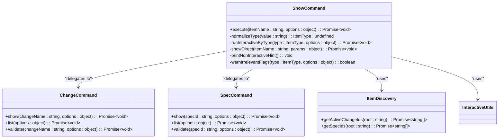
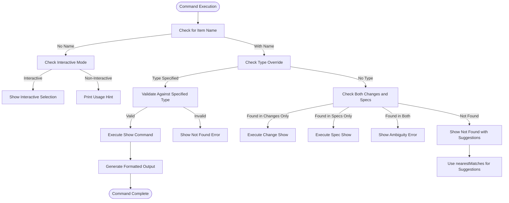
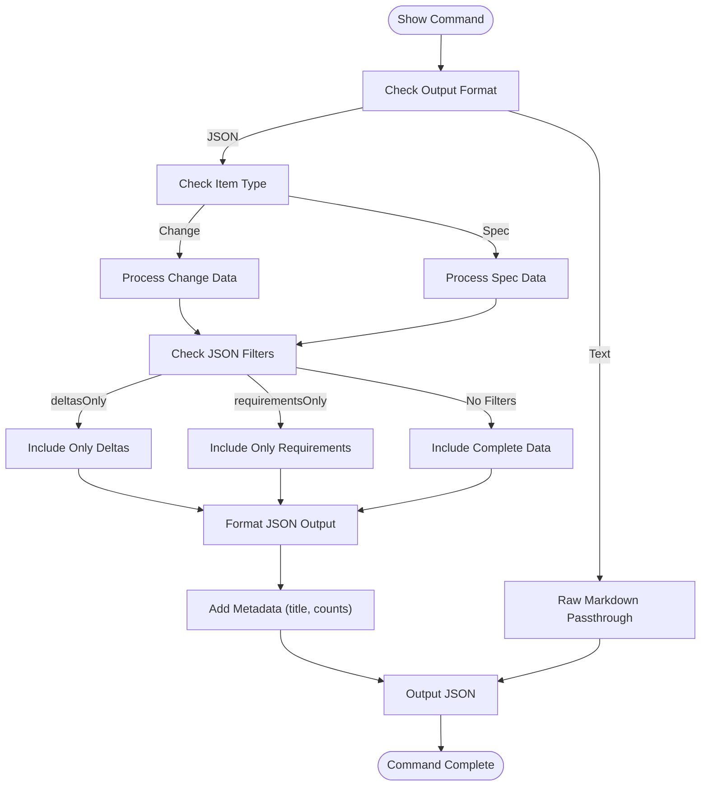
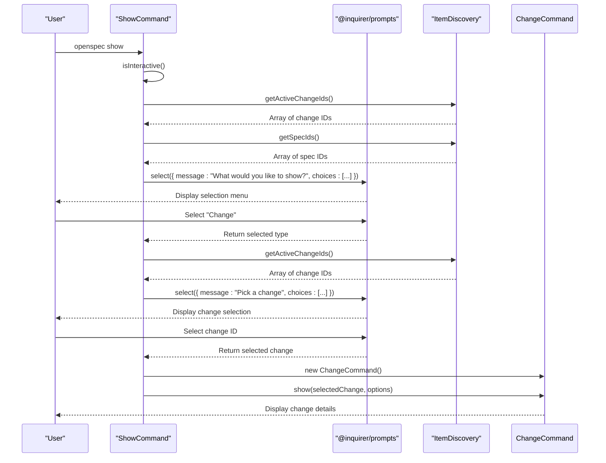
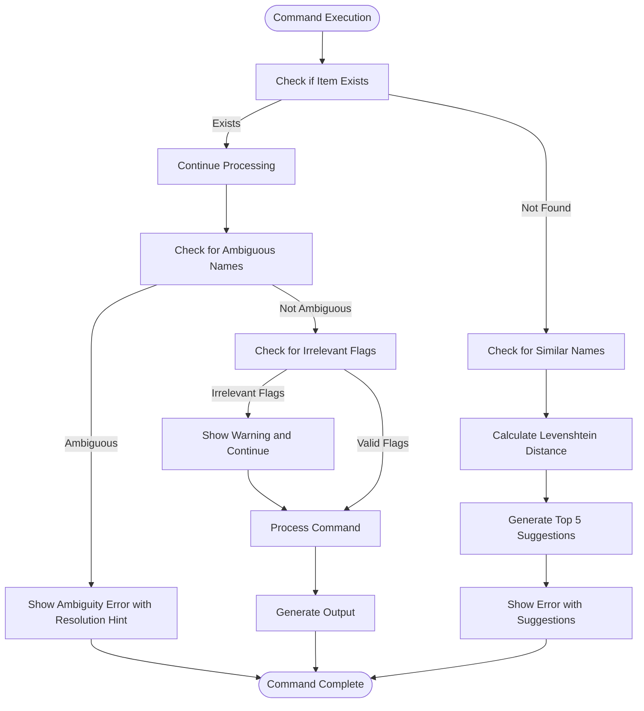
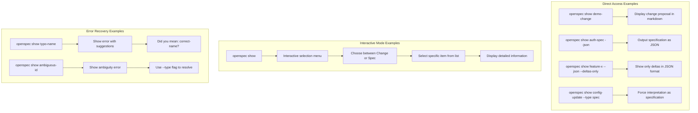
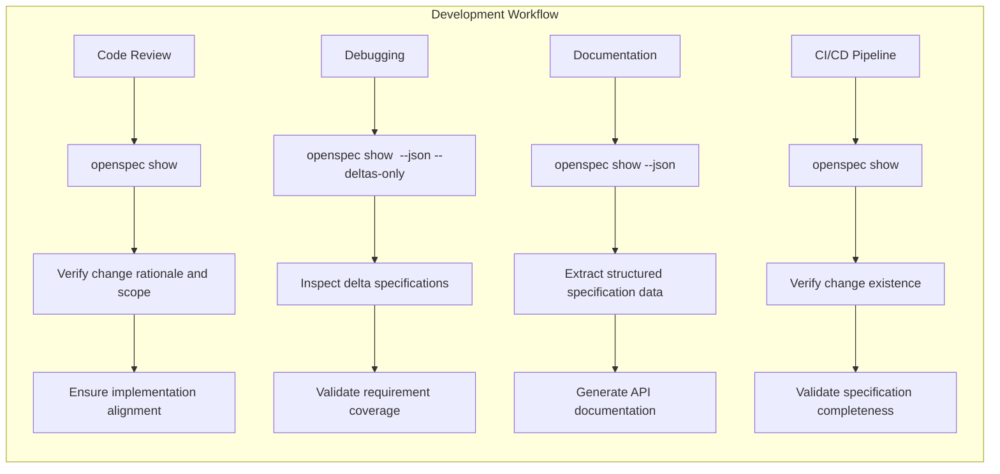

# openspec show

<cite>
**Referenced Files in This Document**   
- [show.ts](file://src/commands/show.ts)
- [change.ts](file://src/commands/change.ts)
- [spec.ts](file://src/commands/spec.ts)
- [item-discovery.ts](file://src/utils/item-discovery.ts)
- [interactive.ts](file://src/utils/interactive.ts)
- [match.ts](file://src/utils/match.ts)
- [change-parser.ts](file://src/core/parsers/change-parser.ts)
- [markdown-parser.ts](file://src/core/parsers/markdown-parser.ts)
- [change.schema.ts](file://src/core/schemas/change.schema.ts)
- [spec.schema.ts](file://src/core/schemas/spec.schema.ts)
- [index.ts](file://src/cli/index.ts)
- [show.test.ts](file://test/commands/show.test.ts)
- [change.interactive-show.test.ts](file://test/commands/change.interactive-show.test.ts)
- [spec.interactive-show.test.ts](file://test/commands/spec.interactive-show.test.ts)
</cite>

## Table of Contents
1. [Introduction](#introduction)
2. [Command Architecture](#command-architecture)
3. [Change Discovery and Resolution](#change-discovery-and-resolution)
4. [Content Parsing and Data Structures](#content-parsing-and-data-structures)
5. [Output Generation and Formatting](#output-generation-and-formatting)
6. [Interactive Mode Integration](#interactive-mode-integration)
7. [Error Handling and Validation](#error-handling-and-validation)
8. [Usage Examples](#usage-examples)
9. [Integration with Development Workflows](#integration-with-development-workflows)
10. [Conclusion](#conclusion)

## Introduction

The `openspec show` command provides a unified interface for displaying detailed information about OpenSpec changes and specifications. This command serves as a central tool for developers to inspect change proposals and specification documents, supporting both interactive and non-interactive workflows. The implementation is designed to handle various input types, including change IDs and specification paths, while providing context-aware information that enhances debugging and review processes.

The command's architecture follows a modular design pattern, delegating specific responsibilities to specialized components. It integrates with the OpenSpec ecosystem through well-defined interfaces, ensuring consistency across different command types. The implementation prioritizes user experience by offering intelligent defaults, helpful error messages, and suggestions for common issues like invalid identifiers.

**Section sources**
- [show.ts](file://src/commands/show.ts#L1-L140)
- [index.ts](file://src/cli/index.ts#L227-L251)

## Command Architecture

The `openspec show` command is implemented as a class-based system with clear separation of concerns. The `ShowCommand` class serves as the entry point, coordinating between discovery, parsing, and display operations. This architecture enables the command to handle both direct invocations with specific identifiers and interactive sessions where users can browse available items.

The command's execution flow begins with input validation and type detection. When no item name is provided, the command checks for interactive capabilities and presents a selection interface. For direct invocations, it performs type resolution to determine whether the requested item is a change or specification. This resolution process considers user-specified types, file system presence, and potential ambiguities.



**Diagram sources**
- [show.ts](file://src/commands/show.ts#L14-L140)
- [change.ts](file://src/commands/change.ts#L16-L292)
- [spec.ts](file://src/commands/spec.ts#L68-L109)
- [item-discovery.ts](file://src/utils/item-discovery.ts#L4-L46)

## Change Discovery and Resolution

The change discovery mechanism in `openspec show` relies on the `item-discovery.ts` utility module to locate active changes and specifications within the project structure. The `getActiveChangeIds` function scans the `openspec/changes` directory, identifying directories that contain a `proposal.md` file while excluding archived changes and hidden directories. Similarly, the `getSpecIds` function discovers specifications by examining the `openspec/specs` directory for folders containing `spec.md` files.

When resolving item types, the command employs a multi-step strategy to handle ambiguous cases. If a user does not specify a type, the system checks both change and specification directories for a matching identifier. When an identifier exists in both locations, the command raises an ambiguity error and suggests using the `--type` flag to resolve the conflict. This approach prevents accidental misinterpretation of identifiers while maintaining flexibility for valid use cases.



**Diagram sources**
- [show.ts](file://src/commands/show.ts#L71-L114)
- [item-discovery.ts](file://src/utils/item-discovery.ts#L4-L46)
- [match.ts](file://src/utils/match.ts#L1-L27)

## Content Parsing and Data Structures

The content parsing system in `openspec show` is built around a hierarchical markdown parsing architecture. The `MarkdownParser` base class provides core functionality for parsing markdown content into structured data, including section extraction, content segmentation, and hierarchical organization. This foundation is extended by the `ChangeParser` class, which adds domain-specific parsing capabilities for change proposals and delta specifications.

For change parsing, the system extracts key sections such as "Why" and "What Changes" from the proposal document. It then processes delta information either from the simple format in the "What Changes" section or from structured delta specifications in associated spec files. The parser identifies operations like ADDED, MODIFIED, REMOVED, and RENAMED by analyzing description text patterns, ensuring consistent interpretation across different writing styles.

```mermaid
classDiagram
class MarkdownParser {
+parseSpec(name : string) : Spec
+parseChange(name : string) : Change
+parseSections() : Section[]
+getContentUntilNextHeader(startLine : number, currentLevel : number) : string
+findSection(sections : Section[], title : string) : Section | undefined
+parseRequirements(section : Section) : Requirement[]
+parseScenarios(requirementSection : Section) : Scenario[]
+parseDeltas(content : string) : Delta[]
}
class ChangeParser {
+parseChangeWithDeltas(name : string) : Promise~Change~
-parseDeltaSpecs(specsDir : string) : Promise~Delta[]~
-parseSpecDeltas(specName : string, content : string) : Delta[]
-parseRenames(content : string) : { from : string; to : string }[]
-parseSectionsFromContent(content : string) : Section[]
-getContentUntilNextHeaderFromLines(lines : string[], startLine : number, currentLevel : number) : string[]
}
MarkdownParser <|-- ChangeParser
class Spec {
+name : string
+overview : string
+requirements : Requirement[]
+metadata : Metadata
}
class Change {
+name : string
+why : string
+whatChanges : string
+deltas : Delta[]
+metadata : Metadata
}
class Delta {
+spec : string
+operation : DeltaOperation
+description : string
+requirement? : Requirement
+requirements? : Requirement[]
+rename? : { from : string; to : string }
}
class Requirement {
+text : string
+scenarios : Scenario[]
}
class Scenario {
+rawText : string
}
class Metadata {
+version : string
+format : string
+sourcePath? : string
}
enum DeltaOperation {
ADDED
MODIFIED
REMOVED
RENAMED
}
MarkdownParser --> Spec
MarkdownParser --> Change
MarkdownParser --> Delta
MarkdownParser --> Requirement
MarkdownParser --> Scenario
MarkdownParser --> Metadata
Delta --> DeltaOperation
Change --> Delta
Spec --> Requirement
Requirement --> Scenario
```

**Diagram sources**
- [markdown-parser.ts](file://src/core/parsers/markdown-parser.ts#L10-L237)
- [change-parser.ts](file://src/core/parsers/change-parser.ts#L12-L234)
- [change.schema.ts](file://src/core/schemas/change.schema.ts#L1-L42)
- [spec.schema.ts](file://src/core/schemas/spec.schema.ts#L1-L17)

## Output Generation and Formatting

The output generation system in `openspec show` supports multiple formats to accommodate different use cases and integration requirements. The command provides both human-readable markdown output and machine-readable JSON format, with various filtering options to control the level of detail displayed. This dual-format approach enables seamless integration with both interactive development workflows and automated tooling.

For text output, the command performs a direct passthrough of the source markdown content, preserving formatting and structure. This raw-first approach ensures deterministic output that matches the original document exactly. For JSON output, the system transforms parsed data into a structured format with consistent field names and hierarchical organization. The JSON output includes metadata such as title extraction, delta counts, and requirement summaries to provide context beyond the raw content.



**Diagram sources**
- [show.ts](file://src/commands/show.ts#L71-L114)
- [change.ts](file://src/commands/change.ts#L29-L89)
- [spec.ts](file://src/commands/spec.ts#L69-L107)

## Interactive Mode Integration

The interactive mode integration in `openspec show` enhances usability by providing a guided interface for exploring changes and specifications. When executed in an interactive terminal, the command presents selection menus that allow users to browse available items without needing to remember specific identifiers. This feature is particularly valuable in projects with numerous changes or specifications, where memorizing all identifiers would be impractical.

The interactive behavior is controlled by the `isInteractive` utility function, which evaluates multiple factors including the presence of a TTY, environment variables, and explicit command-line flags. This multi-layered approach ensures consistent behavior across different execution environments while allowing users to override the default behavior when needed. The selection interface uses the `@inquirer/prompts` library to provide a consistent and accessible user experience.



**Diagram sources**
- [show.ts](file://src/commands/show.ts#L15-L37)
- [interactive.ts](file://src/utils/interactive.ts#L1-L8)
- [item-discovery.ts](file://src/utils/item-discovery.ts#L4-L46)

## Error Handling and Validation

The error handling system in `openspec show` provides comprehensive feedback for common issues while maintaining a clean user experience. When encountering invalid identifiers, the command not only reports the error but also suggests potential matches using the Levenshtein distance algorithm. This fuzzy matching capability helps users recover from typos and naming inconsistencies without requiring exact recall of identifiers.

The validation process includes checks for irrelevant flags, ensuring that options specific to changes or specifications are not mistakenly applied to the wrong item type. When such conflicts occur, the system issues warnings rather than failing outright, allowing the command to proceed with the valid portions of the request. This graceful degradation approach prioritizes usability while still alerting users to potential configuration issues.



**Diagram sources**
- [show.ts](file://src/commands/show.ts#L91-L103)
- [match.ts](file://src/utils/match.ts#L1-L27)
- [show.test.ts](file://test/commands/show.test.ts#L104-L124)

## Usage Examples

The `openspec show` command supports various usage patterns to accommodate different workflows and requirements. For direct access to specific items, users can specify the item name along with optional formatting and filtering parameters. The command automatically detects the item type based on file system presence, eliminating the need for explicit type specification in most cases.

For interactive exploration, users can invoke the command without arguments to access a guided selection interface. This mode is particularly useful when users are unfamiliar with available identifiers or want to browse multiple items in a single session. The interactive mode adapts to the execution environment, automatically disabling prompts when running in non-interactive contexts like scripts or CI/CD pipelines.



**Diagram sources**
- [show.ts](file://src/commands/show.ts#L15-L37)
- [index.ts](file://src/cli/index.ts#L227-L251)
- [show.test.ts](file://test/commands/show.test.ts#L54-L78)

## Integration with Development Workflows

The `openspec show` command integrates seamlessly with development workflows by providing focused information that supports debugging, code review, and documentation processes. During code reviews, reviewers can use the command to quickly access the rationale and scope of changes, ensuring that implementation aligns with the proposed specifications. The JSON output format enables integration with automated tools that analyze change metadata or generate documentation.

For debugging purposes, developers can use the command to verify that change proposals contain the expected delta specifications and requirements. The ability to filter output (e.g., using `--deltas-only`) allows developers to focus on specific aspects of a change without distraction from other content. This targeted information access improves efficiency when troubleshooting implementation issues or validating specification compliance.



**Diagram sources**
- [show.ts](file://src/commands/show.ts#L15-L140)
- [change.ts](file://src/commands/change.ts#L29-L89)
- [spec.ts](file://src/commands/spec.ts#L69-L107)

## Conclusion

The `openspec show` command provides a robust and flexible interface for accessing change proposals and specification documents within the OpenSpec ecosystem. Its architecture balances simplicity with powerful features, offering both direct access to specific items and interactive exploration capabilities. The command's intelligent type resolution, comprehensive error handling, and multiple output formats make it a versatile tool for various development scenarios.

By integrating with the broader OpenSpec workflow, the command enhances productivity and ensures consistency across the development process. Its ability to provide context-aware information supports effective code reviews, debugging, and documentation generation. The implementation demonstrates careful consideration of user experience, with thoughtful defaults, helpful suggestions, and graceful error recovery that minimize friction in daily use.

**Section sources**
- [show.ts](file://src/commands/show.ts#L1-L140)
- [change.ts](file://src/commands/change.ts#L16-L292)
- [spec.ts](file://src/commands/spec.ts#L68-L109)