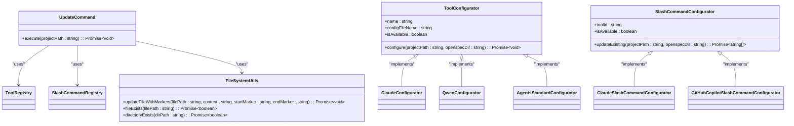
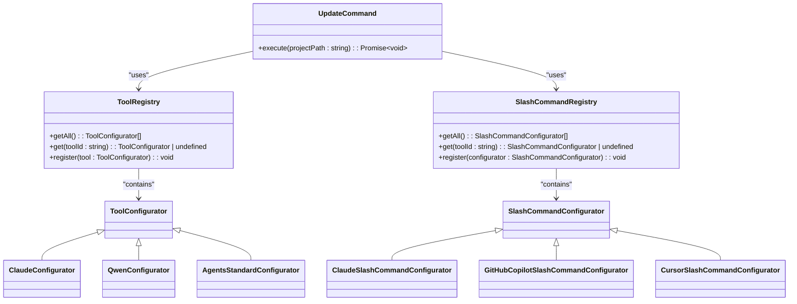
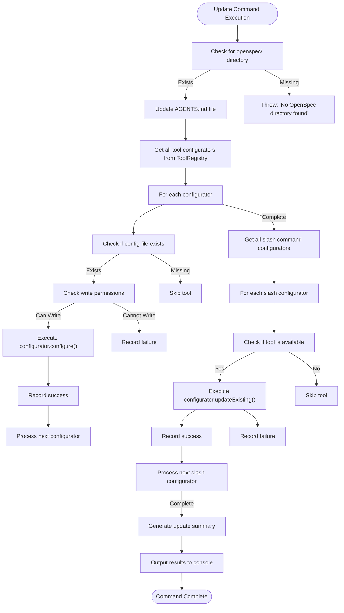

# openspec update

<cite>
**Referenced Files in This Document**   
- [update.ts](file://src/core/update.ts)
- [registry.ts](file://src/core/configurators/registry.ts)
- [slash/registry.ts](file://src/core/configurators/slash/registry.ts)
- [base.ts](file://src/core/configurators/base.ts)
- [file-system.ts](file://src/utils/file-system.ts)
- [config.ts](file://src/core/config.ts)
- [agents-template.ts](file://src/core/templates/agents-template.ts)
- [cli/index.ts](file://src/cli/index.ts)
- [init.ts](file://src/core/init.ts)
</cite>

## Table of Contents
1. [Introduction](#introduction)
2. [Command Purpose and Role](#command-purpose-and-role)
3. [Implementation Details](#implementation-details)
4. [Configuration Update Process](#configuration-update-process)
5. [Integration with Configurators Registry](#integration-with-configurators-registry)
6. [Handling Multiple AI Tools](#handling-multiple-ai-tools)
7. [Update Scenarios](#update-scenarios)
8. [Relationship with Initialization Process](#relationship-with-initialization-process)
9. [Common Issues and Solutions](#common-issues-and-solutions)
10. [Synchronization Mechanism](#synchronization-mechanism)

## Introduction
The `openspec update` command is a critical component of the OpenSpec system, designed to maintain synchronization between project settings and AI tool configurations. This documentation provides a comprehensive analysis of the command's functionality, implementation details, and integration with the broader OpenSpec ecosystem. The command enables developers to refresh AI tool configuration files when project settings change, ensuring that all AI assistants have access to the most current project instructions and guidelines.

## Command Purpose and Role
The `openspec update` command serves as a maintenance tool for keeping AI assistant configurations synchronized with the current state of a project. Its primary purpose is to refresh configuration files for various AI tools when project settings or requirements change. Unlike the initialization process, which sets up a new project, the update command modifies existing configurations while preserving custom modifications made by developers.

The command plays a crucial role in maintaining consistency across different AI tools by ensuring they all reference the same up-to-date project instructions. It operates on two levels: updating the central `AGENTS.md` file that contains comprehensive project guidelines, and refreshing individual AI tool configuration files. This dual approach ensures that both general project instructions and tool-specific configurations remain current.

**Section sources**
- [update.ts](file://src/core/update.ts#L1-L130)
- [cli/index.ts](file://src/cli/index.ts#L76-L89)

## Implementation Details
The `openspec update` command is implemented as the `UpdateCommand` class in the `update.ts` file. The implementation follows a structured approach to ensure safe and reliable updates to configuration files. The command begins by verifying the existence of the OpenSpec directory, throwing an error if it's not found, which ensures that the command is executed within a properly initialized OpenSpec project.

The update process consists of three main phases: updating the `AGENTS.md` file, updating existing AI tool configuration files, and refreshing slash command configurations. The command uses a registry pattern to manage different configurators, allowing for extensibility and easy addition of support for new AI tools. Each configurator implements a standard interface defined by the `ToolConfigurator` interface, ensuring consistent behavior across different tools.

The implementation includes comprehensive error handling to manage various failure scenarios, such as insufficient file permissions or configuration errors. The command collects information about successfully updated files, newly created files, and any failures, providing a detailed summary of the update operation. This feedback mechanism helps users understand exactly what changes were made during the update process.

**Diagram sources **
- [update.ts](file://src/core/update.ts#L8-L130)
- [base.ts](file://src/core/configurators/base.ts#L1-L6)
- [file-system.ts](file://src/utils/file-system.ts#L44-L165)

**Section sources**
- [update.ts](file://src/core/update.ts#L1-L130)
- [base.ts](file://src/core/configurators/base.ts#L1-L6)
- [file-system.ts](file://src/utils/file-system.ts#L1-L188)

## Configuration Update Process
The configuration update process in the `openspec update` command follows a careful approach to preserve existing customizations while applying necessary updates. The process begins with a check for the existence of the OpenSpec directory, ensuring the command is executed in a properly initialized project context.

The first step in the update process is the replacement of the `AGENTS.md` file, which contains the central project instructions for AI assistants. This file is always updated, regardless of whether it previously existed, ensuring that all AI tools have access to the latest project guidelines. The update command then proceeds to handle individual AI tool configuration files, but with a crucial difference: it only updates files that already exist in the project.

For each AI tool configurator, the command checks whether the corresponding configuration file exists before attempting to update it. This selective approach prevents the creation of configuration files for tools that the developer hasn't explicitly set up, maintaining a clean project environment. When updating existing files, the command uses marker-based content replacement to preserve any custom content outside the OpenSpec-managed sections.

The update process also handles slash command configurations separately from main tool configurations. These are typically stored in tool-specific directories (e.g., `.claude/commands/`) and are updated only if they already exist. This ensures that the command refreshes existing slash commands without creating new ones that the developer hasn't explicitly set up.

**Section sources**
- [update.ts](file://src/core/update.ts#L19-L129)
- [file-system.ts](file://src/utils/file-system.ts#L129-L165)

## Integration with Configurators Registry
The `openspec update` command integrates with two separate registries to manage different types of AI tool configurations: the `ToolRegistry` for main tool configurations and the `SlashCommandRegistry` for slash command configurations. This registry pattern provides a flexible and extensible architecture that allows for easy addition of support for new AI tools without modifying the core update logic.

The `ToolRegistry` contains configurators for main AI tool configuration files such as `CLAUDE.md`, `QWEN.md`, and `AGENTS.md`. Each configurator in this registry implements the `ToolConfigurator` interface, which defines a standard method for configuring a tool. The registry is implemented as a singleton with a static map of tool IDs to configurator instances, initialized through a static block that registers all supported tools.

Similarly, the `SlashCommandRegistry` manages configurators for slash command files used by various AI tools. This registry follows the same pattern as the `ToolRegistry` but is specialized for handling tool-specific command configurations. The separation between these two registries allows for different update behaviors: main tool configurations are updated based on file existence, while slash command configurations are refreshed only if they already exist.

This registry-based architecture enables the update command to iterate through all registered configurators without needing to know the specific details of each tool. The command simply calls the appropriate method on each configurator, allowing the configurator itself to handle the tool-specific update logic. This separation of concerns makes the code more maintainable and easier to extend with support for additional AI tools.

**Diagram sources **
- [registry.ts](file://src/core/configurators/registry.ts#L10-L47)
- [slash/registry.ts](file://src/core/configurators/slash/registry.ts#L19-L70)
- [update.ts](file://src/core/update.ts#L8-L130)

**Section sources**
- [registry.ts](file://src/core/configurators/registry.ts#L1-L47)
- [slash/registry.ts](file://src/core/configurators/slash/registry.ts#L1-L70)
- [update.ts](file://src/core/update.ts#L1-L130)

## Handling Multiple AI Tools
The `openspec update` command is designed to handle multiple AI tools through a modular and extensible architecture. The system supports a wide range of AI tools including Claude Code, Qwen Code, GitHub Copilot, Cursor, Windsurf, Codex, and others, each with their own configuration requirements and file structures.

The command handles multiple AI tools by using a registry-based approach where each tool has a corresponding configurator responsible for managing its specific configuration files. When the update command executes, it retrieves all registered configurators from both the `ToolRegistry` and `SlashCommandRegistry` and processes them sequentially. For main tool configurations, the command checks if the corresponding configuration file exists before attempting to update it, ensuring that only tools actively used in the project are modified.

For slash command configurations, the handling is slightly different. The command iterates through all registered slash command configurators and attempts to update existing command files, but does not create new ones. This approach respects the developer's choices about which tools and commands to use, preventing the creation of configuration files for tools that haven't been explicitly set up.

The system also includes error isolation, meaning that if an update fails for one tool, it doesn't prevent the command from attempting to update configurations for other tools. The command collects information about all successes and failures, providing a comprehensive summary at the end of the operation. This allows developers to identify specific tools that may have configuration issues while still benefiting from successful updates to other tools.

**Section sources**
- [update.ts](file://src/core/update.ts#L25-L88)
- [registry.ts](file://src/core/configurators/registry.ts#L10-L47)
- [slash/registry.ts](file://src/core/configurators/slash/registry.ts#L19-L70)
- [config.ts](file://src/core/config.ts#L19-L37)

## Update Scenarios
The `openspec update` command addresses several common scenarios where project settings change and AI tool configurations need to be refreshed. These scenarios include adding new slash commands, modifying existing tool configurations, and updating project-wide guidelines that affect all AI assistants.

One typical scenario is when new slash commands are added to the OpenSpec system. For example, when support for Factory Droid slash commands was added (as documented in the 2025-10-22 change), developers who had previously set up Factory Droid would need to run `openspec update` to get the new command configurations. The update command would detect the existing Factory Droid configuration directory and refresh the slash command files with the latest templates, preserving any custom modifications outside the OpenSpec-managed sections.

Another common scenario involves modifications to existing tool configurations. When the guidelines for AI assistants are updated—such as changes to the recommended workflow or new best practices—running `openspec update` ensures that all AI tools receive these updates. For instance, if the process for creating change proposals is modified, the update command would refresh the `AGENTS.md` file and any tool-specific configuration files to reflect these changes.

A third scenario occurs when project-specific settings change, such as the addition of new capabilities or modifications to existing ones. In this case, the update command ensures that AI assistants are aware of these changes by refreshing their configuration files with the latest project context. This is particularly important for maintaining consistency across different AI tools that may be used by various team members.

The command also handles edge cases such as merge conflicts during updates. By using marker-based content replacement, the update process preserves custom modifications made by developers while updating the OpenSpec-managed sections. This approach minimizes the risk of losing important customizations during the update process.

**Section sources**
- [update.ts](file://src/core/update.ts#L19-L129)
- [file-system.ts](file://src/utils/file-system.ts#L129-L165)
- [agents-template.ts](file://src/core/templates/agents-template.ts#L1-L458)

## Relationship with Initialization Process
The `openspec update` command has a complementary relationship with the `openspec init` command, serving different but related purposes in the project lifecycle. While the initialization process sets up a new project with default configurations, the update command maintains and refreshes existing configurations as project needs evolve.

The initialization process creates all necessary configuration files for the selected AI tools, establishing the initial project setup. In contrast, the update command is more selective, only modifying files that already exist in the project. This distinction is crucial: `init` is for project creation, while `update` is for project maintenance.

When a project is first initialized, the `init` command creates configuration files for all selected tools, including both main configuration files (like `CLAUDE.md`) and slash command files. Subsequent runs of the `update` command will only refresh these existing files, preserving any custom modifications while updating the OpenSpec-managed content. This ensures that developers don't lose their customizations when project guidelines are updated.

The two commands also differ in their approach to tool selection. The `init` command typically includes an interactive process for selecting which AI tools to configure, while the `update` command automatically processes all tools that have existing configuration files. This means that developers can add support for a new tool by running `init` again (or manually creating the configuration file) and then use `update` to keep it current.

This relationship creates a workflow where `init` establishes the foundation and `update` maintains it, allowing for a flexible approach to project configuration management. Developers can use `init` to set up their preferred tools and then rely on `update` to keep those configurations current as the OpenSpec system evolves.

**Section sources**
- [update.ts](file://src/core/update.ts#L1-L130)
- [init.ts](file://src/core/init.ts)
- [cli/index.ts](file://src/cli/index.ts#L40-L74)

## Common Issues and Solutions
The `openspec update` command may encounter several common issues during execution, each with specific solutions to ensure successful configuration updates. Understanding these issues and their resolutions is essential for maintaining a smooth development workflow.

One common issue is insufficient file permissions, which prevents the command from modifying existing configuration files. The system detects this condition before attempting to update a file and throws a descriptive error message indicating which file cannot be modified due to permission constraints. The solution is to ensure the user has write permissions for the configuration files or to run the command with appropriate privileges.

Another frequent issue is merge conflicts that may arise when custom modifications conflict with updates to the OpenSpec-managed sections. The command's marker-based update approach minimizes this risk by preserving content outside the `<!-- OPENSPEC:START -->` and `<!-- OPENSPEC:END -->` markers. However, if the markers themselves have been modified or removed, the update process will fail with a clear error message. The solution is to restore the markers or manually integrate the updates.

Tool-specific configuration problems can also occur, such as when a tool's configuration directory structure changes between versions. The command handles this by catching errors during individual configurator execution and continuing with other tools, ensuring that a problem with one tool doesn't prevent updates to others. The detailed summary output helps identify which tools encountered issues.

A specific issue related to slash command updates is the potential for creating unwanted configuration files. The system addresses this by only updating existing slash command files and never creating new ones during the update process. This prevents the proliferation of configuration files for tools that the developer hasn't explicitly set up.

For cases where the OpenSpec directory is missing, the command provides a clear error message directing the user to run `openspec init` first. This ensures that users understand the prerequisite for using the update command.

**Section sources**
- [update.ts](file://src/core/update.ts#L47-L67)
- [update.ts](file://src/core/update.ts#L80-L87)
- [file-system.ts](file://src/utils/file-system.ts#L88-L104)
- [file-system.ts](file://src/utils/file-system.ts#L147-L159)

## Synchronization Mechanism
The `openspec update` command employs a sophisticated synchronization mechanism to maintain consistency between project settings and AI tool instructions. This mechanism is built around marker-based content management, which allows for targeted updates while preserving custom modifications.

The core of the synchronization mechanism is the use of special markers (`<!-- OPENSPEC:START -->` and `<!-- OPENSPEC:END -->`) that delineate the sections of configuration files managed by OpenSpec. When updating a file, the command reads the existing content, locates these markers, and replaces only the content between them with the latest template. This approach ensures that any custom content outside these markers remains untouched, preserving developer modifications.

The synchronization process begins with the `AGENTS.md` file, which serves as the central repository of project guidelines. This file is always updated, providing a single source of truth for all AI assistants. The command then proceeds to synchronize individual tool configurations, but only for tools that already have configuration files in the project. This selective approach prevents the creation of unnecessary configuration files while ensuring that active tools receive the latest updates.

For slash command configurations, the synchronization follows a similar pattern but with additional considerations for tool-specific directory structures. The command navigates to the appropriate directory for each tool (e.g., `.claude/commands/` for Claude) and updates only the existing command files. This maintains the integrity of the tool's configuration structure while refreshing the OpenSpec-specific content.

The mechanism also includes error detection and reporting to identify synchronization issues. If markers are missing or improperly formatted, the command fails with a descriptive error, preventing potentially destructive updates. The comprehensive summary output provides transparency into what was updated, what was created, and what failed, allowing developers to verify the synchronization results.

This synchronization mechanism ensures that all AI tools have access to the most current project instructions while respecting the developer's control over their configuration environment. It strikes a balance between automation and flexibility, making it easier to maintain consistent AI assistant behavior across a development team.

**Diagram sources **
- [update.ts](file://src/core/update.ts#L14-L129)
- [file-system.ts](file://src/utils/file-system.ts#L129-L165)
- [config.ts](file://src/core/config.ts#L3-L6)

**Section sources**
- [update.ts](file://src/core/update.ts#L1-L130)
- [file-system.ts](file://src/utils/file-system.ts#L1-L188)
- [config.ts](file://src/core/config.ts#L1-L38)