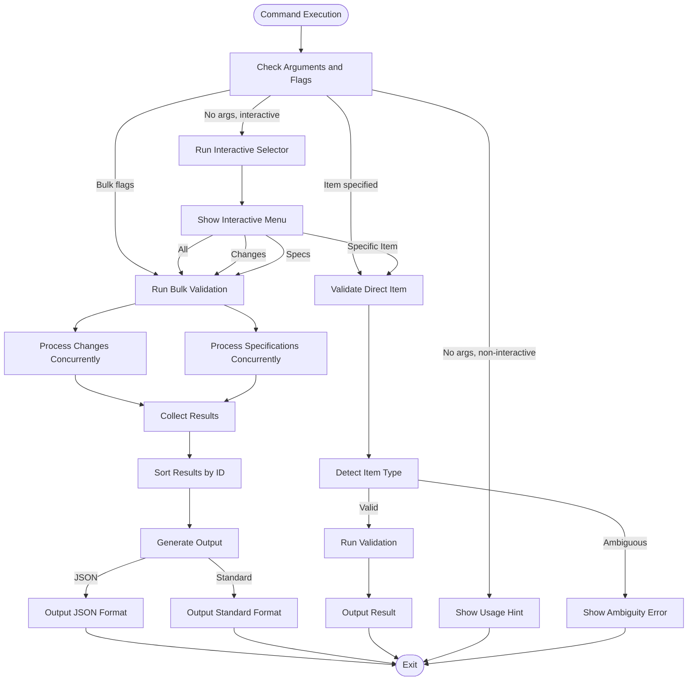
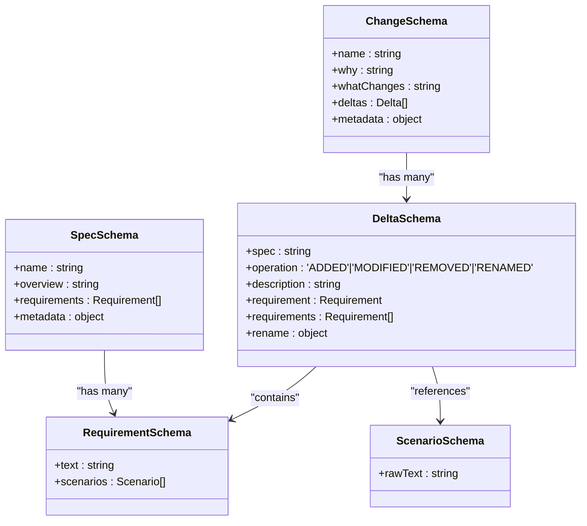
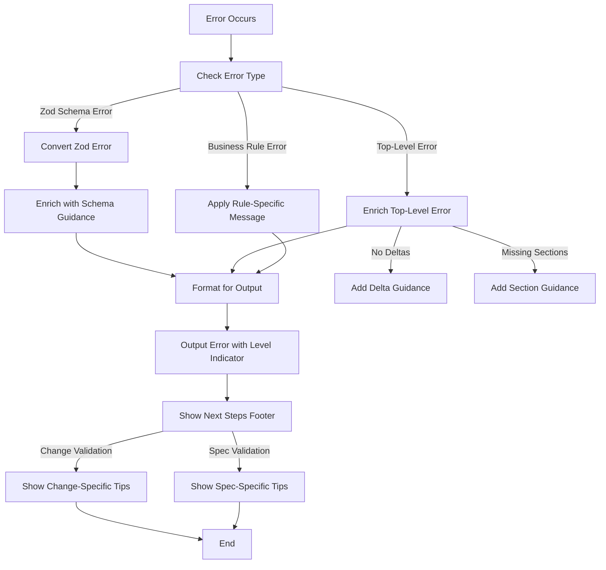

# openspec validate

<cite>
**Referenced Files in This Document**   
- [validate.ts](file://src/commands/validate.ts)
- [validator.ts](file://src/core/validation/validator.ts)
- [spec.schema.ts](file://src/core/schemas/spec.schema.ts)
- [change.schema.ts](file://src/core/schemas/change.schema.ts)
- [base.schema.ts](file://src/core/schemas/base.schema.ts)
- [constants.ts](file://src/core/validation/constants.ts)
- [types.ts](file://src/core/validation/types.ts)
- [markdown-parser.ts](file://src/core/parsers/markdown-parser.ts)
- [change-parser.ts](file://src/core/parsers/change-parser.ts)
- [cli/index.ts](file://src/cli/index.ts)
- [validate.test.ts](file://test/commands/validate.test.ts)
- [validate.enriched-output.test.ts](file://test/commands/validate.enriched-output.test.ts)
</cite>

## Table of Contents
1. [Introduction](#introduction)
2. [Command Usage and Modes](#command-usage-and-modes)
3. [Validation Implementation](#validation-implementation)
4. [Schema Validation with Zod](#schema-validation-with-zod)
5. [Requirement Checking and Business Rules](#requirement-checking-and-business-rules)
6. [Error Message Generation and Enrichment](#error-message-generation-and-enrichment)
7. [Validation Output Formats](#validation-output-formats)
8. [Integration with Specification Format](#integration-with-specification-format)
9. [Common Issues and Solutions](#common-issues-and-solutions)
10. [Performance Considerations](#performance-considerations)

## Introduction

The `openspec validate` command serves as the primary mechanism for verifying the correctness and completeness of specification files within the OpenSpec ecosystem. This command ensures that both standalone specifications and change proposals adhere to the defined OpenSpec conventions, maintaining consistency and quality across the documentation. The validation process combines structural schema validation with semantic rule enforcement to catch both syntactic errors and logical inconsistencies.

The validation system is designed to support the spec-driven development workflow by providing immediate feedback on specification quality, helping developers identify issues early in the development process. It operates on two primary artifact types: specifications (stored in `openspec/specs/`) and changes (stored in `openspec/changes/`), each with their own validation rules and requirements.

**Section sources**
- [validate.ts](file://src/commands/validate.ts#L1-L306)
- [cli/index.ts](file://src/cli/index.ts#L204-L224)

## Command Usage and Modes

The `openspec validate` command supports multiple execution modes to accommodate different use cases and workflows. The command can validate individual items, all changes, all specifications, or all items of both types. When no arguments are provided in a non-interactive environment, the command displays helpful guidance on available options.

The command offers two primary validation modes: standard output and enriched JSON output. The standard mode provides human-readable output with visual indicators (✓ for valid, ✗ for invalid) and detailed error messages, while the JSON mode produces structured output suitable for integration with CI/CD pipelines and automated tooling.

Interactive mode is automatically enabled when running in a terminal environment, allowing users to select items to validate through a menu-driven interface. This mode is particularly useful during development when working with multiple specifications or changes. The command also supports a `--no-interactive` flag to disable interactive prompts when needed.

**Diagram sources**
- [validate.ts](file://src/commands/validate.ts#L30-L272)
- [cli/index.ts](file://src/cli/index.ts#L204-L224)

**Section sources**
- [validate.ts](file://src/commands/validate.ts#L30-L272)
- [cli/index.ts](file://src/cli/index.ts#L204-L224)

## Validation Implementation

The validation implementation is structured around two primary classes: `ValidateCommand` and `Validator`. The `ValidateCommand` class handles the command-line interface, argument parsing, and execution flow, while the `Validator` class encapsulates the core validation logic. This separation of concerns allows for reusable validation functionality that can be invoked from different contexts.

The validation process begins with the `ValidateCommand.execute()` method, which determines the appropriate validation mode based on the provided arguments and flags. For bulk validation operations (using `--all`, `--changes`, or `--specs`), the command retrieves all relevant item IDs and processes them concurrently to improve performance. The concurrency level can be controlled via the `--concurrency` flag or the `OPENSPEC_CONCURRENCY` environment variable, with a default of 6 concurrent validations.

For individual item validation, the command first attempts to detect the item type by checking against known change and specification IDs. When an item name matches both a change and a specification, the command requires the user to specify the type explicitly using the `--type` flag to avoid ambiguity. This design prevents accidental validation of the wrong artifact type.

The validation process is designed to be resilient to file system errors, with appropriate error handling that provides meaningful feedback to users. When validation fails due to file access issues, the system generates error messages that include guidance on how to resolve the problem, such as checking file permissions or verifying the existence of required directories.

**Section sources**
- [validate.ts](file://src/commands/validate.ts#L30-L272)
- [validator.ts](file://src/core/validation/validator.ts#L15-L449)

## Schema Validation with Zod

The OpenSpec validation system leverages Zod, a TypeScript-first schema declaration and validation library, to enforce structural correctness of specification and change files. Zod schemas are defined for both specifications and changes, capturing the required fields, data types, and constraints that must be satisfied for valid artifacts.

The `SpecSchema` defines the structure of a specification, requiring a non-empty name, purpose section, and at least one requirement. Each requirement must contain text with SHALL or MUST keywords and at least one scenario. The schema uses Zod's refinement capabilities to enforce these semantic rules, providing custom error messages when validation fails.

Similarly, the `ChangeSchema` defines the structure of a change proposal, requiring a non-empty name, sufficiently long "Why" section (minimum 50 characters), "What Changes" section, and at least one delta. The schema also limits the number of deltas per change to 10, encouraging users to create focused changes that are easier to review and implement.

Zod's safe parsing feature is used throughout the validation process, allowing the system to capture validation errors without throwing exceptions. This approach enables comprehensive error reporting, where multiple validation issues can be identified and reported in a single pass rather than failing on the first error encountered.

**Diagram sources**
- [spec.schema.ts](file://src/core/schemas/spec.schema.ts#L5-L17)
- [change.schema.ts](file://src/core/schemas/change.schema.ts#L10-L42)
- [base.schema.ts](file://src/core/schemas/base.schema.ts#L4-L20)

**Section sources**
- [spec.schema.ts](file://src/core/schemas/spec.schema.ts#L5-L17)
- [change.schema.ts](file://src/core/schemas/change.schema.ts#L10-L42)
- [base.schema.ts](file://src/core/schemas/base.schema.ts#L4-L20)
- [validator.ts](file://src/core/validation/validator.ts#L22-L102)

## Requirement Checking and Business Rules

Beyond structural validation, the OpenSpec validator enforces a set of business rules that ensure specifications and changes meet quality standards and follow established conventions. These rules are implemented in the `applySpecRules()` and `applyChangeRules()` methods of the `Validator` class and complement the schema validation performed by Zod.

For specifications, the validator checks that the purpose section is sufficiently detailed (at least 50 characters) and that no requirement exceeds 500 characters in length. Long requirements are flagged as informational issues, suggesting that they be broken down into smaller, more focused requirements. Each requirement must include at least one scenario, which must be formatted using level-4 headers (####) to ensure consistency.

For changes, the validator ensures that each delta has a meaningful description (not just a few words) and that ADDED or MODIFIED deltas include requirements. The system also validates delta-formatted specification files within change directories, enforcing rules such as: ADDED and MODIFIED requirements must contain SHALL or MUST keywords and at least one scenario; REMOVED requirements only require names; RENAMED requirements must be properly paired; and there are no conflicting entries within or across sections.

The validator also checks for cross-section conflicts within the same specification file, such as a requirement appearing in both MODIFIED and REMOVED sections, which would create ambiguity about the intended change. These semantic validations help prevent logical errors that could lead to incorrect implementation.

**Section sources**
- [validator.ts](file://src/core/validation/validator.ts#L288-L345)
- [validator.ts](file://src/core/validation/validator.ts#L113-L272)
- [constants.ts](file://src/core/validation/constants.ts#L5-L49)

## Error Message Generation and Enrichment

The OpenSpec validation system places significant emphasis on generating clear, actionable error messages that help users understand and resolve issues. Error messages are categorized into three levels: ERROR (critical issues that invalidate the artifact), WARNING (potential problems that should be addressed), and INFO (suggestions for improvement).

When validation fails, the system enriches error messages with contextual guidance to help users resolve the issues. For example, if a change has no deltas, the error message includes specific instructions on how to add delta sections and requirements. This guidance is defined in the `VALIDATION_MESSAGES` constants and is appended to relevant error messages to provide remediation steps.

The validator also handles top-level errors (such as file access issues) by enriching the base error message with context-specific guidance. This ensures that even when validation fails due to unexpected issues, users receive helpful information rather than cryptic error messages.

For ambiguous situations, such as when an item name matches both a change and a specification, the system provides clear instructions on how to resolve the ambiguity, including using the `--type` flag or alternative command syntax. The system also provides suggestions for misspelled item names using a Levenshtein distance algorithm to find the closest matches among available items.

**Diagram sources**
- [validator.ts](file://src/core/validation/validator.ts#L274-L286)
- [validator.ts](file://src/core/validation/validator.ts#L347-L359)
- [validator.ts](file://src/core/validation/validator.ts#L168-L181)
- [constants.ts](file://src/core/validation/constants.ts#L15-L48)

**Section sources**
- [validator.ts](file://src/core/validation/validator.ts#L274-L359)
- [constants.ts](file://src/core/validation/constants.ts#L15-L48)

## Validation Output Formats

The `openspec validate` command supports multiple output formats to accommodate different use cases and integration scenarios. The default output format is designed for human readability, using visual indicators (✓ for valid items, ✗ for invalid items) and color-coded error messages to quickly convey validation results.

In standard output mode, successful validation displays a simple confirmation message indicating that the item is valid. Failed validation shows each issue with an appropriate prefix (✗ for errors, ⚠ for warnings, ℹ for informational messages) and includes a "Next steps" section with specific guidance on how to resolve common issues. This contextual help reduces the need for users to consult documentation when addressing validation failures.

The JSON output format, enabled with the `--json` flag, produces structured data that can be easily consumed by automated systems. The JSON output includes detailed information about each validation item, including its ID, type, validity status, specific issues, and execution duration. The structured format also includes a summary section with totals by item type, making it suitable for integration with CI/CD pipelines, dashboards, and reporting tools.

For bulk validation operations, the command displays a progress indicator showing the current validation status, which is automatically suppressed when JSON output is requested. The results are sorted alphabetically by ID to ensure consistent output across runs, facilitating comparison and automation.

**Section sources**
- [validate.ts](file://src/commands/validate.ts#L149-L181)
- [validate.ts](file://src/commands/validate.ts#L250-L271)

## Integration with Specification Format

The validation system is tightly integrated with the OpenSpec specification format, enforcing conventions that ensure consistency and quality across all specifications and changes. The system validates both the high-level structure of specification files and the detailed formatting of individual components.

For specifications, the validator ensures the presence of required sections (## Purpose and ## Requirements) and validates the hierarchical structure of requirements and scenarios. Requirements must be formatted with level-3 headers (###) and scenarios with level-4 headers (####), maintaining a consistent document structure that is both human-readable and machine-parsable.

For changes, the validator supports two formats for specifying deltas: inline in the "What Changes" section using bullet points with **spec:** syntax, and in separate specification files within the change's specs/ directory using delta headers (## ADDED/MODIFIED/REMOVED/RENAMED Requirements). The system prefers the delta file format when both are present, as it provides more detailed information and better supports complex changes.

The validation process also normalizes line endings (converting CRLF to LF) to ensure consistent parsing across different operating systems, addressing a common source of validation issues when collaborating across Windows and Unix-based systems. This normalization allows the system to handle files created on different platforms without requiring manual conversion.

**Section sources**
- [markdown-parser.ts](file://src/core/parsers/markdown-parser.ts#L10-L237)
- [change-parser.ts](file://src/core/parsers/change-parser.ts#L12-L234)
- [validator.ts](file://src/core/validation/validator.ts#L113-L272)

## Common Issues and Solutions

Despite the comprehensive validation system, users may encounter certain common issues when working with OpenSpec. Understanding these issues and their solutions helps improve the overall experience and effectiveness of the specification process.

One common issue is cryptic error messages, particularly when validation fails due to subtle formatting problems. The system addresses this by enriching error messages with specific guidance on how to resolve the issue, such as indicating that scenarios must use level-4 headers or that requirements must contain SHALL or MUST keywords. The "Next steps" footer provides additional context-specific advice to help users quickly address common problems.

False positives can occur when the system misidentifies the operation type of a delta based on keywords in the description. For example, a description containing "new" might be incorrectly classified as an ADDED operation. The solution is to use more precise language in delta descriptions or to use the delta file format, which provides explicit operation headers and reduces ambiguity.

Another common issue is validation performance when working with large numbers of specifications or complex changes. The system addresses this through concurrent validation and efficient parsing, but users can further optimize performance by validating specific items rather than all items, or by using the JSON output format which has less overhead than interactive progress indicators.

**Section sources**
- [validate.ts](file://src/commands/validate.ts#L111-L124)
- [validator.ts](file://src/core/validation/validator.ts#L217-L226)
- [validate.test.ts](file://test/commands/validate.test.ts#L92-L96)
- [validate.enriched-output.test.ts](file://test/commands/validate.enriched-output.test.ts#L21-L45)

## Performance Considerations

The `openspec validate` command is designed with performance in mind, particularly when validating large numbers of specifications or complex changes. The system employs several strategies to optimize validation performance while maintaining accuracy and reliability.

The most significant performance optimization is concurrent validation, which allows multiple items to be validated simultaneously. By default, the system processes up to 6 validations concurrently, with the concurrency level configurable via the `--concurrency` flag or the `OPENSPEC_CONCURRENCY` environment variable. This parallel processing significantly reduces the total validation time for large projects with many specifications.

The validation process is also optimized to minimize file system operations and parsing overhead. The system uses efficient parsing algorithms that process content in a single pass where possible, and caches results when appropriate. For bulk operations, the system retrieves all necessary file paths and metadata before beginning validation, reducing the number of individual file system calls.

Memory usage is carefully managed, with the system processing each item independently and releasing resources promptly. This approach prevents memory accumulation during long-running validation operations and allows the system to scale to projects of any size.

For extremely large validation operations, users can optimize performance by targeting specific validation scopes (changes or specs only) rather than validating all items, or by using the JSON output format which has less overhead than the interactive progress indicators used in standard output mode.

**Section sources**
- [validate.ts](file://src/commands/validate.ts#L183-L247)
- [validate.ts](file://src/core/validation/validator.ts#L113-L272)