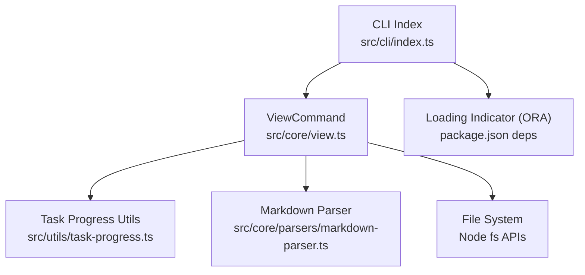
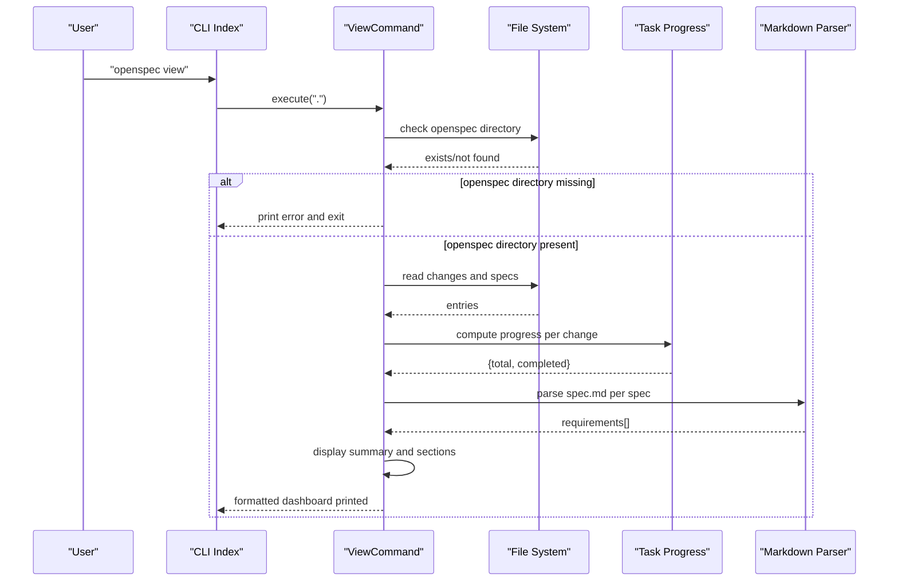
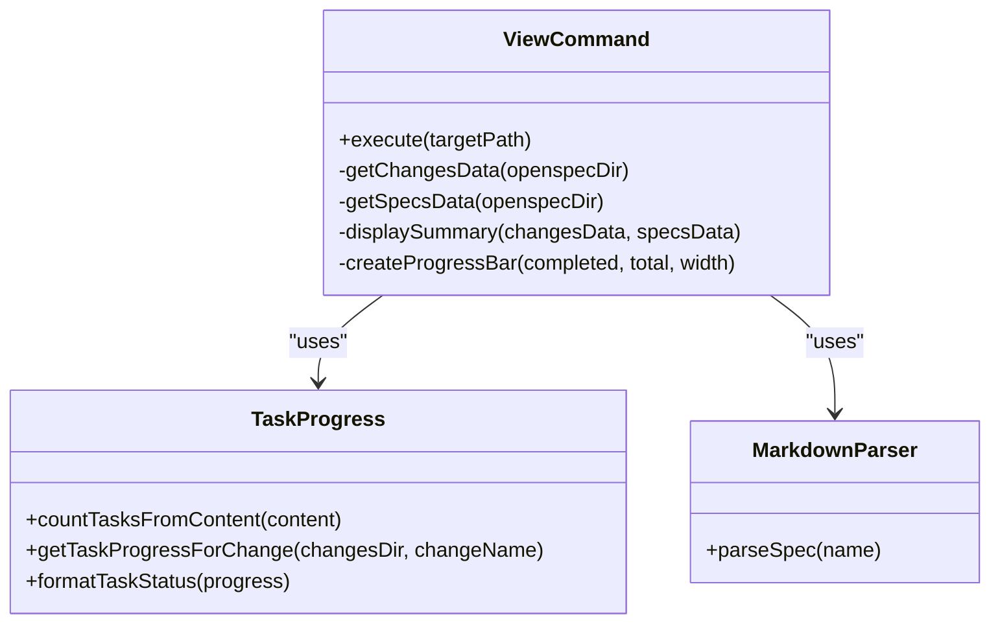
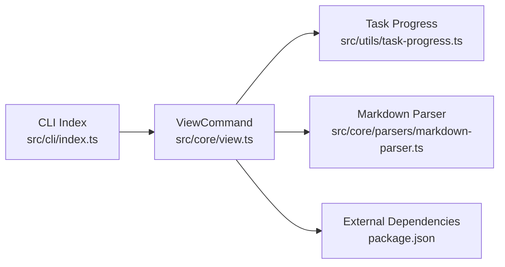

# openspec view

<cite>
**Referenced Files in This Document**
- [src/cli/index.ts](file://src/cli/index.ts)
- [src/core/view.ts](file://src/core/view.ts)
- [src/utils/task-progress.ts](file://src/utils/task-progress.ts)
- [src/core/parsers/markdown-parser.ts](file://src/core/parsers/markdown-parser.ts)
- [openspec/specs/cli-view/spec.md](file://openspec/specs/cli-view/spec.md)
- [test/core/view.test.ts](file://test/core/view.test.ts)
- [README.md](file://README.md)
- [package.json](file://package.json)
</cite>

## Table of Contents
1. [Introduction](#introduction)
2. [Project Structure](#project-structure)
3. [Core Components](#core-components)
4. [Architecture Overview](#architecture-overview)
5. [Detailed Component Analysis](#detailed-component-analysis)
6. [Dependency Analysis](#dependency-analysis)
7. [Performance Considerations](#performance-considerations)
8. [Troubleshooting Guide](#troubleshooting-guide)
9. [Conclusion](#conclusion)

## Introduction
The openspec view command provides an interactive dashboard that gives developers a unified, visual overview of the OpenSpec project state. It surfaces key metrics, highlights active and completed changes, and lists specifications with requirement counts. This dashboard accelerates change discovery and status monitoring by consolidating frequently needed information into a single, readable view.

The command is part of the CLI entrypoint and integrates with the core ViewCommand implementation, which reads from the openspec directory structure, computes progress, parses spec metadata, and renders a formatted summary.

## Project Structure
The openspec view command spans the CLI registration and the core implementation:

- CLI registration: The command is registered in the CLI index and wired to the ViewCommand class.
- Core implementation: The ViewCommand class orchestrates data discovery, progress computation, spec parsing, and rendering.
- Utilities: Task progress calculation and Markdown parsing are reused to compute change progress and requirement counts.
- Tests: Unit tests validate sorting behavior and rendering expectations.

**Diagram sources**
- [src/cli/index.ts](file://src/cli/index.ts#L108-L120)
- [src/core/view.ts](file://src/core/view.ts#L1-L189)
- [src/utils/task-progress.ts](file://src/utils/task-progress.ts#L1-L44)
- [src/core/parsers/markdown-parser.ts](file://src/core/parsers/markdown-parser.ts#L1-L237)
- [package.json](file://package.json#L65-L72)

**Section sources**
- [src/cli/index.ts](file://src/cli/index.ts#L108-L120)
- [src/core/view.ts](file://src/core/view.ts#L1-L189)
- [src/utils/task-progress.ts](file://src/utils/task-progress.ts#L1-L44)
- [src/core/parsers/markdown-parser.ts](file://src/core/parsers/markdown-parser.ts#L1-L237)
- [package.json](file://package.json#L65-L72)

## Core Components
- CLI command registration: The view command is registered with a description and invokes ViewCommand.execute.
- ViewCommand: Orchestrates dashboard rendering by collecting changes and specs data, computing summary metrics, and printing sections for active changes, completed changes, and specifications.
- Task progress utilities: Parse tasks.md to compute total and completed tasks for each change.
- Markdown parser: Parses spec.md to extract requirements and compute requirement counts.

Key responsibilities:
- Validate openspec directory presence and exit early with an error if missing.
- Enumerate changes and specs, compute progress, and sort items deterministically.
- Render summary metrics and sections with consistent formatting and symbols.

**Section sources**
- [src/cli/index.ts](file://src/cli/index.ts#L108-L120)
- [src/core/view.ts](file://src/core/view.ts#L1-L189)
- [src/utils/task-progress.ts](file://src/utils/task-progress.ts#L1-L44)
- [src/core/parsers/markdown-parser.ts](file://src/core/parsers/markdown-parser.ts#L1-L237)

## Architecture Overview
The openspec view command follows a straightforward flow: CLI action triggers ViewCommand.execute, which gathers data from the filesystem, computes metrics, and prints a formatted dashboard.

**Diagram sources**
- [src/cli/index.ts](file://src/cli/index.ts#L108-L120)
- [src/core/view.ts](file://src/core/view.ts#L1-L189)
- [src/utils/task-progress.ts](file://src/utils/task-progress.ts#L1-L44)
- [src/core/parsers/markdown-parser.ts](file://src/core/parsers/markdown-parser.ts#L1-L237)

## Detailed Component Analysis

### ViewCommand Implementation
The ViewCommand class encapsulates the dashboard logic:
- Validates openspec directory existence.
- Gathers active and completed changes by scanning the changes directory and computing progress per change.
- Gathers specifications by scanning the specs directory and parsing spec.md to count requirements.
- Computes and prints summary metrics including total specs, total requirements, active changes, completed changes, and overall task progress.
- Renders sections for active changes (with progress bars), completed changes, and specifications (sorted by requirement count).
- Uses chalk for color coding and Unicode characters for progress bars.

**Diagram sources**
- [src/core/view.ts](file://src/core/view.ts#L1-L189)
- [src/utils/task-progress.ts](file://src/utils/task-progress.ts#L1-L44)
- [src/core/parsers/markdown-parser.ts](file://src/core/parsers/markdown-parser.ts#L1-L237)

**Section sources**
- [src/core/view.ts](file://src/core/view.ts#L1-L189)

### Task Progress Calculation
The task progress utilities parse tasks.md to compute:
- Total tasks: lines matching the task pattern.
- Completed tasks: lines matching the completed task pattern.
- Fallback behavior: returns zeros when tasks.md is missing or unreadable.

Sorting behavior for active changes:
- Items are sorted by completion percentage ascending, with ties broken by lexicographic ordering of change names to ensure deterministic output.

**Section sources**
- [src/utils/task-progress.ts](file://src/utils/task-progress.ts#L1-L44)
- [test/core/view.test.ts](file://test/core/view.test.ts#L31-L77)

### Specification Parsing and Requirement Counting
The MarkdownParser extracts spec metadata:
- Parses sections and validates required sections for specs.
- Extracts requirements and scenarios to compute requirement counts.
- The ViewCommand uses this to sort specifications by requirement count descending.

**Section sources**
- [src/core/parsers/markdown-parser.ts](file://src/core/parsers/markdown-parser.ts#L1-L237)
- [src/core/view.ts](file://src/core/view.ts#L112-L142)

### CLI Registration and Loading Indicators
The CLI registers the view command and wraps execution with error handling. While the ViewCommand itself does not use Inquirer for interactive prompts, the CLI integrates ORA for consistent error reporting and spinner usage across commands.

- Command registration: The view command is registered with a description and invokes ViewCommand.execute.
- Error handling: On exceptions, the CLI prints a failure message using ORA and exits with a non-zero code.

Note: The openspec view command is intentionally a non-interactive dashboard. Interactive prompts are not used here; the CLI uses ORA primarily for consistent error messaging.

**Section sources**
- [src/cli/index.ts](file://src/cli/index.ts#L108-L120)
- [package.json](file://package.json#L65-L72)

### Hierarchical Navigation and User Interaction Patterns
The openspec view command provides a dashboard-style overview. While it does not implement an interactive menu with Inquirer, users can navigate to detailed views using the list and show commands:

- Use openspec list to switch between changes and specs listings.
- Use openspec show to inspect a specific change or spec.
- Use openspec validate to check formatting and structure.

The dashboard footer suggests using openspec list --changes or openspec list --specs for detailed views, guiding users toward the complementary commands.

**Section sources**
- [src/core/view.ts](file://src/core/view.ts#L67-L69)
- [README.md](file://README.md#L240-L248)

### Examples of User Interactions and Navigation Patterns
- Initial overview: Running openspec view in a project with changes and specs yields a dashboard with summary metrics, active changes with progress bars, completed changes, and specifications sorted by requirement count.
- Status monitoring: Developers can run openspec view regularly to monitor overall progress and quickly identify stalled changes.
- Transition to details: After reviewing the dashboard, users can run openspec list --changes or openspec list --specs to drill down into specific items, or openspec show <item> to inspect details.

**Section sources**
- [src/core/view.ts](file://src/core/view.ts#L1-L189)
- [README.md](file://README.md#L240-L248)

## Dependency Analysis
The ViewCommand depends on:
- File system operations to enumerate changes and specs.
- Task progress utilities to compute completion percentages.
- Markdown parser to extract spec metadata and requirements.
- CLI wiring for command registration and error handling.

**Diagram sources**
- [src/cli/index.ts](file://src/cli/index.ts#L108-L120)
- [src/core/view.ts](file://src/core/view.ts#L1-L189)
- [src/utils/task-progress.ts](file://src/utils/task-progress.ts#L1-L44)
- [src/core/parsers/markdown-parser.ts](file://src/core/parsers/markdown-parser.ts#L1-L237)
- [package.json](file://package.json#L65-L72)

**Section sources**
- [src/cli/index.ts](file://src/cli/index.ts#L108-L120)
- [src/core/view.ts](file://src/core/view.ts#L1-L189)
- [src/utils/task-progress.ts](file://src/utils/task-progress.ts#L1-L44)
- [src/core/parsers/markdown-parser.ts](file://src/core/parsers/markdown-parser.ts#L1-L237)
- [package.json](file://package.json#L65-L72)

## Performance Considerations
- File system enumeration: The command scans the changes and specs directories. For projects with many changes/specs, consider keeping the openspec directory lean or using the list command for targeted views.
- Parsing overhead: Parsing spec.md for requirement counts occurs per spec. For large projects, this cost is proportional to the number of specs.
- Sorting: Active changes are sorted by completion percentage and name, which is efficient for typical project sizes.

[No sources needed since this section provides general guidance]

## Troubleshooting Guide
Common issues and resolutions:

- No openspec directory found
  - Symptom: The command exits with an error indicating the openspec directory is missing.
  - Cause: Running the command outside a project initialized with OpenSpec.
  - Resolution: Initialize OpenSpec in the project using openspec init and rerun the command.

- Terminal compatibility problems
  - Symptom: Unexpected characters or missing colors in terminals.
  - Cause: Terminal lacks Unicode support or color output is disabled.
  - Resolution: Ensure your terminal supports Unicode and colors. Disable color output globally with the --no-color flag if needed.

- Navigation errors
  - Symptom: Errors when accessing changes or specs directories.
  - Cause: Permission issues or missing files.
  - Resolution: Verify file permissions and ensure the openspec directory structure is intact. Re-run openspec init if necessary.

- Progress calculation anomalies
  - Symptom: Changes appear with zero progress unexpectedly.
  - Cause: Missing or unreadable tasks.md.
  - Resolution: Ensure tasks.md exists and follows the expected task list format.

- Spec parsing errors
  - Symptom: A spec appears with zero requirement count.
  - Cause: spec.md could not be parsed (missing required sections).
  - Resolution: Fix spec.md to include required sections and re-run the command.

**Section sources**
- [src/core/view.ts](file://src/core/view.ts#L11-L14)
- [src/utils/task-progress.ts](file://src/utils/task-progress.ts#L27-L35)
- [src/core/parsers/markdown-parser.ts](file://src/core/parsers/markdown-parser.ts#L24-L49)

## Conclusion
The openspec view command delivers a focused, non-interactive dashboard that consolidates project status across changes and specifications. It emphasizes readability and quick insights, complemented by the list and show commands for detailed navigation. By leveraging task progress computation and spec parsing, it provides actionable metrics that enhance developer experience in a spec-driven workflow.

[No sources needed since this section summarizes without analyzing specific files]