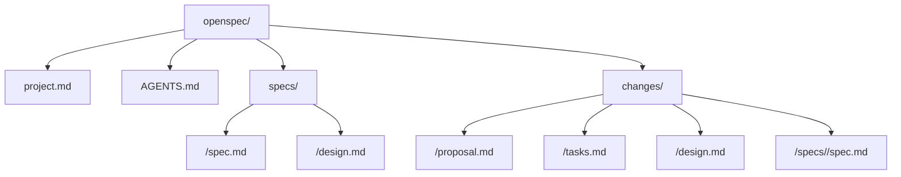
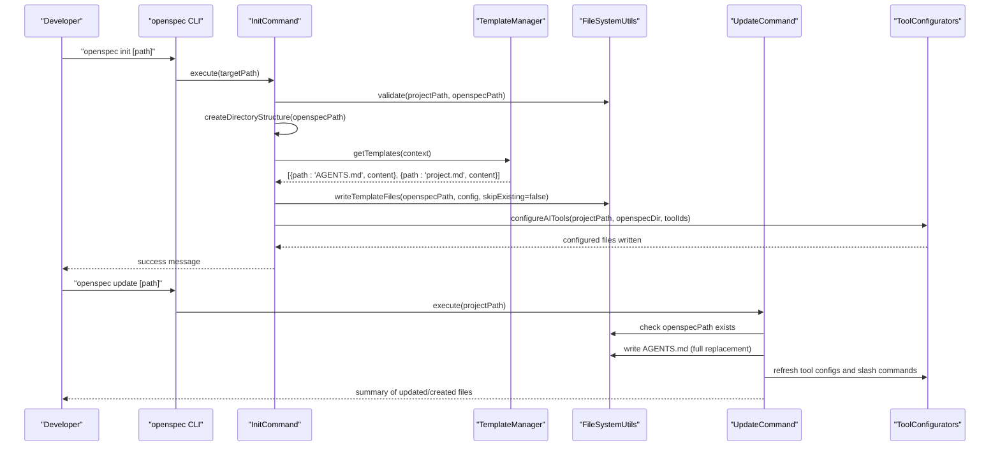
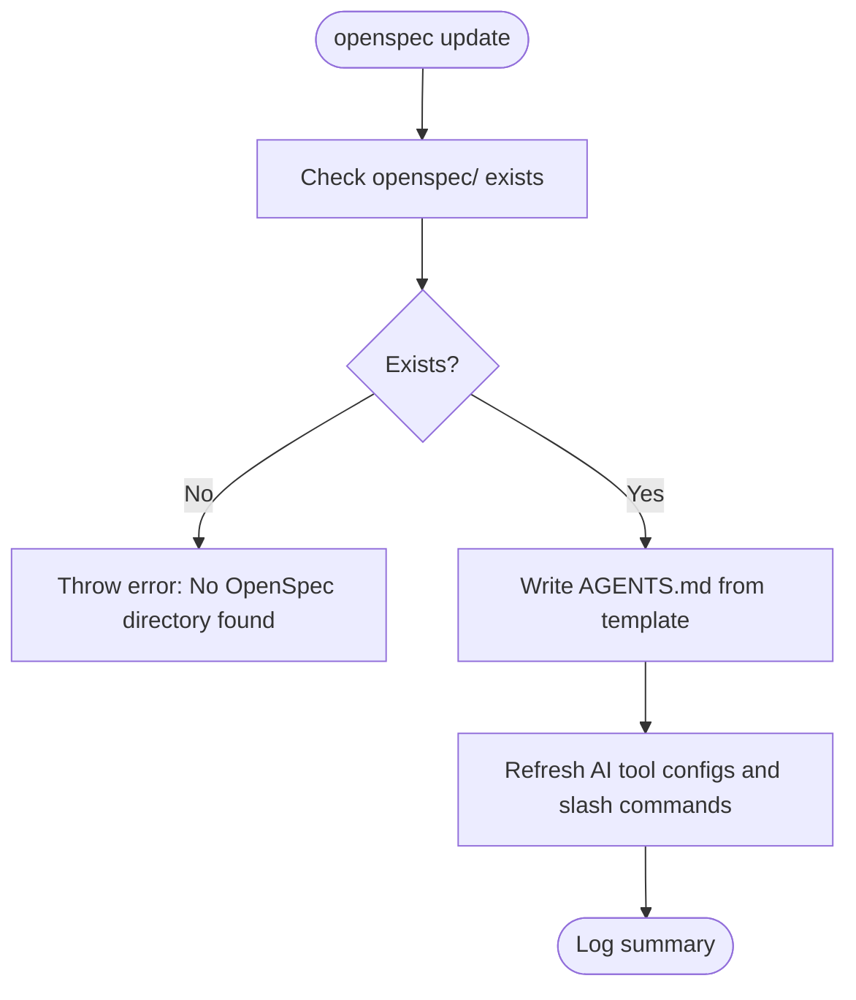
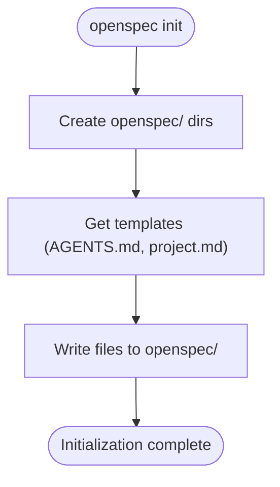
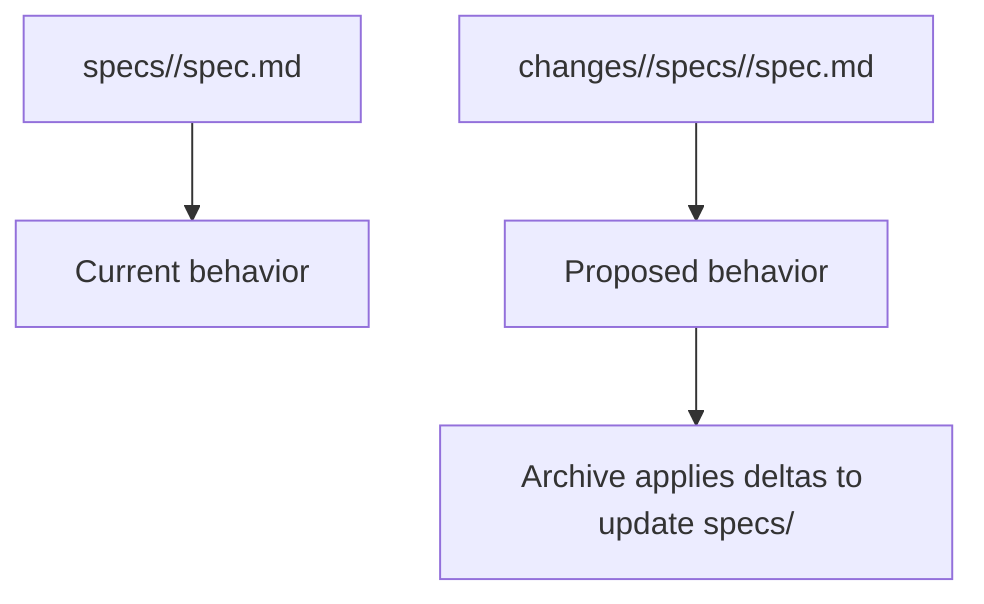
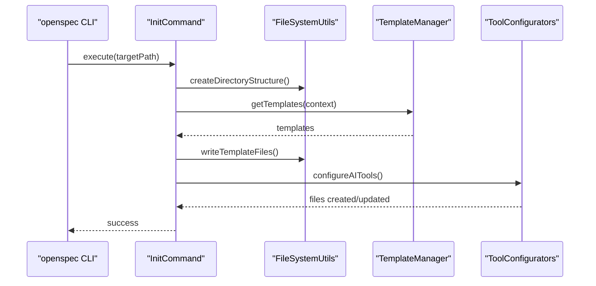
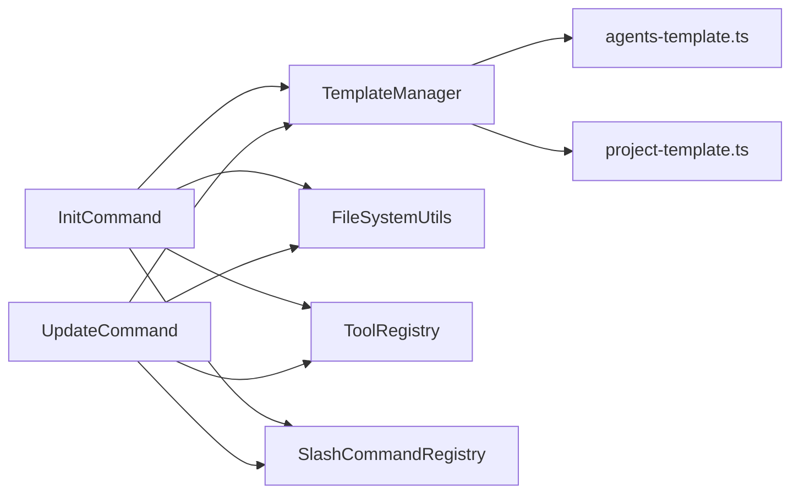

# Configuration Files

<cite>
**Referenced Files in This Document**
- [AGENTS.md](file://openspec/AGENTS.md)
- [project.md](file://openspec/project.md)
- [init.ts](file://src/core/init.ts)
- [update.ts](file://src/core/update.ts)
- [agents-template.ts](file://src/core/templates/agents-template.ts)
- [project-template.ts](file://src/core/templates/project-template.ts)
- [index.ts](file://src/core/templates/index.ts)
- [config.ts](file://src/core/config.ts)
- [agents.ts](file://src/core/configurators/agents.ts)
- [cli-init/spec.md](file://openspec/specs/cli-init/spec.md)
- [openspec-conventions/spec.md](file://openspec/specs/openspec-conventions/spec.md)
- [openspec.js](file://bin/openspec.js)
- [update.test.ts](file://test/core/update.test.ts)
- [test/fixtures/tmp-init/openspec/changes/c1/proposal.md](file://test/fixtures/tmp-init/openspec/changes/c1/proposal.md)
- [test/fixtures/tmp-init/openspec/specs/alpha/spec.md](file://test/fixtures/tmp-init/openspec/specs/alpha/spec.md)
</cite>

## Table of Contents
1. [Introduction](#introduction)
2. [Project Structure](#project-structure)
3. [Core Components](#core-components)
4. [Architecture Overview](#architecture-overview)
5. [Detailed Component Analysis](#detailed-component-analysis)
6. [Dependency Analysis](#dependency-analysis)
7. [Performance Considerations](#performance-considerations)
8. [Troubleshooting Guide](#troubleshooting-guide)
9. [Conclusion](#conclusion)
10. [Appendices](#appendices)

## Introduction
This section documents OpenSpec’s configuration files and project structure. It explains:
- The purpose and format of AGENTS.md as the standardized hand-off file for AI coding assistants.
- The role of openspec/project.md as the project-level context file defining tech stack, architecture, and conventions.
- The directory layout of openspec/, including the separation between specs/ (current truth) and changes/ (proposed updates).
- How configuration files are generated during openspec init and updated during openspec update.
- How these files maintain consistency across team members using different AI tools.
- Practical guidance for maintaining and evolving these files as projects grow.

## Project Structure
OpenSpec organizes specification and change artifacts under a dedicated openspec/ directory. The structure is enforced by both convention and specification:

- openspec/
  - project.md: Project-level context and conventions
  - AGENTS.md: AI assistant instructions and workflow
  - specs/: Current truth of capabilities and designs
  - changes/: Proposed changes and deltas
    - [change-id]/: Per-change proposal and implementation plan
      - proposal.md: Why, what, and impact
      - tasks.md: Implementation checklist
      - design.md: Optional technical decisions
      - specs/: Delta changes per affected capability

**Diagram sources**
- [openspec-conventions/spec.md](file://openspec/specs/openspec-conventions/spec.md#L233-L262)
- [cli-init/spec.md](file://openspec/specs/cli-init/spec.md#L21-L34)

**Section sources**
- [openspec-conventions/spec.md](file://openspec/specs/openspec-conventions/spec.md#L233-L262)
- [cli-init/spec.md](file://openspec/specs/cli-init/spec.md#L21-L34)

## Core Components
- AGENTS.md: The canonical hand-off file for AI coding assistants. It defines the three-stage workflow, directory structure, spec format, and operational guidance. It is generated by openspec init and refreshed by openspec update.
- project.md: The project-level context file that captures purpose, tech stack, conventions, architecture patterns, testing strategy, domain context, constraints, and external dependencies. It is generated by openspec init and can be manually curated afterward.
- CLI commands:
  - openspec init: Creates the openspec/ directory structure and writes AGENTS.md and project.md, then configures AI tool integrations.
  - openspec update: Refreshes AGENTS.md and updates managed sections in AI tool configuration files.

**Section sources**
- [AGENTS.md](file://openspec/AGENTS.md#L1-L120)
- [project.md](file://openspec/project.md#L1-L53)
- [init.ts](file://src/core/init.ts#L417-L460)
- [update.ts](file://src/core/update.ts#L1-L130)

## Architecture Overview
The configuration lifecycle is driven by CLI commands and templates:

**Diagram sources**
- [init.ts](file://src/core/init.ts#L385-L460)
- [index.ts](file://src/core/templates/index.ts#L14-L26)
- [update.ts](file://src/core/update.ts#L1-L130)
- [agents.ts](file://src/core/configurators/agents.ts#L1-L24)

## Detailed Component Analysis

### AGENTS.md: AI Assistant Hand-Off
- Purpose: Provides a single source of truth for AI coding assistants. It documents the three-stage workflow, directory structure, spec format, and operational guidance.
- Format: Markdown with structured sections for quick scanning and machine parsing. It includes:
  - Quick checklist and essential commands
  - Directory structure diagram
  - Proposal and implementation guidance
  - Spec format rules (scenarios, requirement wording, delta operations)
  - Troubleshooting tips and validation guidance
- Maintenance:
  - Generated by openspec init using a template.
  - Refreshed by openspec update, which replaces the entire AGENTS.md file with the latest template content.
  - Managed markers ensure that root-level AGENTS.md can be updated without losing custom content outside the managed region.

**Diagram sources**
- [update.ts](file://src/core/update.ts#L1-L130)
- [agents-template.ts](file://src/core/templates/agents-template.ts#L1-L458)

**Section sources**
- [AGENTS.md](file://openspec/AGENTS.md#L1-L120)
- [update.ts](file://src/core/update.ts#L1-L130)
- [agents-template.ts](file://src/core/templates/agents-template.ts#L1-L458)

### project.md: Project-Level Context
- Purpose: Captures project-specific context and conventions to guide AI assistants and human contributors.
- Content areas: Purpose, Tech Stack, Code Style, Architecture Patterns, Testing Strategy, Git Workflow, Domain Context, Constraints, External Dependencies.
- Generation:
  - Created by openspec init using a template.
  - The template accepts a ProjectContext object; in the CLI, this is currently a placeholder and can be expanded later.

**Diagram sources**
- [init.ts](file://src/core/init.ts#L709-L759)
- [index.ts](file://src/core/templates/index.ts#L14-L26)
- [project-template.ts](file://src/core/templates/project-template.ts#L1-L38)

**Section sources**
- [project.md](file://openspec/project.md#L1-L53)
- [project-template.ts](file://src/core/templates/project-template.ts#L1-L38)
- [init.ts](file://src/core/init.ts#L709-L759)

### Directory Structure: specs/ vs changes/
- specs/: Contains the current truth of capabilities and optional design notes. Each capability is a focused unit under its own directory.
- changes/: Contains proposals for future changes. Each change has:
  - proposal.md: Why, what, and impact
  - tasks.md: Implementation checklist
  - design.md: Optional technical decisions
  - specs/: Delta changes per affected capability using structured requirement sections

**Diagram sources**
- [openspec-conventions/spec.md](file://openspec/specs/openspec-conventions/spec.md#L296-L358)
- [cli-init/spec.md](file://openspec/specs/cli-init/spec.md#L21-L34)

**Section sources**
- [openspec-conventions/spec.md](file://openspec/specs/openspec-conventions/spec.md#L296-L358)
- [cli-init/spec.md](file://openspec/specs/cli-init/spec.md#L21-L34)

### CLI Lifecycle: init and update
- openspec init:
  - Validates environment and permissions
  - Creates openspec/ directory structure
  - Writes AGENTS.md and project.md from templates
  - Configures AI tool integrations and slash commands
  - Provides progress indicators and success messages
- openspec update:
  - Ensures openspec/ exists
  - Replaces AGENTS.md with the latest template
  - Refreshes managed sections in AI tool configuration files
  - Updates slash command files for supported tools

**Diagram sources**
- [init.ts](file://src/core/init.ts#L385-L460)
- [index.ts](file://src/core/templates/index.ts#L14-L26)
- [agents.ts](file://src/core/configurators/agents.ts#L1-L24)

**Section sources**
- [init.ts](file://src/core/init.ts#L385-L460)
- [update.ts](file://src/core/update.ts#L1-L130)
- [config.ts](file://src/core/config.ts#L1-L38)

### Maintaining Consistency Across AI Tools
- Root AGENTS.md is always created/refreshed by openspec init and openspec update to ensure every team member finds the primary OpenSpec instructions.
- AI tool configuration files are managed via configurators and slash command generators. These files are updated by openspec update to keep instructions synchronized.
- Managed markers delineate the OpenSpec-managed region in tool-specific files, allowing safe refresh without overwriting custom content.

**Section sources**
- [agents.ts](file://src/core/configurators/agents.ts#L1-L24)
- [update.ts](file://src/core/update.ts#L1-L130)
- [update.test.ts](file://test/core/update.test.ts#L922-L1405)

### Guidance for Evolving Configuration Files
- Keep AGENTS.md as the single source of truth for AI workflows. Use openspec update to propagate changes across the team.
- Expand project.md with domain context and constraints as the project grows. Treat it as a living document that informs AI assistants and reviewers.
- When introducing new AI tools, use openspec init to add integrations and slash commands. Use openspec update to refresh managed sections.
- Maintain a clear separation between specs/ (current truth) and changes/ (proposed updates). Use structured requirement sections and scenarios to ensure clarity and parseability.

**Section sources**
- [AGENTS.md](file://openspec/AGENTS.md#L1-L120)
- [project.md](file://openspec/project.md#L1-L53)
- [openspec-conventions/spec.md](file://openspec/specs/openspec-conventions/spec.md#L264-L324)

## Dependency Analysis
- TemplateManager depends on:
  - agents-template.ts for AGENTS.md content
  - project-template.ts for project.md content
- InitCommand depends on:
  - TemplateManager to render templates
  - FileSystemUtils to create directories and write files
  - ToolConfigurators and SlashCommandRegistry to configure AI tools
- UpdateCommand depends on:
  - TemplateManager to regenerate AGENTS.md
  - ToolRegistry and SlashCommandRegistry to refresh tool configurations
  - FileSystemUtils to check existence and permissions

**Diagram sources**
- [index.ts](file://src/core/templates/index.ts#L14-L26)
- [init.ts](file://src/core/init.ts#L385-L460)
- [update.ts](file://src/core/update.ts#L1-L130)

**Section sources**
- [index.ts](file://src/core/templates/index.ts#L14-L26)
- [init.ts](file://src/core/init.ts#L385-L460)
- [update.ts](file://src/core/update.ts#L1-L130)

## Performance Considerations
- Parallel checks: During extend mode, InitCommand checks tool configurations in parallel to reduce latency.
- Minimal IO: Template rendering is lightweight; most work is directory creation and file writes.
- Incremental updates: openspec update refreshes only managed sections in tool files, avoiding unnecessary rewrites.

**Section sources**
- [init.ts](file://src/core/init.ts#L641-L687)
- [update.ts](file://src/core/update.ts#L1-L130)

## Troubleshooting Guide
- openspec update throws an error if openspec/ does not exist:
  - Run openspec init first to create the directory structure and template files.
- Permission errors when updating tool files:
  - Ensure write permissions in the project directory; openspec update checks and reports permission issues.
- AGENTS.md not updated:
  - Confirm openspec update ran successfully and that the managed markers are intact in root AGENTS.md.
- Tool configuration not refreshed:
  - Verify the tool is available and that its files contain OpenSpec markers; openspec update refreshes only files with markers.

**Section sources**
- [update.ts](file://src/core/update.ts#L1-L130)
- [update.test.ts](file://test/core/update.test.ts#L922-L1405)

## Conclusion
OpenSpec’s configuration files—AGENTS.md and project.md—form the foundation for consistent, AI-assisted specification and change management. The openspec init and openspec update commands automate generation and maintenance, ensuring that all team members, regardless of the AI tool they use, operate from the same authoritative source of truth. By adhering to the directory structure and structured spec format, teams can evolve their documentation alongside their codebase with clarity and reliability.

## Appendices

### Example: Well-Structured project.md
A well-structured project.md communicates:
- Purpose and goals
- Tech stack and runtime
- Code style and architecture patterns
- Testing strategy and Git workflow
- Domain context, constraints, and external dependencies

These elements help AI assistants understand the project’s context and align their suggestions accordingly.

**Section sources**
- [project.md](file://openspec/project.md#L1-L53)
- [project-template.ts](file://src/core/templates/project-template.ts#L1-L38)

### Example: CLI Entrypoint
The CLI binary delegates to the compiled CLI entrypoint.

**Section sources**
- [openspec.js](file://bin/openspec.js#L1-L3)