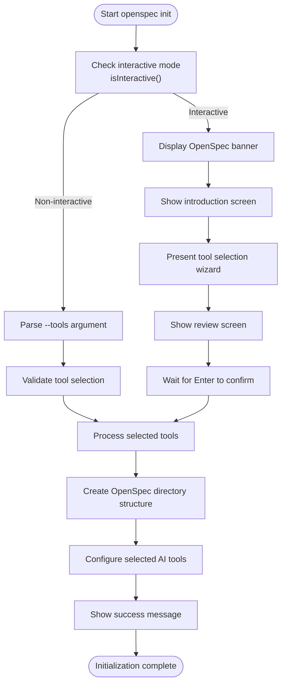
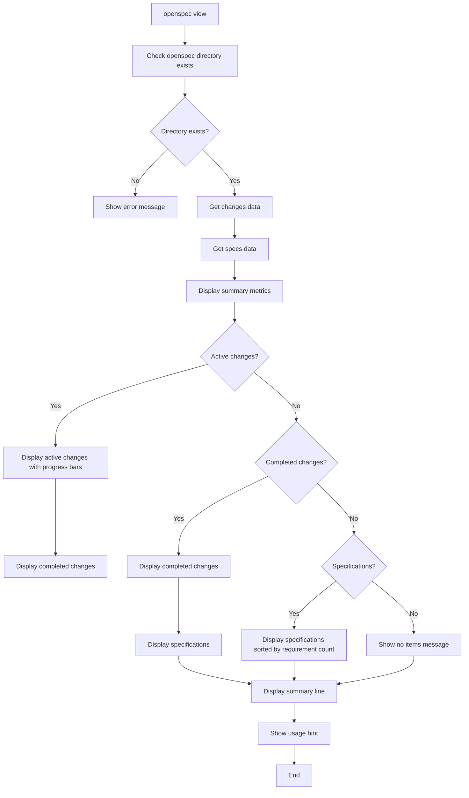

# Interactive Features

<cite>
**Referenced Files in This Document**   
- [interactive.ts](file://src/utils/interactive.ts)
- [init.ts](file://src/core/init.ts)
- [archive.ts](file://src/core/archive.ts)
- [view.ts](file://src/core/view.ts)
- [change.ts](file://src/commands/change.ts)
- [show.ts](file://src/commands/show.ts)
- [spec.ts](file://src/commands/spec.ts)
- [validate.ts](file://src/commands/validate.ts)
- [index.ts](file://src/cli/index.ts)
</cite>

## Table of Contents
1. [Introduction](#introduction)
2. [Interactive Mode Overview](#interactive-mode-overview)
3. [AI Tool Selection During Initialization](#ai-tool-selection-during-initialization)
4. [Confirmation Prompts in Archiving Operations](#confirmation-prompts-in-archiving-operations)
5. [Interactive Dashboard with 'openspec view'](#interactive-dashboard-with-openspec-view)
6. [Technical Implementation of Interactive Components](#technical-implementation-of-interactive-components)
7. [Interactive Workflows and Usage Guidance](#interactive-workflows-and-usage-guidance)

## Introduction
OpenSpec provides a rich set of interactive capabilities designed to enhance user experience during key operations. The system leverages TTY-based interactive prompts through the Inquirer library to guide users through complex workflows such as project initialization, archiving changes, and validating specifications. These interactive features provide a consistent user experience across different commands while maintaining compatibility with non-interactive environments like CI/CD pipelines. This document details the interactive capabilities of OpenSpec, focusing on how users interact with the system during critical operations and how these interactions are implemented technically.

## Interactive Mode Overview
OpenSpec's interactive capabilities are built around the TTY (Teletypewriter) interface, detecting whether the standard input stream is connected to a terminal. The system uses the `isInteractive` function in `src/utils/interactive.ts` to determine if interactive mode should be enabled, checking both the presence of the `--no-interactive` flag and the `OPEN_SPEC_INTERACTIVE` environment variable. When interactive mode is available, OpenSpec employs the `@inquirer/prompts` library to create user-friendly prompts that guide users through various operations. The interactive mode is particularly valuable during key operations like `openspec init` and `openspec archive`, where user decisions significantly impact the outcome. For environments where interactive prompts are not appropriate, such as automated scripts or CI/CD pipelines, OpenSpec provides non-interactive alternatives through command-line flags and environment variables, ensuring flexibility across different usage scenarios.

**Section sources**
- [interactive.ts](file://src/utils/interactive.ts#L1-L7)

## AI Tool Selection During Initialization
The `openspec init` command features a sophisticated interactive tool selection process that guides users through configuring AI assistants for their project. When initializing a new OpenSpec project, users are presented with a multi-step wizard that first displays an introduction, then allows selection of AI tools, and finally provides a review screen. The wizard, implemented in `src/core/init.ts`, presents both natively supported providers (with OpenSpec custom slash commands) and universal options like the AGENTS.md file. Users can navigate the list using arrow keys, toggle selections with the space bar, and confirm their choices with Enter. The interface clearly indicates which tools are already configured in the project, helping users make informed decisions about refreshing or adding new integrations. For non-interactive use cases, the `--tools` flag accepts values like "all", "none", or a comma-separated list of tool IDs, allowing automation while maintaining the same configuration capabilities.

**Diagram sources **
- [init.ts](file://src/core/init.ts#L1-L800)

**Section sources**
- [init.ts](file://src/core/init.ts#L1-L800)
- [index.ts](file://src/cli/index.ts#L40-L74)

## Confirmation Prompts in Archiving Operations
The `openspec archive` command incorporates multiple interactive confirmation prompts to prevent accidental data loss and ensure users are aware of potential issues. When archiving a change without specifying a change name, the system automatically presents an interactive selection menu showing all active changes with their progress status. Before proceeding with the archive operation, the system checks for incomplete tasks and validation errors, prompting the user for confirmation if any are found. These confirmation prompts are implemented using the `confirm` function from `@inquirer/prompts` and include appropriate default responses (typically false for warnings about incomplete tasks). The `--yes` flag can be used to bypass all confirmation prompts, making the command suitable for automated scripts. Additionally, when updating specification files during archiving, users are prompted to confirm whether they want to proceed with the updates, providing an extra layer of protection against unintended changes to specification files.

**Section sources**
- [archive.ts](file://src/core/archive.ts#L1-L607)

## Interactive Dashboard with 'openspec view'
The `openspec view` command provides an interactive dashboard that offers visual feedback on the project's status, displaying key metrics in a console-based interface. When executed, this command renders a comprehensive dashboard showing active changes, completed changes, and specifications with their respective requirement counts. Active changes are displayed with progress bars that visually represent the completion percentage of tasks, using colored blocks to indicate progress. The dashboard sorts active changes by completion percentage, helping users quickly identify which changes are closest to completion. Completed changes are shown with checkmark indicators, while specifications are sorted by requirement count in descending order. The interface uses color coding (cyan for active changes, green for completed changes, and blue for specifications) to enhance readability and provide immediate visual cues about the project's state. This dashboard serves as a quick overview of the project's health and progress, making it easier for teams to track their specification-driven development workflow.

**Diagram sources **
- [view.ts](file://src/core/view.ts#L1-L189)

**Section sources**
- [view.ts](file://src/core/view.ts#L1-L189)

## Technical Implementation of Interactive Components
OpenSpec's interactive components are implemented using the `@inquirer/prompts` library, which provides a robust foundation for creating TTY-based user interfaces. The core interactive utilities are centralized in `src/utils/interactive.ts`, where the `isInteractive` function serves as the gatekeeper for all interactive features. This function evaluates three conditions in order of precedence: the presence of the `--no-interactive` flag, the `OPEN_SPEC_INTERACTIVE` environment variable, and the TTY status of stdin. Commands that require interactive capabilities import specific prompt types from `@inquirer/prompts` as needed, such as `select` for list selections and `confirm` for yes/no questions. The interactive components are integrated with the core command logic through dependency injection, allowing commands to accept custom prompt functions for testing and flexibility. This architecture enables consistent interactive behavior across commands while maintaining separation of concerns between the interactive presentation layer and the underlying business logic.

**Section sources**
- [interactive.ts](file://src/utils/interactive.ts#L1-L7)
- [archive.ts](file://src/core/archive.ts#L1-L607)
- [change.ts](file://src/commands/change.ts#L1-L292)
- [show.ts](file://src/commands/show.ts#L1-L140)
- [spec.ts](file://src/commands/spec.ts#L1-L250)
- [validate.ts](file://src/commands/validate.ts#L1-L306)

## Interactive Workflows and Usage Guidance
OpenSpec's interactive workflows are designed to balance user guidance with automation capabilities, making them suitable for both local development and CI/CD environments. In local development, the interactive mode shines by providing step-by-step guidance through complex operations, reducing the cognitive load on developers and minimizing configuration errors. For example, during project initialization, the interactive wizard helps users understand their AI tool options and make informed decisions about which integrations to configure. In CI/CD pipelines, where interactive prompts would block automation, OpenSpec's non-interactive modes ensure seamless integration through command-line flags and environment variables. The `--yes` flag for archiving operations and the `--tools` flag for initialization allow full automation of these processes. Users should employ interactive modes when setting up new projects or performing complex operations that benefit from guided workflows, while using non-interactive modes for automated scripts, continuous integration, and other scenarios requiring unattended execution. This dual approach ensures that OpenSpec remains user-friendly for interactive use while maintaining the reliability needed for automated environments.

**Section sources**
- [init.ts](file://src/core/init.ts#L1-L800)
- [archive.ts](file://src/core/archive.ts#L1-L607)
- [index.ts](file://src/cli/index.ts#L1-L254)