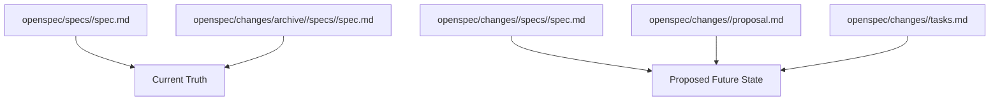
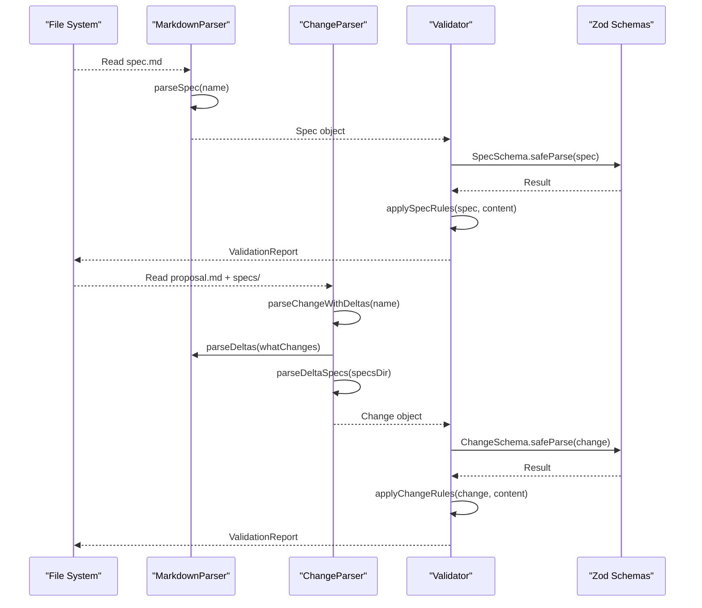
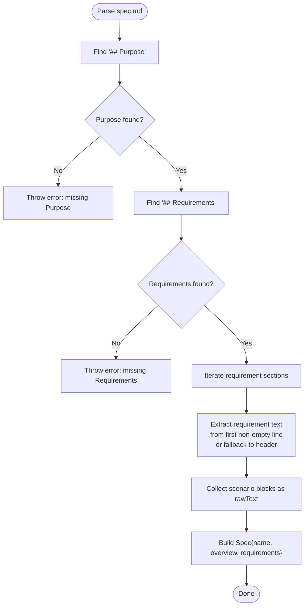
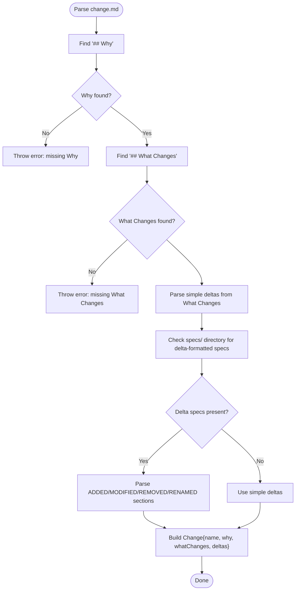
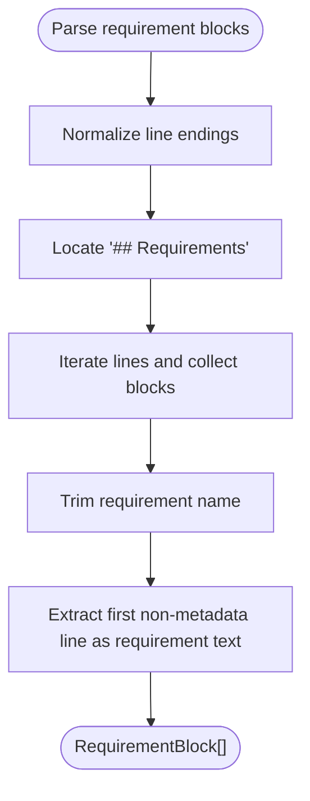
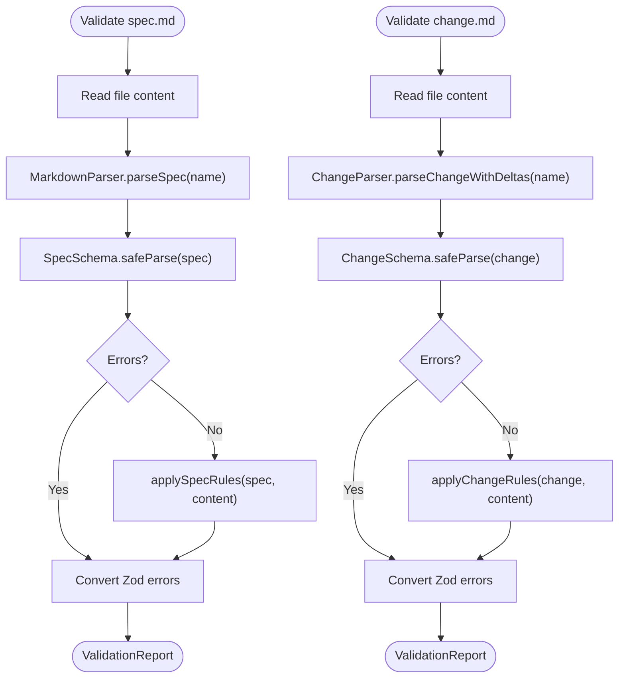
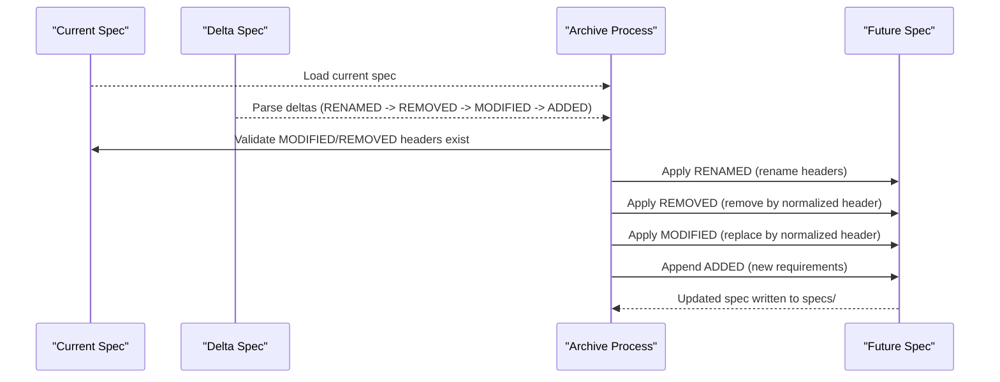
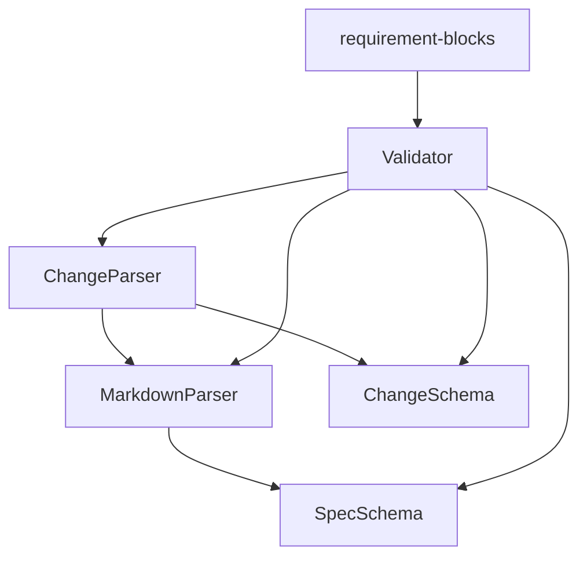

# Specification Format

<cite>
**Referenced Files in This Document**
- [markdown-parser.ts](file://src/core/parsers/markdown-parser.ts)
- [change-parser.ts](file://src/core/parsers/change-parser.ts)
- [requirement-blocks.ts](file://src/core/parsers/requirement-blocks.ts)
- [spec.schema.ts](file://src/core/schemas/spec.schema.ts)
- [validator.ts](file://src/core/validation/validator.ts)
- [constants.ts](file://src/core/validation/constants.ts)
- [openspec-conventions/spec.md](file://openspec/specs/openspec-conventions/spec.md)
- [cli-init/spec.md](file://openspec/specs/cli-init/spec.md)
- [add-scaffold-command/spec.md](file://openspec/changes/add-scaffold-command/spec.md)
- [markdown-parser.test.ts](file://test/core/parsers/markdown-parser.test.ts)
- [validation.test.ts](file://test/core/validation.test.ts)
</cite>

## Table of Contents
1. [Introduction](#introduction)
2. [Project Structure](#project-structure)
3. [Core Components](#core-components)
4. [Architecture Overview](#architecture-overview)
5. [Detailed Component Analysis](#detailed-component-analysis)
6. [Dependency Analysis](#dependency-analysis)
7. [Performance Considerations](#performance-considerations)
8. [Troubleshooting Guide](#troubleshooting-guide)
9. [Conclusion](#conclusion)
10. [Appendices](#appendices)

## Introduction
This section documents OpenSpec’s specification format and conventions. It explains the structured markdown format for requirements and scenarios, the delta format used in change proposals, the validation rules enforced by the system, and how the markdown parser extracts structured data. It also clarifies the relationship between current specifications under openspec/specs/ and proposed updates under openspec/changes/, and provides guidance on organizing specifications by feature area and maintaining living documentation through the archiving process.

## Project Structure
OpenSpec organizes specifications and change proposals in a consistent directory layout:
- openspec/specs/: current deployed capabilities and their specifications
- openspec/changes/: proposed changes with future-state specs and supporting artifacts
- openspec/changes/archive/: completed changes archived under dated directories

The conventions specification itself documents the project structure and conventions, including how to organize specs by feature area and how to maintain living documentation.

**Diagram sources**
- [openspec-conventions/spec.md](file://openspec/specs/openspec-conventions/spec.md#L235-L261)
- [cli-init/spec.md](file://openspec/specs/cli-init/spec.md#L1-L20)

**Section sources**
- [openspec-conventions/spec.md](file://openspec/specs/openspec-conventions/spec.md#L235-L261)

## Core Components
- MarkdownParser: Parses spec and change documents, extracting sections, requirements, scenarios, and deltas.
- ChangeParser: Extends MarkdownParser to parse delta-formatted spec files under changes/<id>/specs/.
- Requirement Blocks Parser: Parses requirement blocks from plain specs and delta specs, including normalization and extraction of requirement headers.
- Validator: Applies schema validation and convention-based rules to specs and changes, including delta-specific validations.
- Validation Constants: Defines thresholds and messages for validation.

Key conventions enforced by the system:
- Every spec must have a Purpose section and a Requirements section.
- Every spec must have at least one requirement.
- Every requirement must include at least one scenario.
- Requirement text must contain SHALL or MUST.
- Change proposals must include at least one delta.
- Delta-formatted specs must use ADDED, MODIFIED, REMOVED, and optionally RENAMED sections with well-formed requirement headers.

**Section sources**
- [markdown-parser.ts](file://src/core/parsers/markdown-parser.ts#L24-L49)
- [markdown-parser.ts](file://src/core/parsers/markdown-parser.ts#L51-L76)
- [spec.schema.ts](file://src/core/schemas/spec.schema.ts#L5-L16)
- [validator.ts](file://src/core/validation/validator.ts#L22-L48)
- [validator.ts](file://src/core/validation/validator.ts#L319-L345)
- [constants.ts](file://src/core/validation/constants.ts#L15-L49)

## Architecture Overview
The specification format is processed through a layered pipeline:
- Parsing: MarkdownParser and ChangeParser extract structured data from markdown.
- Schema Validation: Zod schemas enforce structural correctness.
- Convention Validation: Validator enforces semantic rules (SHALL/MUST, scenarios, deltas).
- Delta Application: Archive process applies deltas to current specs using header-based matching.

**Diagram sources**
- [markdown-parser.ts](file://src/core/parsers/markdown-parser.ts#L24-L76)
- [change-parser.ts](file://src/core/parsers/change-parser.ts#L20-L53)
- [validator.ts](file://src/core/validation/validator.ts#L22-L101)
- [spec.schema.ts](file://src/core/schemas/spec.schema.ts#L5-L16)

## Detailed Component Analysis

### Structured Markdown Format for Specifications
OpenSpec uses a consistent, parseable markdown format for behavioral specifications:
- Purpose: describes what the spec covers.
- Requirements: contains one or more requirements.
- Requirement: level-3 header with a descriptive name, followed by requirement text that must include SHALL or MUST.
- Scenario: level-4 header with a descriptive name, followed by Gherkin-style bullets using WHEN/THEN/AND.

The parser extracts:
- Spec overview from the Purpose section.
- Requirement text from the first non-empty content line after the requirement header, falling back to the header text if no content is present.
- Scenarios as rawText blocks under each requirement.

**Diagram sources**
- [markdown-parser.ts](file://src/core/parsers/markdown-parser.ts#L24-L49)
- [markdown-parser.ts](file://src/core/parsers/markdown-parser.ts#L145-L200)
- [markdown-parser.test.ts](file://test/core/parsers/markdown-parser.test.ts#L1-L105)

**Section sources**
- [markdown-parser.ts](file://src/core/parsers/markdown-parser.ts#L24-L49)
- [markdown-parser.ts](file://src/core/parsers/markdown-parser.ts#L145-L200)
- [markdown-parser.test.ts](file://test/core/parsers/markdown-parser.test.ts#L1-L105)

### Gherkin-Style Scenarios
Scenarios use level-4 headers and bold keywords:
- WHEN: conditions or triggers
- THEN: expected outcomes
- AND: additional outcomes or conditions

The parser preserves the rawText of scenario blocks for downstream processing and validation.

**Section sources**
- [markdown-parser.ts](file://src/core/parsers/markdown-parser.ts#L187-L200)
- [cli-init/spec.md](file://openspec/specs/cli-init/spec.md#L1-L20)

### Delta Format for Change Proposals
Change proposals use a delta format under openspec/changes/<change-id>/specs/<capability>/spec.md with the following top-level sections:
- ADDED Requirements: new requirements with complete structured content.
- MODIFIED Requirements: modified requirements using the same header text as current specs (normalized).
- REMOVED Requirements: requirement names only (normalized).
- RENAMED Requirements: explicit FROM and TO pairs using requirement headers.

The ChangeParser:
- Parses simple deltas from the What Changes section using bullet syntax with bold spec keys.
- Prefers delta-formatted specs under specs/ when present.
- Parses delta sections case-insensitively and extracts requirement blocks, removed names, and renamed pairs.

**Diagram sources**
- [change-parser.ts](file://src/core/parsers/change-parser.ts#L20-L53)
- [change-parser.ts](file://src/core/parsers/change-parser.ts#L55-L82)
- [change-parser.ts](file://src/core/parsers/change-parser.ts#L84-L149)

**Section sources**
- [change-parser.ts](file://src/core/parsers/change-parser.ts#L20-L53)
- [change-parser.ts](file://src/core/parsers/change-parser.ts#L55-L82)
- [change-parser.ts](file://src/core/parsers/change-parser.ts#L84-L149)
- [add-scaffold-command/spec.md](file://openspec/changes/add-scaffold-command/spec.md#L1-L45)

### Requirement Blocks Extraction and Normalization
The requirement-blocks parser:
- Identifies requirement headers and collects requirement blocks.
- Normalizes requirement names by trimming.
- Supports metadata lines before the first scenario and ignores metadata lines when extracting requirement text.
- Parses removed names and renamed pairs from delta sections.

**Diagram sources**
- [requirement-blocks.ts](file://src/core/parsers/requirement-blocks.ts#L15-L23)
- [requirement-blocks.ts](file://src/core/parsers/requirement-blocks.ts#L24-L97)
- [requirement-blocks.ts](file://src/core/parsers/requirement-blocks.ts#L119-L142)
- [requirement-blocks.ts](file://src/core/parsers/requirement-blocks.ts#L172-L194)
- [requirement-blocks.ts](file://src/core/parsers/requirement-blocks.ts#L196-L213)
- [requirement-blocks.ts](file://src/core/parsers/requirement-blocks.ts#L215-L235)

**Section sources**
- [requirement-blocks.ts](file://src/core/parsers/requirement-blocks.ts#L15-L23)
- [requirement-blocks.ts](file://src/core/parsers/requirement-blocks.ts#L24-L97)
- [requirement-blocks.ts](file://src/core/parsers/requirement-blocks.ts#L119-L142)
- [requirement-blocks.ts](file://src/core/parsers/requirement-blocks.ts#L172-L194)
- [requirement-blocks.ts](file://src/core/parsers/requirement-blocks.ts#L196-L213)
- [requirement-blocks.ts](file://src/core/parsers/requirement-blocks.ts#L215-L235)

### Validation Rules Enforced by the System
The Validator enforces:
- Structural validation via Zod schemas (SpecSchema, ChangeSchema).
- Convention-based rules:
  - Spec must have Purpose and Requirements sections.
  - Spec must have at least one requirement.
  - Each requirement must have at least one scenario.
  - Requirement text must contain SHALL or MUST.
  - Change must have Why and What Changes sections.
  - Change must have at least one delta.
  - Delta-formatted specs must:
    - Include at least one requirement in ADDED or MODIFIED sections.
    - Contain SHALL or MUST in requirement text.
    - Include at least one scenario per requirement.
    - Not duplicate requirement names within the same section.
    - Not place the same requirement in conflicting sections (e.g., MODIFIED and REMOVED).
    - Ensure RENAMED pairs are well-formed and not duplicated.
- Strict mode: fails on warnings; non-strict mode passes with warnings.

**Diagram sources**
- [validator.ts](file://src/core/validation/validator.ts#L22-L101)
- [validator.ts](file://src/core/validation/validator.ts#L104-L272)
- [spec.schema.ts](file://src/core/schemas/spec.schema.ts#L5-L16)

**Section sources**
- [validator.ts](file://src/core/validation/validator.ts#L22-L101)
- [validator.ts](file://src/core/validation/validator.ts#L104-L272)
- [constants.ts](file://src/core/validation/constants.ts#L15-L49)
- [validation.test.ts](file://test/core/validation.test.ts#L1-L180)

### Relationship Between Current Truth and Proposed Updates
- Current truth: openspec/specs/<capability>/spec.md documents what is currently deployed.
- Proposed updates: openspec/changes/<change-id>/specs/<capability>/spec.md contains only the deltas (ADDED, MODIFIED, REMOVED, RENAMED) to the future state.
- Archive process: Completes the change by applying deltas to current specs using header-based matching, then moves the change to openspec/changes/archive/<YYYY-MM-DD-...>.

**Diagram sources**
- [openspec-conventions/spec.md](file://openspec/specs/openspec-conventions/spec.md#L143-L165)
- [change-parser.ts](file://src/core/parsers/change-parser.ts#L84-L149)

**Section sources**
- [openspec-conventions/spec.md](file://openspec/specs/openspec-conventions/spec.md#L143-L165)

### Examples of Well-Formed Specifications and Common Formatting Errors
Well-formed examples:
- Behavioral spec with structured requirements and scenarios: [cli-init/spec.md](file://openspec/specs/cli-init/spec.md#L1-L20)
- Delta-formatted change with ADDED Requirements and scenarios: [add-scaffold-command/spec.md](file://openspec/changes/add-scaffold-command/spec.md#L1-L45)
- Conventions specification documenting format and process: [openspec-conventions/spec.md](file://openspec/specs/openspec-conventions/spec.md#L263-L390)

Common formatting errors and remedies:
- Missing Purpose or Requirements sections: Ensure required headers exist and content is present. See guidance appended to messages.
- Missing scenarios: Add at least one level-4 scenario header with WHEN/THEN/AND bullets.
- Missing SHALL or MUST: Include a SHALL or MUST statement in requirement text.
- Missing deltas in change proposals: Add specs/ directory with delta headers or provide explicit deltas in What Changes.
- Duplicate requirement names: Ensure unique requirement headers within a spec.
- Renamed requirement pairs: Use RENAMED section with explicit FROM and TO requirement headers.

**Section sources**
- [markdown-parser.test.ts](file://test/core/parsers/markdown-parser.test.ts#L1-L105)
- [validation.test.ts](file://test/core/validation.test.ts#L1-L180)
- [constants.ts](file://src/core/validation/constants.ts#L15-L49)

### Guidance on Organizing Specifications and Maintaining Living Documentation
- Organize specs by feature area under openspec/specs/<capability>/spec.md.
- Keep specs as the single source of truth for current behavior.
- Use changes/<change-id>/specs/<capability>/spec.md to propose deltas only.
- Archive completed changes to openspec/changes/archive/<YYYY-MM-DD-...>/ to preserve history.
- Maintain AGENTS.md and project.md alongside specs for context and AI instructions.
- Use verb–noun CLI commands and clear naming conventions for capabilities.

**Section sources**
- [openspec-conventions/spec.md](file://openspec/specs/openspec-conventions/spec.md#L235-L261)
- [openspec-conventions/spec.md](file://openspec/specs/openspec-conventions/spec.md#L439-L461)

## Dependency Analysis
The following diagram shows key dependencies among components involved in parsing and validating specifications and changes.

**Diagram sources**
- [markdown-parser.ts](file://src/core/parsers/markdown-parser.ts#L1-L237)
- [change-parser.ts](file://src/core/parsers/change-parser.ts#L1-L234)
- [requirement-blocks.ts](file://src/core/parsers/requirement-blocks.ts#L1-L235)
- [validator.ts](file://src/core/validation/validator.ts#L1-L449)
- [spec.schema.ts](file://src/core/schemas/spec.schema.ts#L1-L17)

**Section sources**
- [markdown-parser.ts](file://src/core/parsers/markdown-parser.ts#L1-L237)
- [change-parser.ts](file://src/core/parsers/change-parser.ts#L1-L234)
- [requirement-blocks.ts](file://src/core/parsers/requirement-blocks.ts#L1-L235)
- [validator.ts](file://src/core/validation/validator.ts#L1-L449)
- [spec.schema.ts](file://src/core/schemas/spec.schema.ts#L1-L17)

## Performance Considerations
- Parsing is linear in the number of lines in spec and change files.
- Delta parsing scans top-level sections and requirement blocks; complexity scales with content size.
- Validation adds minimal overhead compared to parsing.
- Recommendations:
  - Keep requirement names concise to improve readability and reduce parsing ambiguity.
  - Limit excessive metadata lines before scenarios to minimize unnecessary content traversal.
  - Use the delta format to avoid large diffs and simplify parsing.

[No sources needed since this section provides general guidance]

## Troubleshooting Guide
Common issues and resolutions:
- Missing Purpose or Requirements sections: Add required headers and content. See guidance appended to messages.
- No scenarios: Add at least one level-4 scenario header with WHEN/THEN/AND bullets.
- Missing SHALL/MUST: Include a SHALL or MUST statement in requirement text.
- No deltas: Add specs/ directory with delta headers or provide explicit deltas in What Changes.
- Duplicate requirement names: Ensure unique requirement headers within a spec.
- Conflicting sections: Do not place the same requirement in MODIFIED and REMOVED, or in MODIFIED and ADDED.
- Renamed pairs: Use RENAMED section with explicit FROM and TO requirement headers.

Use strict mode to fail on warnings and ensure stricter adherence to conventions.

**Section sources**
- [constants.ts](file://src/core/validation/constants.ts#L15-L49)
- [validator.ts](file://src/core/validation/validator.ts#L288-L345)
- [validation.test.ts](file://test/core/validation.test.ts#L291-L489)

## Conclusion
OpenSpec’s specification format and conventions provide a structured, parseable, and machine-readable way to document system capabilities and propose changes. The markdown parser extracts requirements and scenarios, while the validator enforces semantic rules and delta-specific constraints. By organizing specs by feature area and using the delta format for changes, teams can maintain living documentation that evolves with deployments and is easy to review and archive.

[No sources needed since this section summarizes without analyzing specific files]

## Appendices
- Example of structured behavioral spec: [cli-init/spec.md](file://openspec/specs/cli-init/spec.md#L1-L20)
- Example of delta-formatted change: [add-scaffold-command/spec.md](file://openspec/changes/add-scaffold-command/spec.md#L1-L45)
- Conventions specification: [openspec-conventions/spec.md](file://openspec/specs/openspec-conventions/spec.md#L263-L390)

[No sources needed since this section aggregates references already cited above]