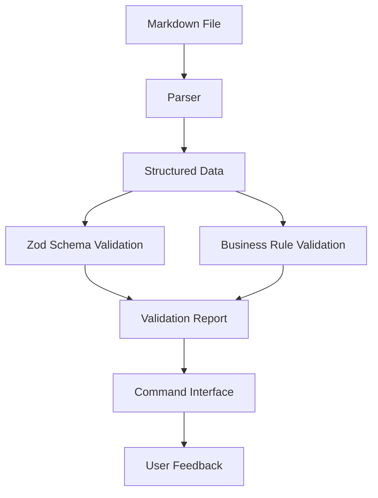
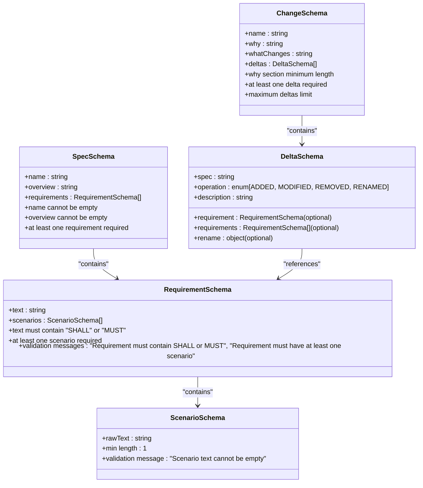
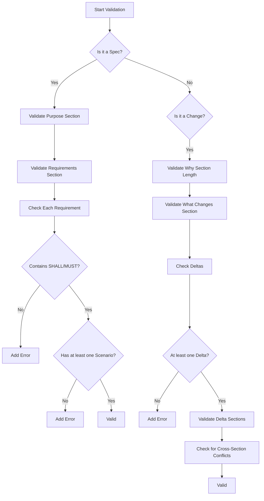
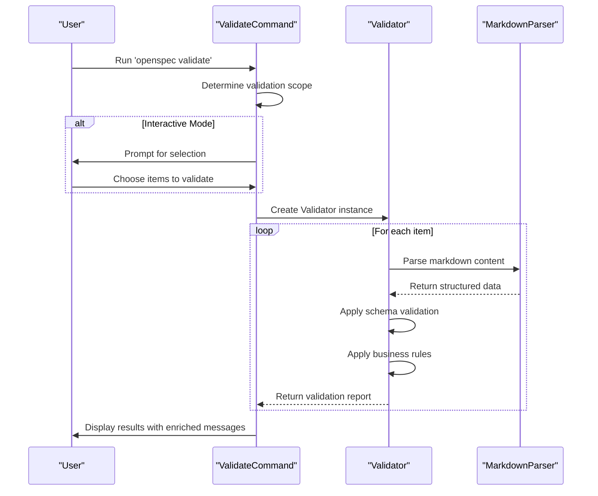
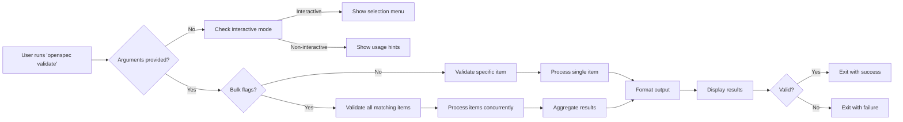
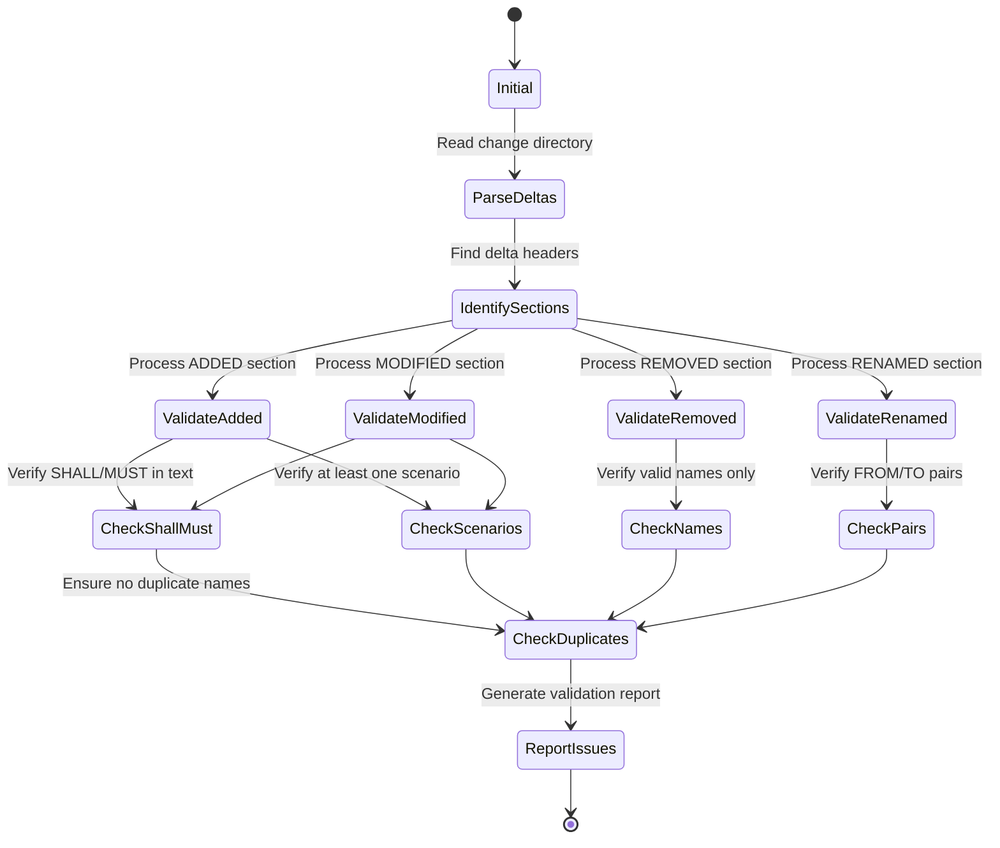
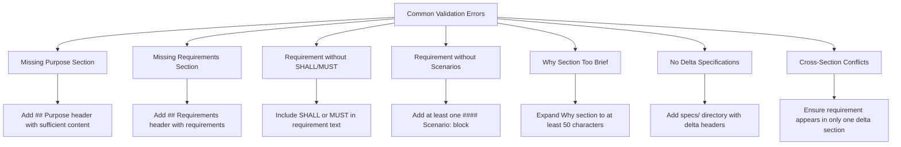
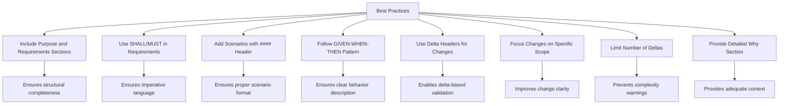
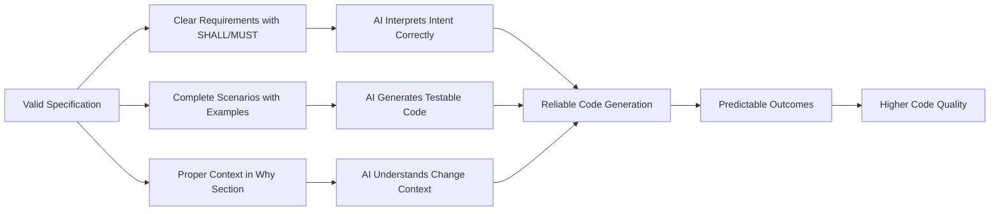

# Validation System

<cite>
**Referenced Files in This Document**   
- [base.schema.ts](file://src/core/schemas/base.schema.ts)
- [spec.schema.ts](file://src/core/schemas/spec.schema.ts)
- [change.schema.ts](file://src/core/schemas/change.schema.ts)
- [validator.ts](file://src/core/validation/validator.ts)
- [constants.ts](file://src/core/validation/constants.ts)
- [types.ts](file://src/core/validation/types.ts)
- [validate.ts](file://src/commands/validate.ts)
- [markdown-parser.ts](file://src/core/parsers/markdown-parser.ts)
- [change-parser.ts](file://src/core/parsers/change-parser.ts)
- [requirement-blocks.ts](file://src/core/parsers/requirement-blocks.ts)
</cite>

## Table of Contents
1. [Introduction](#introduction)
2. [Core Validation Architecture](#core-validation-architecture)
3. [Schema-Based Data Integrity](#schema-based-data-integrity)
4. [Validation Rules and Requirements](#validation-rules-and-requirements)
5. [Validation Modes and Error Reporting](#validation-modes-and-error-reporting)
6. [Command Integration and Workflow](#command-integration-and-workflow)
7. [Scope-Aware Validation](#scope-aware-validation)
8. [Common Validation Errors and Solutions](#common-validation-errors-and-solutions)
9. [Best Practices for Specifications](#best-practices-for-specifications)
10. [Impact on AI-Generated Code Reliability](#impact-on-ai-generated-code-reliability)

## Introduction

The OpenSpec validation system ensures that specifications and changes adhere to a strict, well-defined format that guarantees consistency, clarity, and reliability throughout the development process. This system acts as a quality gate before implementation, preventing ambiguous or incomplete specifications from progressing through the development pipeline. The validation framework combines Zod-based schema validation with custom business rules to enforce proper header structure, requirement-scenario relationships, and delta syntax. By providing enriched error messages and supporting multiple validation modes, the system helps users quickly identify and fix issues, ensuring that specifications are not only syntactically correct but also semantically meaningful. This documentation details the architecture, implementation, and usage of the validation system, highlighting how it contributes to the predictability and reliability of AI-generated code.

## Core Validation Architecture

The OpenSpec validation system is built on a modular architecture that separates concerns between schema validation, rule-based validation, and command integration. At its core, the system uses Zod for schema-based validation of data structures, ensuring that specifications and changes conform to predefined types and constraints. The Validator class orchestrates the validation process, combining schema validation with custom business rules that cannot be expressed through schemas alone. The system processes markdown files through specialized parsers that extract structured data from the document format, which is then validated against both schema and business rules.

**Diagram sources**
- [validator.ts](file://src/core/validation/validator.ts)
- [markdown-parser.ts](file://src/core/parsers/markdown-parser.ts)
- [validate.ts](file://src/commands/validate.ts)

**Section sources**
- [validator.ts](file://src/core/validation/validator.ts)
- [markdown-parser.ts](file://src/core/parsers/markdown-parser.ts)
- [validate.ts](file://src/commands/validate.ts)

## Schema-Based Data Integrity

The OpenSpec validation system relies heavily on Zod schemas to enforce data integrity at the structural level. These schemas define the expected shape, types, and constraints for specifications and changes, ensuring that all data conforms to a consistent format. The base.schema.ts file defines fundamental building blocks like ScenarioSchema and RequirementSchema, which are then composed into more complex structures in spec.schema.ts and change.schema.ts. Each schema includes specific validation rules with descriptive error messages that guide users toward correct formatting.

**Diagram sources**
- [base.schema.ts](file://src/core/schemas/base.schema.ts)
- [spec.schema.ts](file://src/core/schemas/spec.schema.ts)
- [change.schema.ts](file://src/core/schemas/change.schema.ts)

**Section sources**
- [base.schema.ts](file://src/core/schemas/base.schema.ts)
- [spec.schema.ts](file://src/core/schemas/spec.schema.ts)
- [change.schema.ts](file://src/core/schemas/change.schema.ts)

## Validation Rules and Requirements

The OpenSpec validation system enforces a comprehensive set of rules that ensure specifications and changes meet quality standards. These rules go beyond basic schema validation to address semantic correctness and best practices. For specifications, the system validates proper header structure, requiring both "## Purpose" and "## Requirements" sections. Each requirement must contain the keywords "SHALL" or "MUST" to ensure clear, imperative language, and must include at least one scenario to provide testable behavior. The system also enforces minimum length requirements for the purpose section to prevent overly brief descriptions.

For changes, the validation rules ensure that each change has a sufficient "Why" section (minimum 50 characters) to provide adequate context, and that the "What Changes" section is not empty. When validating delta-formatted specifications, the system enforces additional rules: at least one delta must be present across all files, ADDED and MODIFIED requirements must include SHALL/MUST and at least one scenario, REMOVED requirements only require names, and RENAMED requirements must be properly paired. The system also prevents cross-section conflicts within specifications, such as the same requirement appearing in both MODIFIED and REMOVED sections.

**Diagram sources**
- [validator.ts](file://src/core/validation/validator.ts)
- [constants.ts](file://src/core/validation/constants.ts)

**Section sources**
- [validator.ts](file://src/core/validation/validator.ts)
- [constants.ts](file://src/core/validation/constants.ts)

## Validation Modes and Error Reporting

The OpenSpec validation system supports multiple validation modes to accommodate different use cases and user preferences. The primary modes include strict and non-strict validation, bulk validation of multiple items, and interactive selection. In strict mode, both errors and warnings cause validation to fail, enforcing the highest quality standards. In non-strict mode, only errors cause failure, allowing warnings to be addressed later. The system provides enriched error messages that not only identify issues but also offer guidance on how to fix them, significantly reducing the time needed to resolve validation problems.

Error reporting is structured to provide clear, actionable feedback. Each validation issue includes a level (ERROR, WARNING, or INFO), a path indicating where the issue occurred, and a descriptive message. ERROR-level issues represent violations of mandatory rules that prevent validation from passing. WARNING-level issues indicate potential problems or deviations from best practices that don't block validation in non-strict mode. INFO-level issues provide suggestions for improvement without implying any problem. The system also supports JSON output format for integration with automated tools and CI/CD pipelines, making it easy to incorporate validation into development workflows.

**Diagram sources**
- [validator.ts](file://src/core/validation/validator.ts)
- [validate.ts](file://src/commands/validate.ts)
- [markdown-parser.ts](file://src/core/parsers/markdown-parser.ts)

**Section sources**
- [validator.ts](file://src/core/validation/validator.ts)
- [validate.ts](file://src/commands/validate.ts)
- [types.ts](file://src/core/validation/types.ts)

## Command Integration and Workflow

The 'openspec validate' command serves as the primary interface to the validation system, integrating the core validation logic with user interaction and workflow considerations. The command supports multiple invocation methods, including validating specific items, validating all changes and specifications, or interactively selecting items to validate. This flexibility allows the command to be used in various contexts, from quick checks during development to comprehensive validation in CI/CD pipelines. The command handles the discovery of specification and change items, manages concurrency for bulk operations, and formats the output according to user preferences.

The validation command acts as a quality gate in the development workflow, typically run before implementation begins. By catching issues early, it prevents developers from working with ambiguous or incomplete specifications that could lead to incorrect implementations. The command's integration with the core validation logic ensures that the same rules are applied consistently across all usage contexts. When validation fails, the command provides clear next steps to help users resolve the issues, making the feedback loop as efficient as possible. The support for JSON output also enables integration with automated testing and deployment systems, allowing validation to be incorporated into broader quality assurance processes.

**Diagram sources**
- [validate.ts](file://src/commands/validate.ts)
- [validator.ts](file://src/core/validation/validator.ts)

**Section sources**
- [validate.ts](file://src/commands/validate.ts)

## Scope-Aware Validation

The OpenSpec validation system implements scope-aware validation that considers the context of changes when evaluating specifications. This approach recognizes that validation rules may need to be applied differently depending on whether a specification is being created, modified, or removed. For example, when validating a change that adds a new specification, the system ensures that all requirements include SHALL/MUST statements and at least one scenario. However, when validating a change that removes a specification, the system only checks that the requirement names are correctly specified, without enforcing scenario requirements.

This context-sensitive validation is particularly important for delta-based changes, where different sections of a specification may be subject to different rules. The system parses delta-formatted specification files to identify ADDED, MODIFIED, REMOVED, and RENAMED requirements, applying appropriate validation rules to each category. For ADDED and MODIFIED requirements, the system enforces the full set of requirements including SHALL/MUST statements and scenarios. For REMOVED requirements, the system only validates that the names are correctly formatted and not duplicated. For RENAMED requirements, the system ensures that FROM and TO pairs are properly matched and that there are no conflicts with other operations on the same requirement.

**Diagram sources**
- [validator.ts](file://src/core/validation/validator.ts)
- [requirement-blocks.ts](file://src/core/parsers/requirement-blocks.ts)

**Section sources**
- [validator.ts](file://src/core/validation/validator.ts)
- [requirement-blocks.ts](file://src/core/parsers/requirement-blocks.ts)

## Common Validation Errors and Solutions

The OpenSpec validation system encounters several common errors that users should be aware of when creating specifications and changes. One frequent issue is missing the "## Purpose" or "## Requirements" sections in a specification, which can be resolved by ensuring these headers are present and properly formatted. Another common error is requirements that lack the mandatory "SHALL" or "MUST" keywords, which can be fixed by adding these imperative terms to the requirement text. Specifications with requirements that have no scenarios are also common, and can be addressed by adding at least one "#### Scenario:" block for each requirement.

For changes, a frequent validation error is having a "Why" section that is too brief (less than 50 characters), which can be resolved by providing more detailed justification for the change. Another common issue is changes that lack delta specifications in the specs/ directory, which can be fixed by adding the appropriate delta headers ("## ADDED/MODIFIED/REMOVED/RENAMED Requirements") and requirement blocks. Users may also encounter errors when the same requirement appears in multiple delta sections, which can be resolved by ensuring each requirement is only modified in one way within a single change.

**Diagram sources**
- [validator.ts](file://src/core/validation/validator.ts)
- [constants.ts](file://src/core/validation/constants.ts)

**Section sources**
- [validator.ts](file://src/core/validation/validator.ts)
- [constants.ts](file://src/core/validation/constants.ts)

## Best Practices for Specifications

To create easily validatable specifications in OpenSpec, users should follow several best practices that align with the validation system's requirements. First, always include both "## Purpose" and "## Requirements" sections in specifications, with the purpose section providing sufficient context (at least 50 characters). Each requirement should be phrased using imperative language with "SHALL" or "MUST" to clearly indicate mandatory behavior. Requirements should be focused and specific, avoiding overly broad statements that could be interpreted in multiple ways.

For scenarios, use the proper "#### Scenario:" header format rather than bullet lists, and ensure each scenario follows the GIVEN-WHEN-THEN pattern for clarity. Include at least one scenario for each requirement to provide testable behavior. When creating changes, use the delta format with appropriate headers ("## ADDED/MODIFIED/REMOVED/RENAMED Requirements") to clearly indicate the nature of the changes. Avoid mixing operations on the same requirement within a single change, as this can lead to validation errors. Finally, keep changes focused with a limited number of deltas (ideally 10 or fewer) to maintain clarity and avoid the "too many deltas" warning.

**Diagram sources**
- [validator.ts](file://src/core/validation/validator.ts)
- [constants.ts](file://src/core/validation/constants.ts)

**Section sources**
- [validator.ts](file://src/core/validation/validator.ts)
- [constants.ts](file://src/core/validation/constants.ts)

## Impact on AI-Generated Code Reliability

The OpenSpec validation system significantly enhances the predictability and reliability of AI-generated code by ensuring that specifications are clear, complete, and unambiguous before implementation begins. By enforcing strict formatting rules and semantic requirements, the system eliminates common sources of ambiguity that could lead to incorrect AI interpretations. The requirement for "SHALL" or "MUST" in requirements ensures that AI systems receive clear, imperative instructions rather than vague suggestions. The mandatory inclusion of scenarios provides concrete examples of expected behavior that AI systems can use to generate appropriate code.

The validation system also improves AI reliability by catching errors early in the development process, before any code generation occurs. This prevents AI systems from working with flawed specifications that could produce incorrect or inconsistent implementations. The enriched error messages help users quickly identify and fix issues, reducing the time between specification creation and validation. By ensuring that specifications meet quality standards, the validation system creates a solid foundation for AI-assisted development, leading to more predictable outcomes and higher-quality code. The scope-aware validation further enhances reliability by ensuring that changes are properly contextualized, reducing the risk of unintended side effects in AI-generated code.

**Diagram sources**
- [validator.ts](file://src/core/validation/validator.ts)
- [constants.ts](file://src/core/validation/constants.ts)

**Section sources**
- [validator.ts](file://src/core/validation/validator.ts)
- [constants.ts](file://src/core/validation/constants.ts)